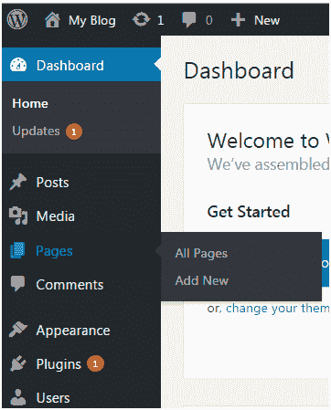
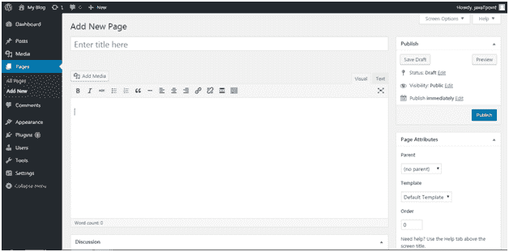
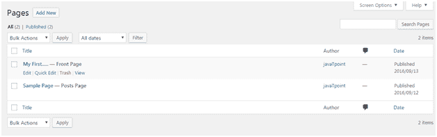
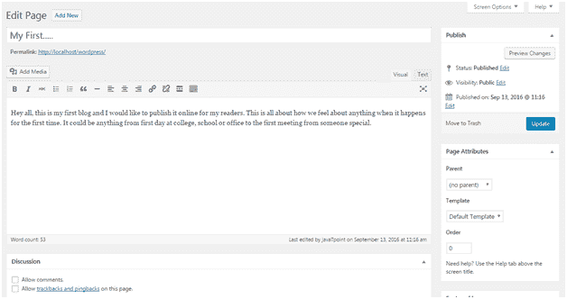
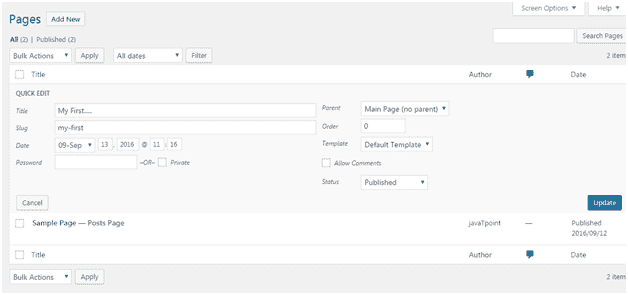
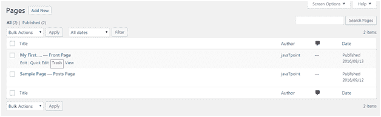

# WordPress 页面

> 原文:[https://www.javatpoint.com/wordpress-pages](https://www.javatpoint.com/wordpress-pages)

页面不同于帖子。它们是静态的，不会经常变化。页面的一些例子有关于、联系等。您可以添加包含您和您的网站信息的页面。

* * *

## 如何添加新页面

转到**页面>添加新的**

看上面的快照，这是编辑页面，你可以在这里给你的页面一个标题和内容。

在这里你可以上传媒体，写内容，给你的页面添加标题。完成页面后，点击**发布**按钮。

* * *

## 如何编辑页面

编辑页面，转到**页面>添加新的**

看上面的快照，这是所有已创建帖子的列表。将鼠标放在帖子上方，将出现以下选项。

有两个选项可以编辑。一个是编辑，另一个是快速编辑。

点击**编辑**，将出现以下页面。

看看上面的快照，在这里你可以编辑文章的标题或内容。

点击**快速编辑**，将出现以下页面。

看看上面的快照，在这里你可以编辑文章的标题、日期和内容。如果你愿意，你也可以为你的文章改变类别。

* * *

## 如何删除页面

要删除帖子，请转到**帖子>所有页面**

看上面的快照，**垃圾桶**选项会让你删除各自的帖子。