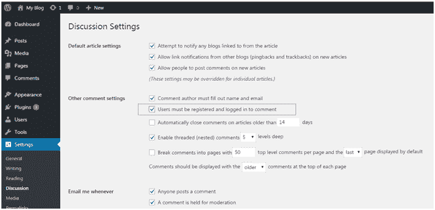
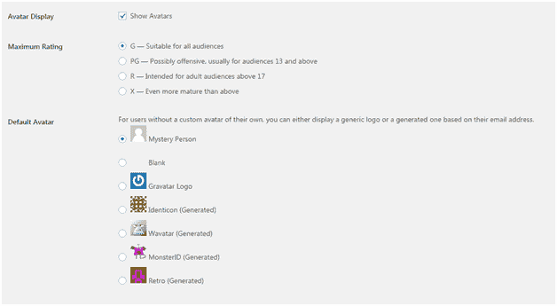

# WordPress 评论

> 原文:[https://www.javatpoint.com/wordpress-comments](https://www.javatpoint.com/wordpress-comments)

评论允许用户与博主或网站团队互动。这在很多方面都有帮助，比如你会知道你的观众想从你这里得到什么。你还能为你的观众做什么。您可以激活或停用评论框。默认情况下，注释处于启用状态。

* * *

## 讨论或评论设置页面

点击**设置>讨论**

您将位于“讨论设置”页面。

看看上面的快照，有很多默认选项。

第一部分为**默认文章设置**，适用于你的所有页面、帖子等。

* * *

## 如何启用或禁用注释

转到**页面>所有页面**

选择任何一个您想要添加评论的页面。

看上面的快照，在右上角，有一个下拉选项。点击它。

查看上面的快照，选中讨论和评论框。

看上面的快照，有两个复选框，

**允许评论-** 允许你的观众在你的帖子上添加评论。

**允许在此页面进行引用通告和回退-** 观众可以进行引用通告和回退。

最后点击**更新**按钮更新你的帖子。

* * *

## 如何编辑评论

编辑评论，进入**评论**侧菜单，

看上面的快照，这是评论页。选择一个评论，点击**编辑。**

看上面的快照，可以在这里编辑评论，然后点击**更新。**

* * *

## 什么是适度评论

除非得到管理员的批准，否则访问者对帖子的评论不会直接发布。这叫做适度。您可以更改评论审核设置。转到**设置>讨论**

当您向下滚动页面时，您会看到以下选项。

看上面的快照，勾选**注释必须手动审批选项。**

* * *

## 如何只允许注册用户评论

您只能允许注册用户评论您的帖子。为此，请转到**设置>常规**

将出现以下页面。

看上面的快照，勾选**框，任何人都可以注册**。

如果你不想让新用户在你的网站上发帖，那就把**新用户默认角色**栏保存为订阅者。

现在转到**设置>讨论**

看上面的快照，勾选**框用户必须注册登录才能评论**。

* * *

## 如何接收评论通知

每当有人在您的网站上留下评论或等待批准时，您都可以收到通知。

对于标记为垃圾邮件的评论，您将不会收到通知。

要接收通知，请转到**设置>讨论**

看上面的快照，勾选**下的框“无论何时给我发邮件”**启用通知。

* * *

## 什么是阿凡达或格拉瓦塔

Word Avatar 用于在线交流中用户的个人资料图像。Gravatar 是一个基于网络的服务，允许用户使用头像。当用户在 WordPress 中创建帐户时，它会搜索与用户电子邮件地址匹配的 gravatar 图像。如果用户有一个带有图片的 gravatar 帐户，那么该图片将作为他们的个人资料图片显示在评论中，如果没有，则设置默认头像图片。

WordPress 中的默认图像是**神秘**人。您可以通过点击**设置>讨论**进行更改

看上面的快照，通过取消勾选**显示头像**，头像图像将不会出现在你的网站中。

默认图像可以从神秘人和空白图像中选择。使用基于用户电子邮件地址生成图像的算法来选择其他图像。