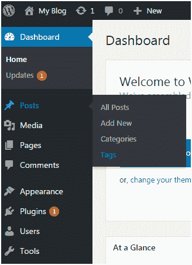
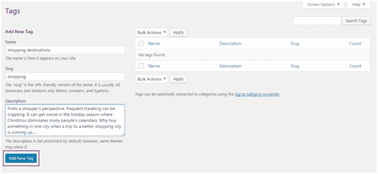
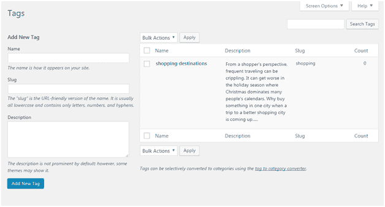
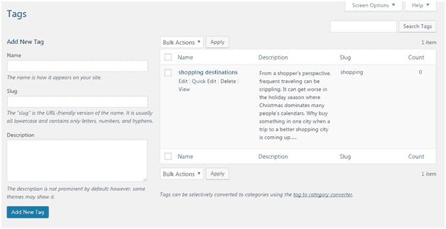
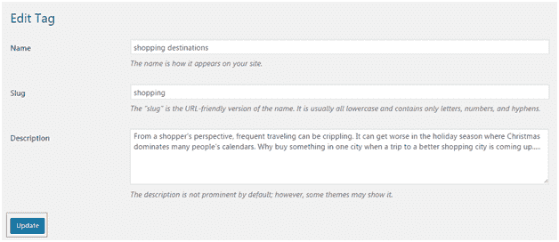
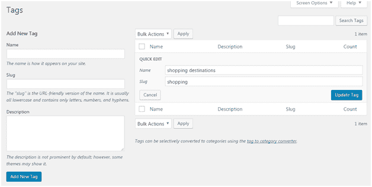
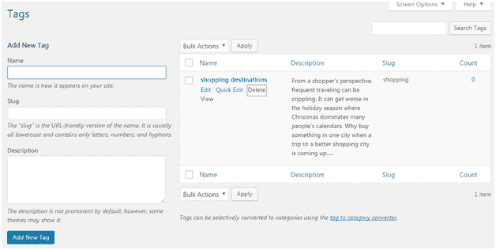

# WordPress 标记

> 原文:[https://www.javatpoint.com/wordpress-tags](https://www.javatpoint.com/wordpress-tags)

* * *

## 什么是标签

在标签的帮助下，类似的帖子可以组合在一起。因此，用户更容易搜索特定的帖子。它告诉用户帖子是关于什么的。标签与类别相似，但仍然不同。

标签的位置可能因主题而异。有时它们可能出现在底部、顶部或侧边栏中。

* * *

## 如何添加标签

要添加标签，请转到**帖子>标签**

看上面的快照，这里你必须填写所有的字段。

**名称-** 必须唯一的标签名称。这里是购物目的地。

**Slug -** 在 URL 中描述一篇帖子。它通常是小写的，只包含字母、数字和连字符。这是我们的购物中心。

**描述-** 是关于标签的简单介绍。当您将鼠标悬停(将指针置于标签上)标签时，将显示此描述。

填写完以上所有信息后，点击**添加新标签**按钮。

下面的屏幕会出现在你面前。

看上面的快照，在右边，显示了创建的标签。

* * *

## 如何编辑标签

要编辑标签，请转到**帖子>标签**并将鼠标移到标签上。

看上面的快照，有两个选项可以编辑。

点击**编辑**，将出现以下页面。

看上面的快照，编辑后点击更新按钮。

点击**快速编辑**，将出现以下页面。

看上面的快照，这里只能编辑标签的名称和 Slug。编辑完成后，点击**更新标签**按钮。

* * *

## 如何删除标签

要删除标签，请转到**发布>标签**并将鼠标放在标签上。

查看上面的快照，点击删除选项，您的标签将被删除。