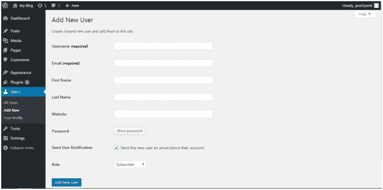
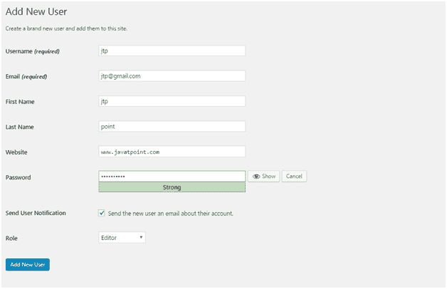
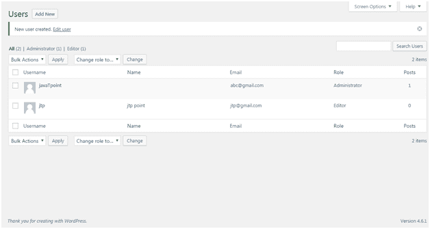
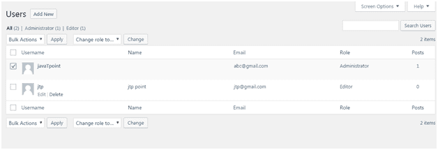
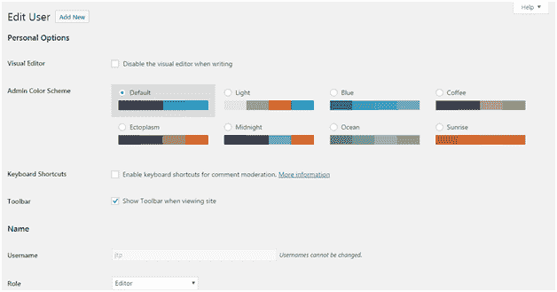
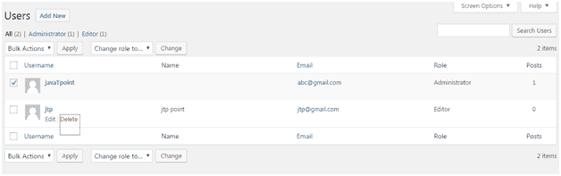
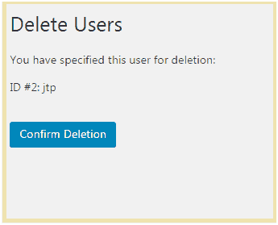
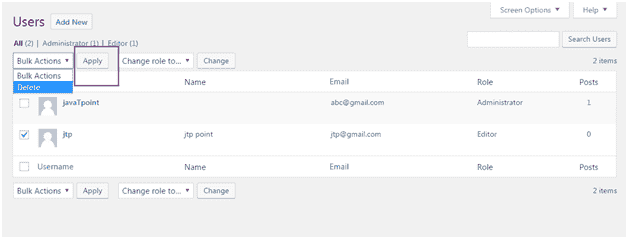

# Wordpress 用户

> 原文:[https://www.javatpoint.com/wordpress-users](https://www.javatpoint.com/wordpress-users)

* * *

## 用户角色

用户角色决定了 WordPress 网站用户的访问权限。

有五个用户角色:

*   **管理员-** 管理员对站点拥有完全权限。他们可以做任何事情，从添加帖子到删除其他用户的帖子。他们有权通过安装插件和添加主题来设计网站。他们甚至可以改变现有的用户？的密码，删除或添加它们。

管理员基本上是网站所有者，他们对自己的网站拥有完全的权限。

*   **编辑-** 他们处理网站的内容部分。他们甚至有权添加、删除、编辑或发布其他帖子。他们还可以添加、删除或编辑评论。
*   **作者-** 他们只以各种方式处理自己的帖子，如创建、删除、编辑、发布或上传图像和视频。他们可以删除他们的帖子，即使那是发表的。他们不能创建新的类别，他们必须从现有的类别中进行选择。虽然他们可以在帖子上添加标签。

他们不能添加或修改任何页面。

*   **投稿人-** 投稿人无权发布自己的帖子或页面。他们必须将帖子发送给管理员进行审查。而且一旦被审核，投稿人就不能再进一步编辑了。

他们甚至不能在自己的帖子中上传图像或视频文件。

*   **订阅者-** 订阅您网站的用户可以登录并更新他们的个人资料。他们有权在需要时更改密码。他们只能阅读帖子并在你的帖子上留下评论。
*   **从者-** 他们没有任何权利。他们只能阅读和评论你的帖子。他们只是在你的网站上注册，以便在你每次更新帖子时收到通知。
*   **查看者-** 他们只能阅读和评论一篇帖子。

* * *

## 如何添加用户

当用户注册到您的网站时，您会收到通知。因此，您可以根据自己的选择编辑用户的角色。

点击**用户>新增**

看上面的快照，填写所有细节，点击**添加新用户按钮。**

 

查看上面的快照，顶部会生成一条消息，说明创建了新用户。

* * *

## 如何编辑用户

编辑用户，进入**用户>所有用户**

看上面的快照，这是用户列表。

单击用户的编辑按钮。

看上面的快照，这里可以编辑和修改细节。

* * *

## 如何删除用户

点击**用户>所有用户，**用户列表将出现。

看上面的快照，选择**删除**选项。

看上面的快照，点击**确认删除**删除该用户。

还有一种删除用户的方法。点击**用户>所有用户**

查看上面的快照，通过点击复选框选择用户，从下拉列表中选择删除，然后点击**应用**按钮。

* * *