# 文字记者菜单

> 原文:[https://www.javatpoint.com/wordpress-menus](https://www.javatpoint.com/wordpress-menus)

菜单是呈现给用户的选项列表。它们大多被用作 WordPress 网站上的导航构建方法。通常，公共内容管理系统的安装之后是默认菜单，该菜单提供到顶层页面的链接。这些菜单可以在带有链接的网站顶部使用。它通常用作带有链接(如主页、电子邮件、联系人或页面)的水平菜单。

## 定义 WordPress 菜单

首先，我们需要定义一个 [WordPress](https://www.javatpoint.com/wordpress-tutorial) 菜单，然后再给它添加项目或者使用它。我们可以使用以下步骤来定义一个 WordPress 菜单。

**第一步:**首先登录 WordPress 仪表盘，点击**【外观】**菜单选项，如下图截图所示。

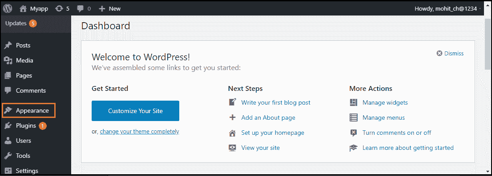

**第二步:****【外观】**菜单选项打开子菜单，我们选择**【菜单】**选项调出菜单编辑器。

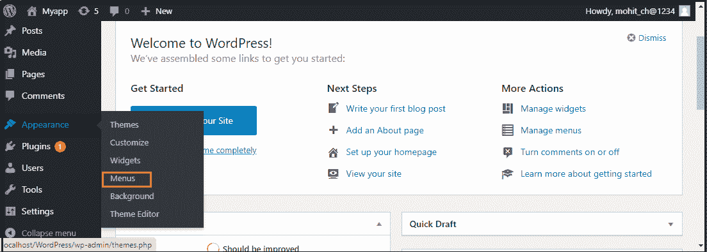

**第三步:**选择**【菜单】**选项后，选择页面顶部红色矩形框中显示的**【新建菜单】**选项。

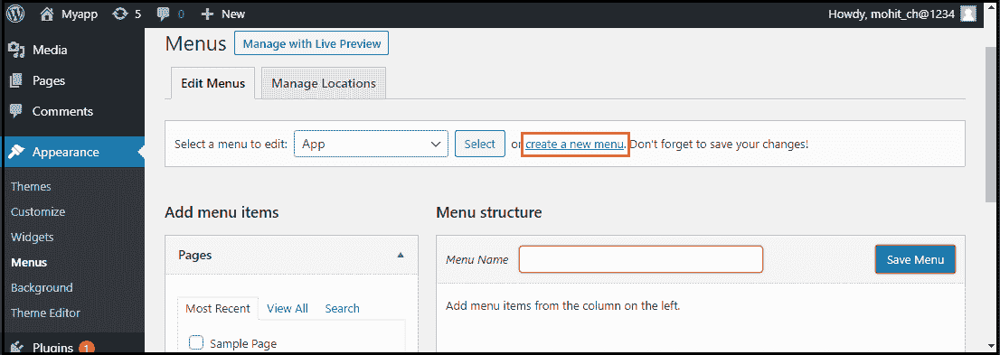

**第 4 步:**现在，在**“菜单名称”**框中输入名称创建新菜单。

**第五步:**之后，点击**“创建菜单”**按钮创建菜单。

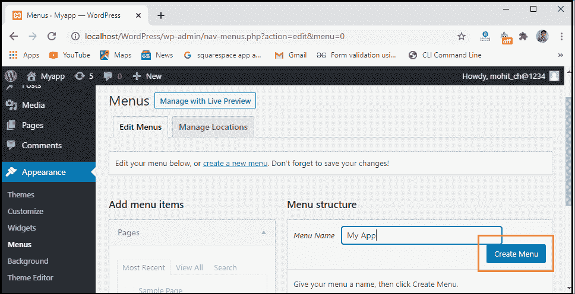

## 添加菜单项

在本节中，我们可以向菜单中添加几个链接类型选项，如页面、帖子、自定义链接和类别。以下是在菜单中添加项目的步骤。

**第一步:**首先，找到标题为 Pages 的窗格。

**第二步:**选择**“查看全部”**链接，查看 WordPress 网站上所有最近发布的页面列表。

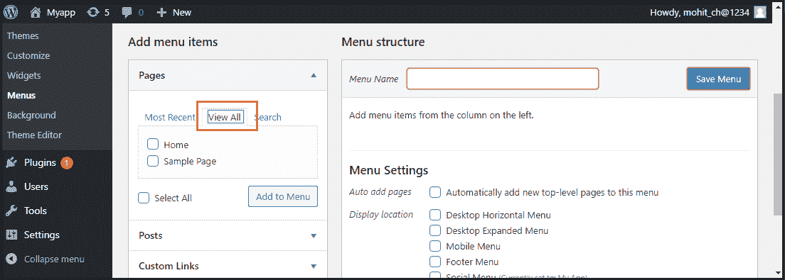

**第三步:**现在，我们可以通过点击每个页面标题对应的复选框来添加页面。

**第 4 步:**要将我们的选择添加到上一步创建的菜单中，请单击本页底部红色矩形框中显示的**“添加到菜单”**按钮。

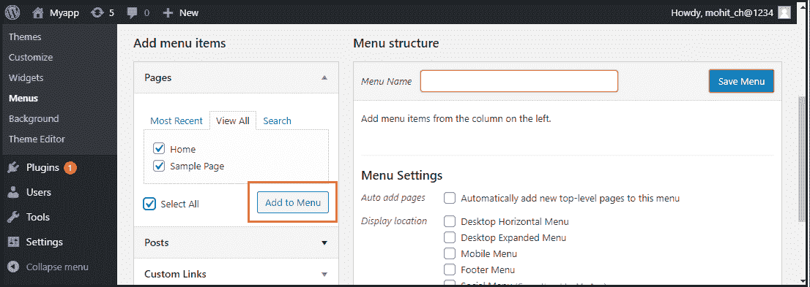

**第五步:**之后，点击**“保存菜单”**按钮。

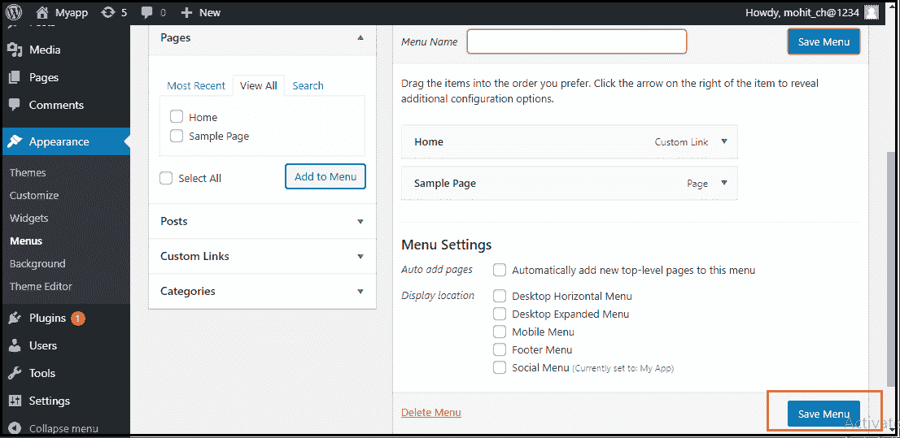

现在，新的自定义菜单已经保存在 WordPress 站点中。

## 删除菜单项

如果我们想从菜单中删除一个项目，我们可以使用以下步骤:

**第一步:**首先在菜单编辑器窗口中找到我们要删除的菜单项。

**第二步:**接下来，点击菜单项右上角的箭头图标。

**第三步:**点击**【删除】**选项。菜单项或框将立即被删除。

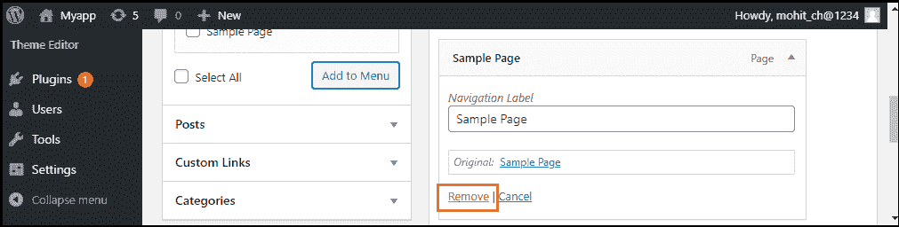

**第四步:**最后点击**【保存菜单】**按钮保存修改。

## 自定义菜单项

有各种定制菜单项可用；其中一些如下:

*   导航标签
*   标题属性
*   链接目标
*   链接关系
*   CSS 类
*   原创

### 导航标签

此字段定义自定义菜单上项目的标题。我们的访问者在访问我们的网站或博客时会看到这一点。

### 标题属性

此字段定义菜单项的备选文本**(“Alt”)**。当用户的鼠标悬停在菜单项上时，将显示该文本。

### 链接目标

它允许用户从下拉菜单中选择**“相同窗口或标签”**或**“新窗口或标签”**。

### 链接关系

它允许我们自动创建 XFN 功能，以展示我们是如何与作者或网站所有者的链接。

### CSS 类

它为菜单项提供可选的 [CSS 类](https://www.javatpoint.com/css-tutorial)。

### 原创

它提供了一个指向菜单项来源的链接，帮助我们查看页面或帖子。

## 创建多级菜单

WordPress 菜单编辑器帮助我们使用**“拖放”**界面构建多级菜单。我们可以上下拖动菜单项来更改您想要在 WordPress 菜单中出现的顺序。我们还可以向左或向右拖动菜单项，在菜单中构建子级。

如果我们想创建一个从属于另一个的菜单项，需要将**“子”**放在其**“父”**下，然后稍微向右拖动。如果我们想创建一个多级菜单，我们可以使用以下步骤:

**第一步:**首先，将光标移到**【孩子】**菜单项上。

**第二步:**按住鼠标左键向右拖动。

**第三步:**现在，松开鼠标键。

**第 4 步:**对每个子菜单项重复所有这些项目。

**步骤 5:** 要保存更改，点击菜单编辑器中的**“保存菜单”**按钮。

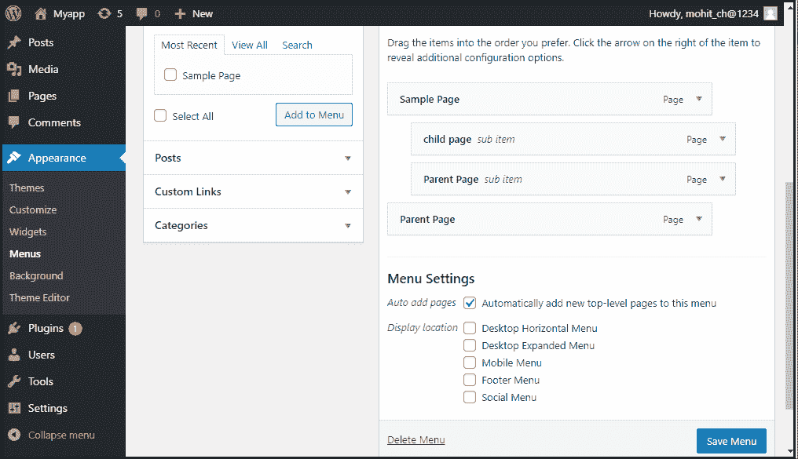

## 如何向菜单添加自定义链接

如果我们想添加 WordPress 菜单的自定义链接，我们需要遵循以下步骤:

**第一步:**首先，我们需要点击菜单左栏的自定义链接选项。每个自定义链接都需要一个**网址**和**链接文本**。

**第二步:**之后，点击**“添加到菜单”**按钮添加链接。

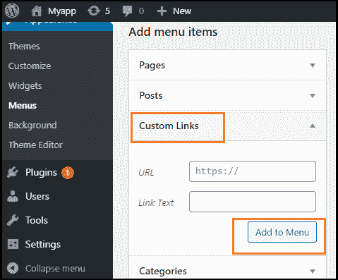

这些自定义链接在我们需要链接到左栏中未列出的页面(如外部网站)时非常有用。

## 如何链接到类别页面或标签

如果我们想将帖子类别或标签添加到我们的菜单中，我们可以使用以下步骤:

**第一步:**首先，点击左侧栏的类别标签。

**步骤 2:** 现在，选择菜单中应该出现的一个选项卡。

**第三步:**之后，点击**“添加到菜单”**按钮，添加类别或标签。

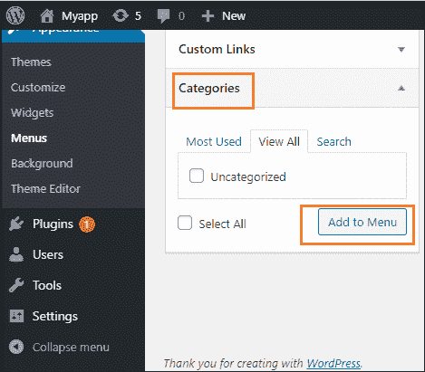

## 如何添加社交菜单

为我们的社交账户创建一个菜单比创建一个常规菜单容易得多。要在 WordPress 菜单编辑器中创建社交帐户，我们可以使用以下步骤:

**第一步:**首先，点击**“新建菜单”**链接。

**第二步:**现在，输入菜单名称，点击**创建菜单**。

**第三步:**接下来，检查**“社交链接”**菜单框的底部，并使用自定义链接选项卡向社交媒体菜单添加链接。

**第四步:**完成所有这些步骤后，点击**“添加到菜单”**按钮添加社交菜单。

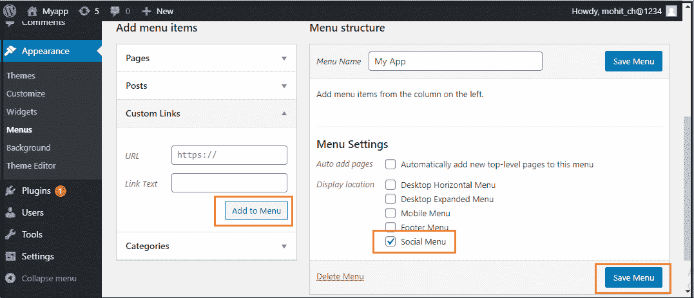

* * *