# WordPress 媒体库

> 原文：<https://www.javatpoint.com/wordpress-media-library>

WordPress 媒体库包含**图像、视频、音频、**和**文件**，在撰写 WordPress 页面或帖子时可以将其包含在内容中。我们可以在媒体库看到很多与媒体相关的东西，比如**添加、删除、**和**编辑**。在本主题中，我们将讨论 WordPress 媒体库的不同阶段。以下是了解 [WordPress](https://www.javatpoint.com/wordpress-tutorial) 媒体库的步骤。

**第一步:**首先进入 [**WordPress 仪表盘**](https://www.javatpoint.com/wordpress-dashboard) 选择**【媒体】**选项，然后点击**【库】**选项。

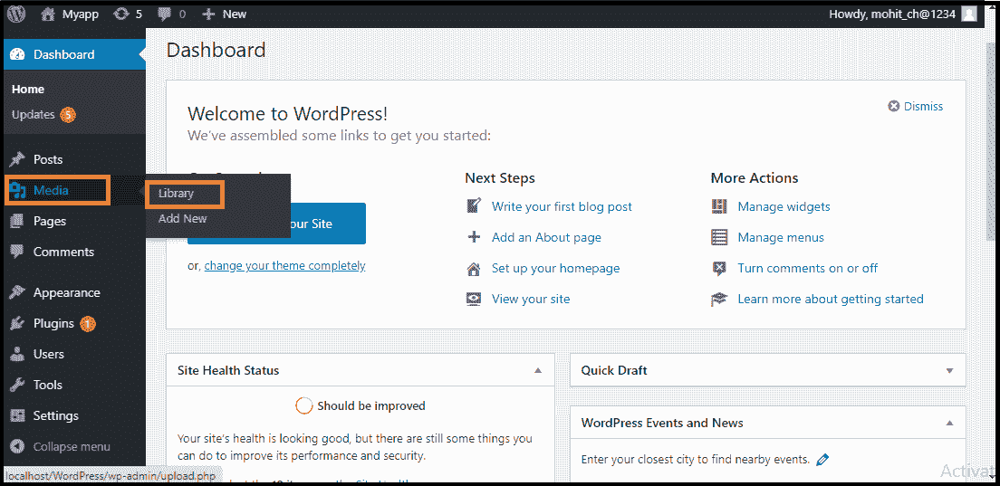

**第二步:**当我们点击库选项时，我们可以看到各种媒体文件，如图像、视频和音频。如果我们想添加新的项目，点击**“添加新的”**按钮。

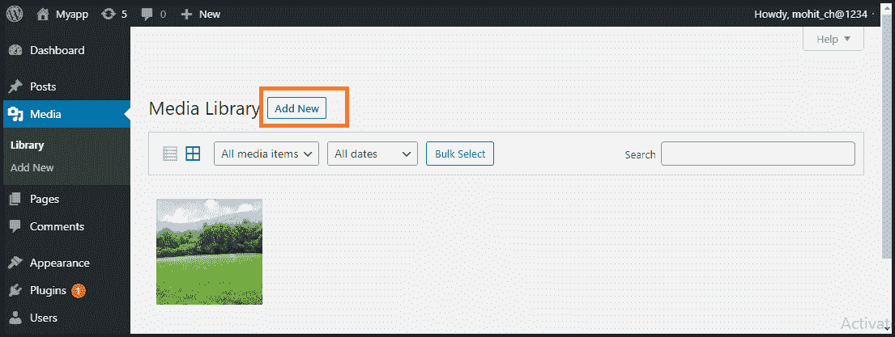

**第三步:**我们可以在媒体库看到一个菜单栏，由**列表视图、网格视图、过滤图像和视频、搜索框**等很多东西组成，如下图截图所示

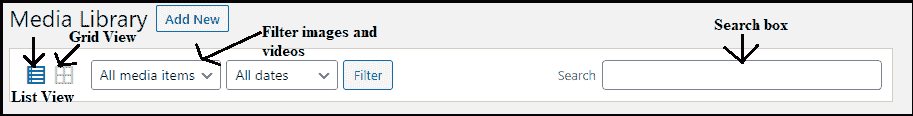

媒体库栏中有各种选项卡，如下所示:

1.  **列表视图:**以列表形式显示媒体文件。
2.  **网格视图:**有助于以网格格式显示所有媒体文件。
3.  **过滤图像和视频:**过滤媒体库中的图像和视频。
4.  **搜索框:**将文件名插入搜索框有助于查找媒体文件。

## 添加媒体文件

现在，我们将知道如何在 WordPress 中添加媒体文件。WordPress 允许我们添加各种媒体文件，如**图像、视频、**和**音频**。

以下是在 WordPress 中添加媒体文件的步骤。

**第一步:**首先进入 **WordPress 仪表盘**选择**【媒体】**选项，然后点击**【新增】**选项。

**第二步:**点击**【新增】**选项后，点击**【选择文件】**选项，从我们本地存储中选择文件，如下图截图所示。

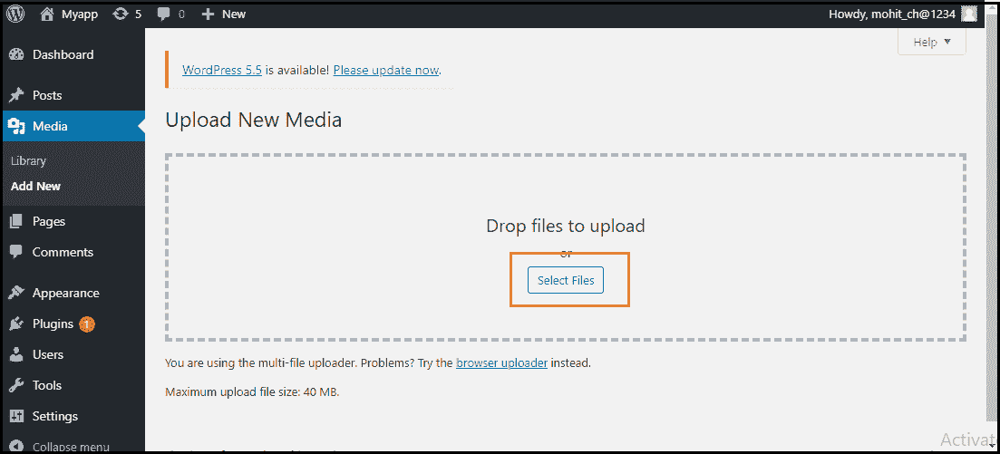

**第三步:**点击**选择文件**后，通过选择添加媒体文件，然后点击**打开**按钮，如下图截图所示。

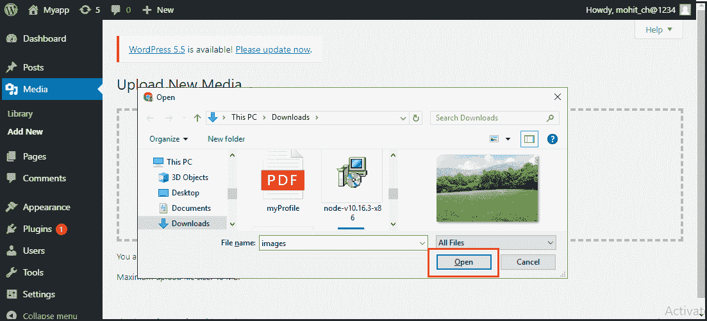

**第四步:**现在，我们将看到我们在列表中添加的媒体文件列表。

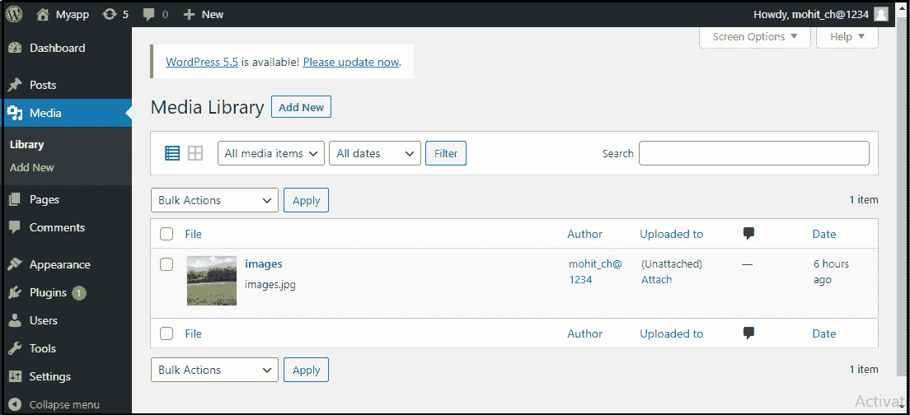

## 已插入媒体文件

我们将知道如何将媒体文件插入 [WordPress 页面或发布](https://www.javatpoint.com/wordpress-posts-vs-pages)。媒体文件可以从 [WordPress 页面](https://www.javatpoint.com/wordpress-pages)或 [WordPress 帖子](https://www.javatpoint.com/wordpress-posts)中的**媒体库、网址**或**本地存储**中插入。以下是插入媒体文件的步骤:

**第一步:**首先进入 **WordPress 仪表盘**点击**【帖子】**然后点击**【新增】**选项将媒体文件插入 WordPress。

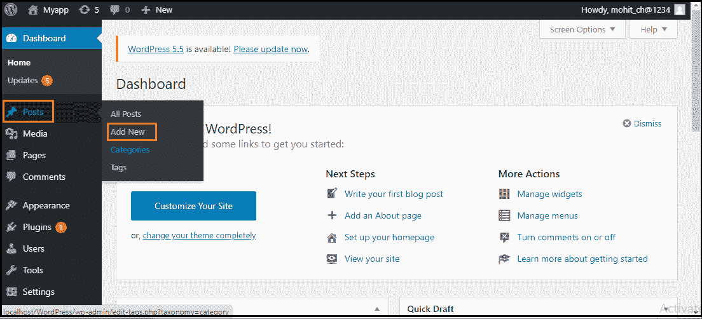

**第二步:**点击**【新增】**选项后，点击**【新增媒体】**按钮。

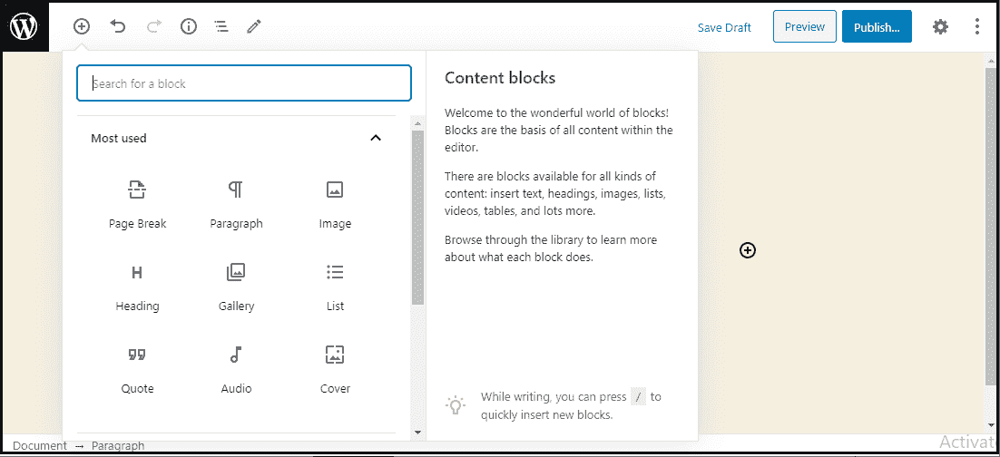

**第三步:**现在，我们可以从库区选择**媒体文件**。

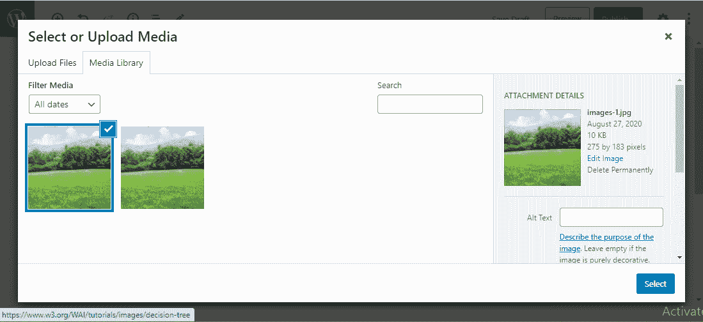

所选媒体文件的所有信息将显示在屏幕右侧的附件详细信息中。

**第四步:**现在，点击**“选择”**按钮，图像将被插入网站的页面或帖子中。

我们也可以通过单击上传文件按钮直接从设备上传文件。只需点击**“选择”**按钮。

## 编辑媒体文件

在这里，我们将了解如何在 WordPress 中**编辑媒体文件**。我们可以处理存储在媒体库中的媒体文件的相关信息。以下是在 WordPress 中编辑媒体文件的步骤。

**第一步:**首先进入 **WordPress 仪表盘**选择**【媒体】**选项，然后点击**【库】**选项。之后，点击**媒体文件名**或编辑链接。

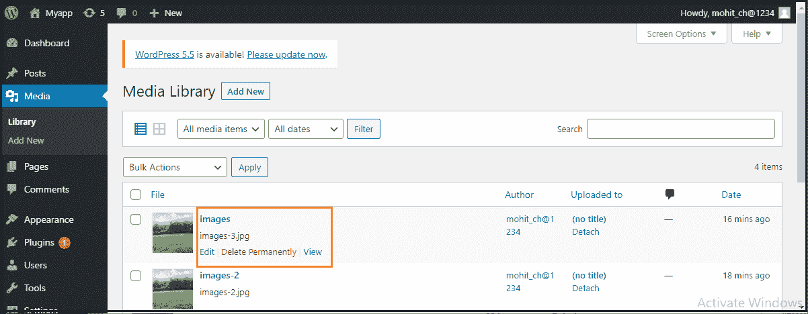

**第二步:**在这里，我们会看到**媒体文件**列表。现在，我们可以选择要编辑的图像。

**第三步:**最后，我们可以看到媒体页面，网站上显示了一些选项。选项如下:

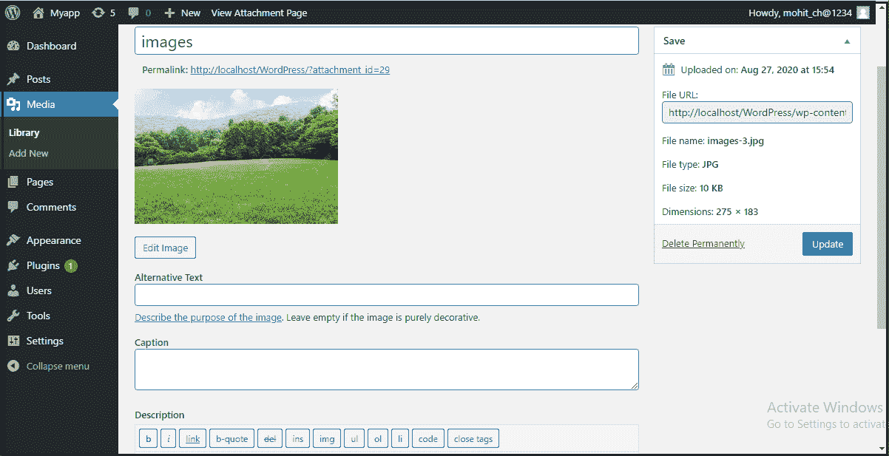

**URL:** 它帮助我们从媒体文件中只读取一个链接。

**标题:**显示媒体名称。如果主题和插件是为显示而设计的，标题通常会出现在图库和附件页面中。

**永久链接:**是媒体附件页面[网址](https://www.javatpoint.com/url-full-form)。它也是查看媒体文件附件页面的链接。

**编辑图像按钮:**它有助于编辑图像的位置，如逆时针旋转、顺时针旋转、垂直翻转、水平翻转、裁剪、翻转等。

**说明:**它允许我们提供媒体文件的详细说明。

**替代文本:**图像的替代文本用于描述媒体，也用于图像的可用性。

**描述:**允许我们解释媒体文件。

**永久删除:**帮助我们永久删除文件。

**步骤 4:** 完成所有这些步骤后，点击**更新**按钮保存更改。

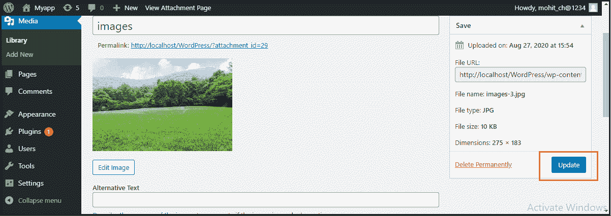

* * *