# 如何安装 WordPress 主题

> 原文：<https://www.javatpoint.com/how-to-install-wordpress-themes>

对于主题安装，首先你需要选择一个免费或高级的主题。有很多网站可以下载主题。主题将以 zip 格式下载。下一个过程是安装过程。安装需要遵循一些步骤。

有两种方法可以安装主题:

*   使用管理主题搜索安装 WordPress
*   使用上传方法安装 WordPress

* * *

## 使用管理主题搜索安装 WordPress

要从**WordPress.org**目录安装免费主题，登录您的账户，点击**外观>主题**。

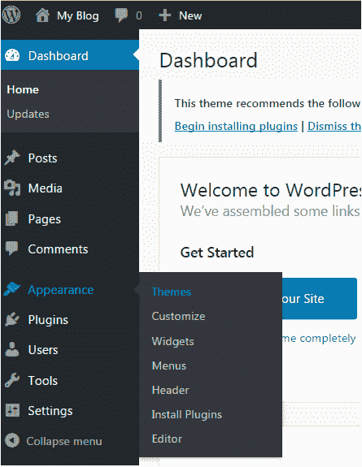

看上面的快照，点击主题选项。下一页将出现在你面前。

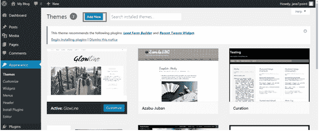

点击添加新按钮**添加新主题**。

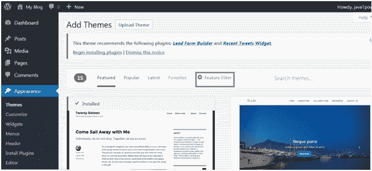

看上面的快照，这里你会看到一个**特征过滤器的选项。**

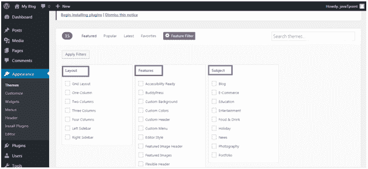

看上面的快照，在这里你可以通过应用你对布局、特征和主题的选择来过滤你对主题的搜索。

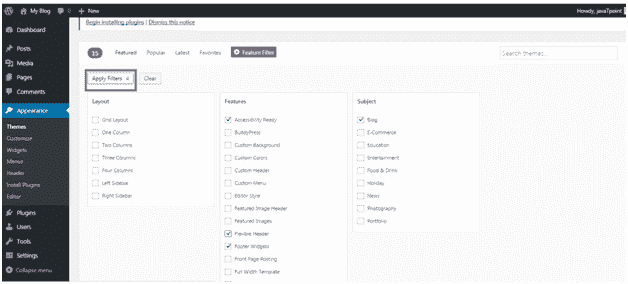

看上面的快照，我们已经选择了 4 个过滤器标准，现在点击按钮**应用过滤器 4** 应用过滤器。

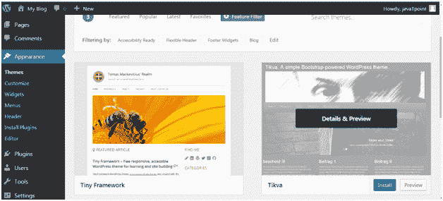

看上面的快照，选择一个主题，将鼠标放在上面。点击**安装**按钮。

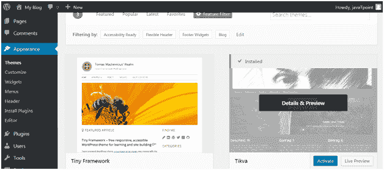

看上面的快照，我们的主题安装好了。要激活它，点击**激活**按钮。您已经成功激活了您的 WordPress 主题。

* * *

## 使用上传方法安装 WordPress

上述方法只是为了安装只在 WordPress 目录中可用的免费主题。但是如果你想安装高级主题，那么你必须选择这个选项，包括以下步骤。这种方法可以用来安装高级以及免费主题。

* * *

## 下载主题

WordPress 网站本身就有大量的主题。WordPress 网站上的所有主题都经过了全面的检查和测试。如果你对这些主题不满意，你可以去其他网站下载一个主题。请确保您选择了受信任的站点来下载主题，因为任何人都可以为 WordPress 创建主题。

主题以 zip 格式下载。

前往**wordpress.org**站点。

看上面的快照，这是站点。点击**主题**。您将被引导至下一页。

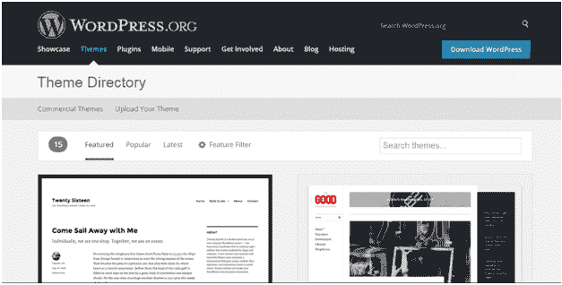

看看上面的快照，在这个页面上你会有很多选择主题的选项。

选择一个主题，然后点击**下载**按钮。

主题将以 zip 格式下载到您的系统中。

* * *

## 安装主题

要安装下载的主题，你必须登录你的 WordPress，点击**外观>主题。**

现在点击**添加新的**按钮，下面的屏幕将出现在你面前。

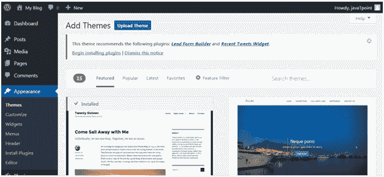

看上面的快照，点击**上传主题**按钮。

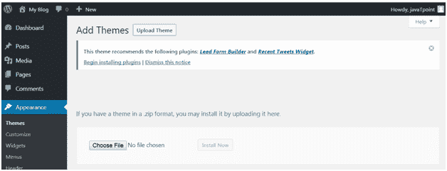

看上面的快照，选择你安装的文件，点击**立即安装。**

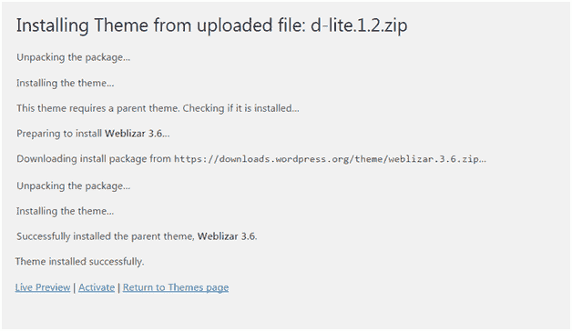

看上面的快照，一旦你的主题安装好了，你会得到一条成功安装的消息。现在点击**激活**按钮，你的主题就成功安装了。

现在可以根据自己的选择进行定制。