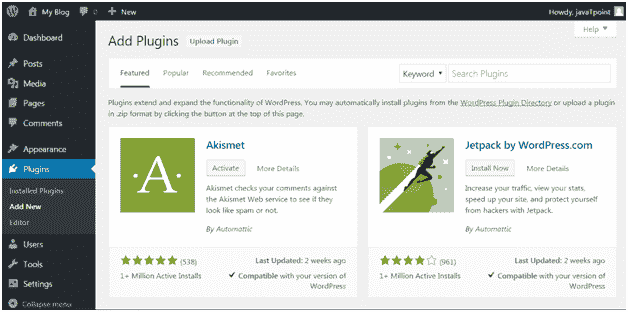
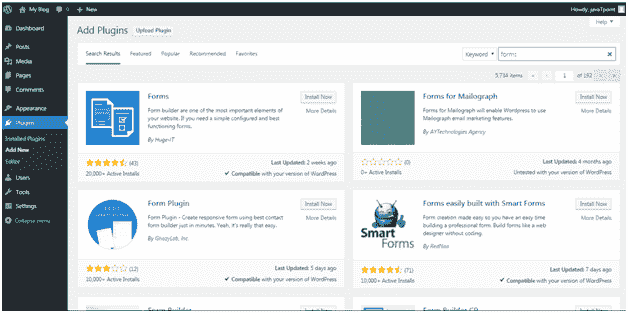
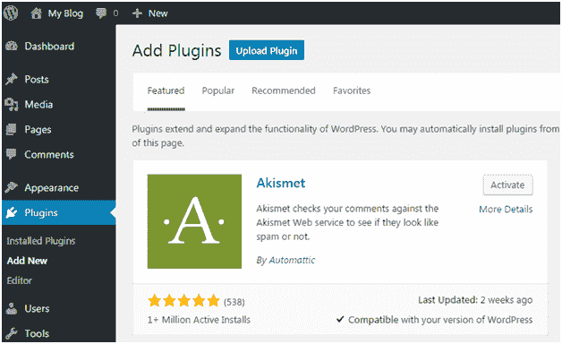
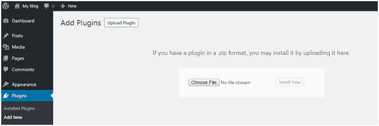
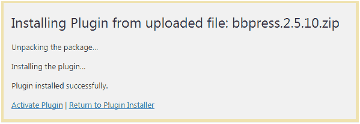

# 如何安装 WordPress 插件

> 原文：<https://www.javatpoint.com/how-to-install-wordpress-plugins>

安装插件将为您的站点提供额外的功能。要安装一个插件，你只需要把插件文件放到你的 wordpress 文件中。安装后，您可以激活或停用它。

有三种方法可以安装插件。

*   使用搜索安装插件
*   使用上传安装插件
*   使用文件传输协议手动安装插件

在这里，我们将讨论所有三种方法。

* * *

## 使用搜索安装插件

这个方法只适用于免费插件，因为搜索只适用于 WordPress 目录。

登录你的 WordPress，进入**插件>新增。**

看上面的快照，这个页面就会显示出来。在这里的搜索选项中，你可以给一个插件名称你想要的函数名。

例如，我们正在搜索表单**插件。**

看上面的快照，与我们的搜索相关的结果显示有一个匹配插件的列表。我们可以选择一个符合我们标准的插件。

选择插件后，点击**立即安装**按钮。您的插件将被安装，但要激活它，您必须点击**激活**按钮。

* * *

## 使用上传安装插件

从这个方法付费插件也可以安装。

首先，从源代码下载一个 zip 格式的插件文件。现在转到**插件>添加新页面。**

看上面的快照，点击**上传插件**。它会把你带到下一页。

看上面的快照，这里你要选择下载的插件文件，点击**立即安装。**

看上面的快照，插件已经成功安装显示一条消息。要激活这个插件，你需要激活它。