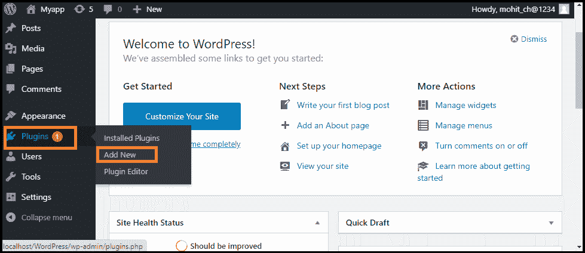
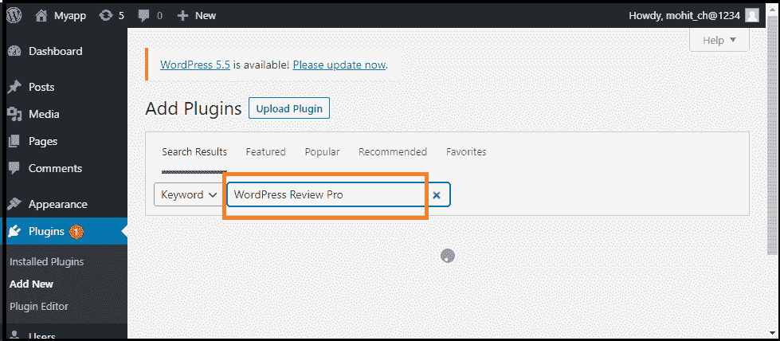
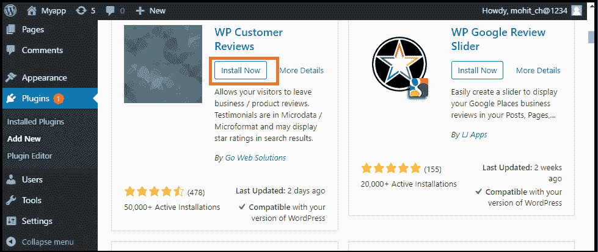

# 评论插件

> 原文:[https://www.javatpoint.com/wordpress-review-plugin](https://www.javatpoint.com/wordpress-review-plugin)

当我们在网站上写产品评论时，评论插件帮助我们使内容更有吸引力和搜索引擎优化友好。WordPress 中有几种类型的评论插件。我们可以选择其中的任何一个，并在我们的网站上使用它。

在本主题中，我们将讨论可以在 [WordPress](https://www.javatpoint.com/wordpress-tutorial) 网站上使用的不同 WordPress Review 插件。

## 我们为什么要使用 WordPress 评论插件？

当人们想在网上购物时，他们会搜索商品评论来做出正确的购买决定。人们在选择或购买任何网上购物项目之前都会在网上查看产品的评级。

所以，展示可能对网站有益的评论是非常重要的。它有助于用户为网站带来更多的访问者，也有助于做出购买某样东西的决定。最重要的是，评论插件帮助我们收集改进产品和网站的反馈。这种工具可以帮助我们通过模式标记提高网站在搜索引擎中的排名。

使用评论插件，我们可以对网站上的特定项目进行评分，这些信息为搜索引擎提供了更多的上下文，使其变得更加 [SEO](https://www.javatpoint.com/seo-tutorial) 友好。

通常，WordPress 评论可以执行两个基本功能:

1.  创建一个独特的评论框，为项目提供清晰的评论。
2.  提供一个丰富的片段，以提高网站在搜索引擎中的排名。

## 装置

插件安装非常容易。我们可以使用以下步骤在 WordPress 中直接安装这些[插件:](https://www.javatpoint.com/wordpress-plugins)

**第一步:**首先，进入**“WordPress 仪表盘”**。

**第二步:**之后，访问**【插件】**菜单，点击**【新增】**选项。

**第三步:**现在，进入搜索框，输入我们要安装的插件名称，然后点击**“搜索插件”**按钮。

**第四步:**找到插件后，点击**“立即安装”**按钮。

## 最佳新闻评论插件

有几个 WordPress 评论插件；其中一些如下:

1.  专业评论
2.  客户评论
3.  网站评论
4.  评论者
5.  WordPress 产品评论精简版

### 专业评论

WordPress 评论专业版是 WordPress 上我们现在可以获得的重要评论插件之一。重要的是，它支持各种丰富的片段，适合各种各样的主题，包括书籍、绘画和电影。

除了 16 个默认设计模板，我们还有一系列定制选项。分析框有无限的颜色选择和 5 个评级系统选项，如星、点、圆、竖起大拇指和百分比。它允许网站与**脸书、Yelp、谷歌、**等社交媒体平台整合，增加评级可信度。

起价 **$67** ，在客户支持下我们可以获得所有这些功能 **24/7** 。

### 客户评论

许多网站目前正在搜索用户生成的反馈，包括**谷歌位置**和**谷歌本地搜索**。WordPress 客户评论帮助我们在博客上建立一个专门的页面来收集**商业/服务**的客户评价或撰写产品评论。我们可以自由修改评论设计，并在评论插件的单独文件中显示管理员的回复。

它也是轻量级的，支持自定义主题插件。这个插件的页面加载速度不会受到影响，因为它与缓存插件配合良好。可以免费安装 WordPress 客户评论。

### 网站评论

网站评论帮助访问者在 1-5 星级之间提交他们对网站的评论。它还提供了带有完整文档的短代码、块和小部件。我们可以添加总是首先显示的最佳评论，并要求在发布新的评论提交之前获得批准。它还允许访问者登录写评论，提交新提交的自定义更新，等等。

### 评论者

它允许我们快速轻松地添加复选框和比较表。我们所要做的就是设置标题，添加号码，然后我们就可以出发了。它可以帮助我们与观众建立更好的关系。

当我们使用它时，我们会在给出评论后通过他们的名字和电子邮件获得用户详细信息。之后，我们可以在各种可定制的小部件上使用他们的评分来显示访问者的反馈有多重要。它通过启用 **Google Recaptcha** 和**管理审核**为我们提供垃圾邮件防护。

它的价格为 **$28** ，通过支付额外费用 **$8.63** ，可以选择延长一年的客户支持。

### WordPress 产品评论精简版

这是 WordPress 网站最好的评论插件之一。它重量轻，包装安全，具有所有必要的功能。当我们想要创建一个帖子时，只需进入设置 WordPress Review Lite 并点击**“这个帖子是评论吗？”**选项，快速使其成为评论页面。接下来，我们需要给这个项目加上一个分数，并给出我们的意见。然后，在评论下面，我们可以很容易地插入购买按钮进行转换。它帮助我们改变元素的颜色，包括等级和利弊。

如果我们想与**亚马逊整合，上传一个定制的评论图标，或者创建一个对照表**，我们必须支付每年从**59 美元**开始的高级版本。

* * *