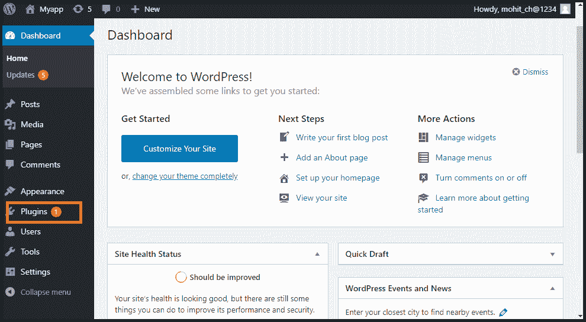
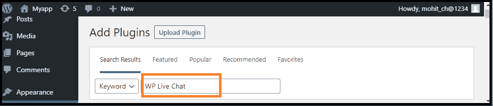
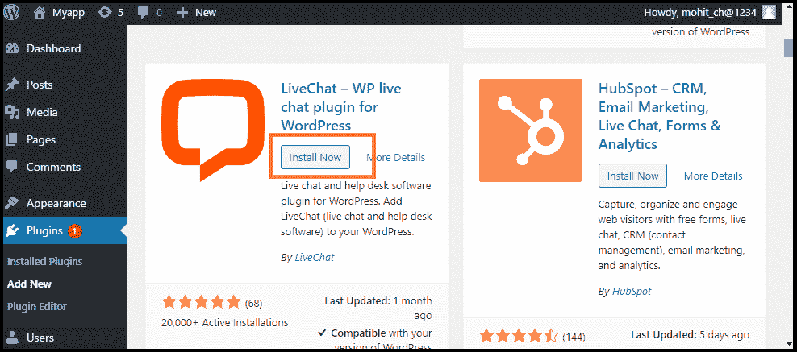
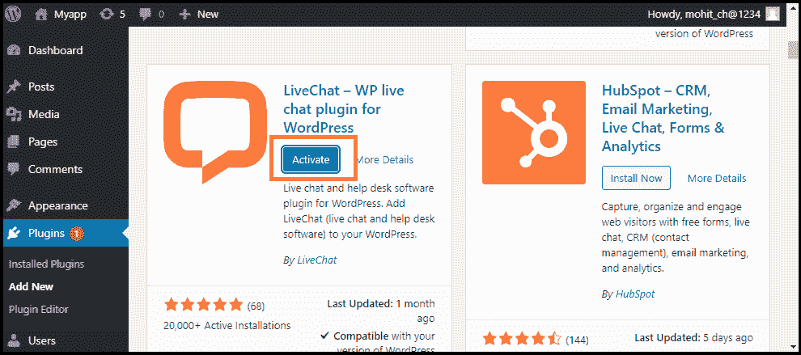
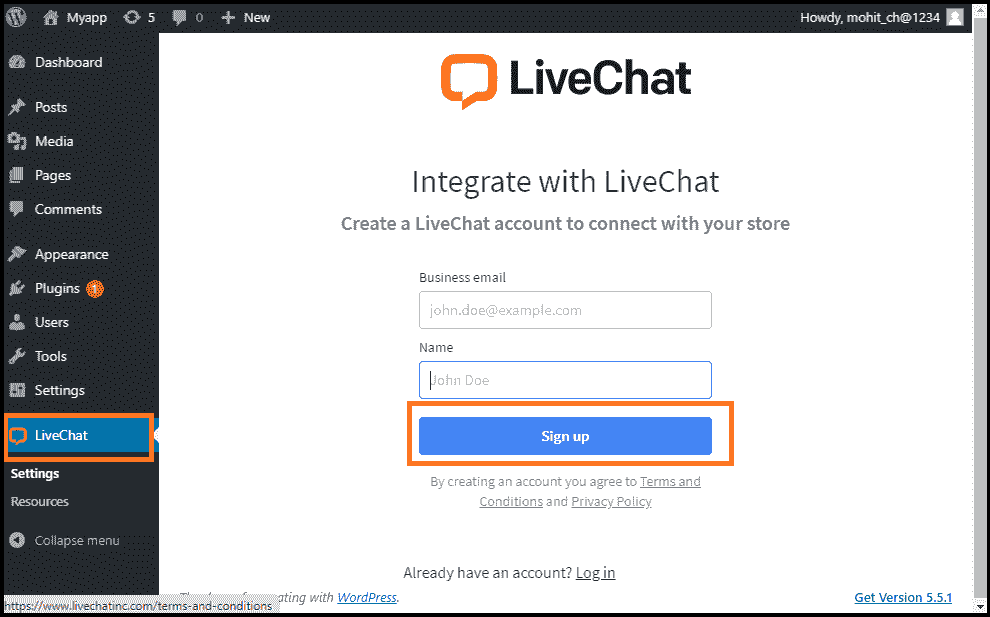

# 现场聊天

> 原文:[https://www.javatpoint.com/wordpress-live-chat-plugin](https://www.javatpoint.com/wordpress-live-chat-plugin)

WordPress 实时聊天插件在网站底部增加了一个实时聊天按钮，帮助访问者与我们实时聊天。直播聊天技术是各种规模公司的理想选择，可以让他们完成更多的销售，提高客户满意度。

如果我们想在我们的 [WordPress 网站](https://www.javatpoint.com/wordpress-tutorial)轻松添加实时聊天支持，需要使用实时聊天插件。这个插件通过即时解决客户问题来提供良好的客户服务。实时聊天插件帮助我们增加销售额，并与客户建立牢固的关系。

WordPress 实时聊天插件是为与任何网站开发人员一起工作而构建的，例如 SiteOrigin 的页面生成器、Beaver Builder 的 WordPress 页面生成器、Elementor 页面生成器等。

它与大多数 WordPress 主题或原型配合良好，我们可以不做任何修改就使用它。一个 liveChat 插件与几个大型电子商务网站合作，如 WooCommerce、BigCommerce 和 Ecwid 电商购物车。

## 安装实时聊天插件

如果我们想使用 WordPress 网站中的实时聊天[插件，我们需要安装它。使用以下步骤安装实时聊天插件:](https://www.javatpoint.com/wordpress-plugins)

**第一步:**首先，进入 WordPress 仪表盘，点击**“插件”**菜单。

**第二步:**点击**【新增】**按钮，在搜索框中搜索**【直播聊天】**插件，然后点击**【立即安装】**按钮。

**第三步:**安装成功后，通过 WordPress 插件菜单激活**“实时聊天”**插件。

**第四步:**现在，点击出现在屏幕左侧的**【直播聊天】**菜单。

**步骤 5:** 现在，在 **LiveChat** 中创建新账户。如果我们已经有了账户，只需**登录**。

## 实时聊天插件的功能

以下是实时聊天插件的功能:

1.  **在多个网站上聊天:**它允许我们将所有 WordPress 网站连接到一个 LiveChat 帐户，并在所有页面上保持一致的聊天小部件。
2.  **通过直播聊天链接直接聊天:**利用该功能，可以通过发送网站、电子邮件和社交媒体的链接来邀请客户聊天。
3.  **聊天小工具定制:**它改进了聊天应用，增加了眼球捕捉器、聊天按钮等。选择一个主题，显示您的徽标，选择一种颜色，并向聊天小部件添加更多修改。
4.  **文件上传支持:**为了更好的了解客户，我们可以通过 Live Chat 小部件收发文件。
5.  **支持和代理评级:**该功能使我们能够在实时聊天期间或之后对对话进行评级，从而更好地了解客户满意度。
6.  **聊天调查:**在实时聊天窗口中添加调查，并在每次对话的开始和结束时收集客户信息和反馈。
7.  **多渠道沟通:**通过在线聊天应用、WhatsApp、苹果商务聊天等多种渠道提供快速客户支持。
8.  **报告和分析:**集成的实时聊天和票证指标优化了与客户的沟通。通过应用编程接口将收集的数据以 CSV 格式报告并导出。

## 实时聊天插件的优势

以下是实时聊天插件的优势:

1.  它为客户解决了即时问题。到目前为止，最快最简单的客户服务平台是直播。
2.  它增加了销售和与客户的沟通。通过实时解决客户关心的问题，简化采购流程。
3.  通过在我们的 WordPress 商店提供实时聊天，更有效地管理商品和产品，保持强大的客户关系，并领先于我们的竞争对手。
4.  它为客人提供了一个免费和直接的寻求帮助的机会，从而提供了方便的客户服务。

## 最佳实时聊天插件

WordPress 中有各种各样的实时聊天插件。现在，我们将讨论最好的 WordPress 实时聊天插件，如下所示:

1.  **聊天机器人**
2.  **正在发送**
3.  **LiveAgent**
4.  **新鲜 hchat**

### 聊天机器人

ChatBot 是实时聊天软件的未来，它可以帮助我们全天候与客户沟通。小企业很容易使用人工智能聊天机器人来发展业务。它有一个简单的拖放界面，我们可以用它来构建我们的聊天机器人。聊天机器人也有各种现成的不同行业的模板，这使得创建适合我们业务需求的定制对话场景变得容易。

它允许我们向虚拟助手添加网站、消息应用程序、脸书页面。如果用户想和真人互动，我们可以轻松转发给电话支持、客户支持代理、Facebook Messenger 等。

### 你是谁

它提供了一个功能强大、用户友好的实时聊天软件。聊天框可以很容易地设置，并使用一个 WordPress 插件将其与网站连接。它允许我们通过实时聊天回答客户最后一分钟的问题，从而将网站访问者转化为客户。Sendinblue 营销自动化与聊天集成，使我们能够捕捉更多的线索。该插件具有各种功能，如细分，脸书广告重定向，内置电子邮件营销集成，完全营销自动化等。提供完整的营销套餐，包括 CRM、登陆页面、[短信](https://www.javatpoint.com/sms-full-form)和邮件营销等。它的工具包帮助我们将用户转化为付费客户。

### LiveAgent

它是 WordPress Live chat 必不可少的插件之一，提供各种软件，包括实时聊天、呼叫中心、电子邮件票务、时间跟踪等。它提供了与 WordPress 和其他网站构建者的集成。此外，它们还与客户关系管理系统、电子邮件营销服务等相集成。

### 新鲜聊天

它是流行的 WordPress 实时聊天插件之一。它被设计成一个对话和信使应用程序。它帮助我们使用代理或人工智能驱动的机器人与客户开始实时聊天。它提供了各种功能，包括实时简介、应用内广告和用于自动对话的客户时间表视图。我们可以使用标签、桌面通知、智能插头、录音响应和私人笔记来提高工作效率。

* * *