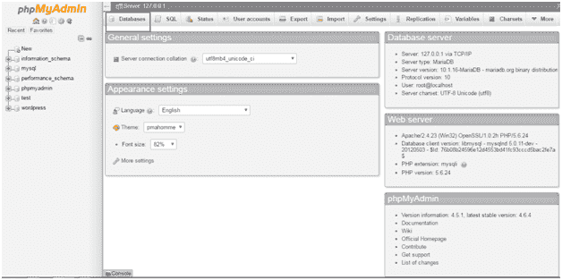
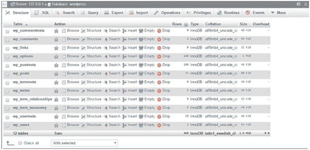
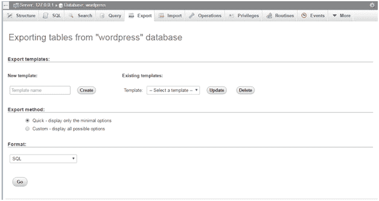
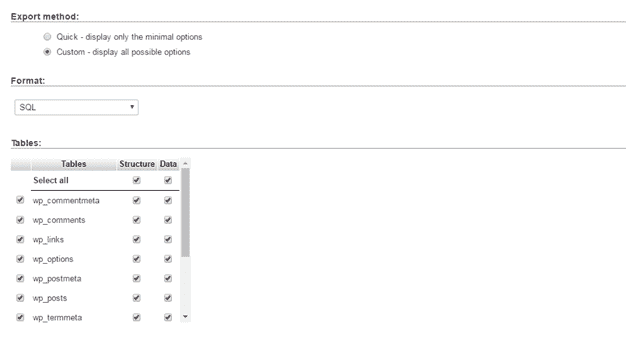
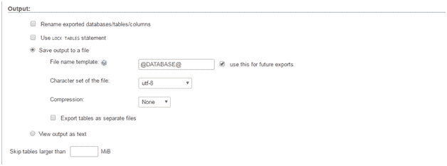

# 如何备份 WordPress 网站

> 原文:[https://www.javatpoint.com/how-to-backup-wordpress-site](https://www.javatpoint.com/how-to-backup-wordpress-site)

备份只是原始站点的副本，如果出现任何问题，您可以通过它恢复原始站点。为安全起见保留备份总是明智的。

一个网站通常由两部分组成。一个是所有安装的主题/插件、媒体等，另一个是数据库，它存储你所有的博客、帖子和评论等。没有文件就没有网站，没有数据库就没有数据。因此两者都很重要，需要备份。

* * *

## 为什么备份很重要

备份允许您在出现问题或网站崩溃时取回您的网站。这可能有很多原因，如外部攻击、黑客攻击、服务器关闭等。

从数据到你网站上的所有帖子，你可能会失去一切。为了避免这种情况，备份很重要。

保护您的备份也是一个重要问题。确保定期或以一定的时间间隔更新你的插件和主题。使用强用户名和密码。数据库名称也应该不常见。

* * *

## 备份 WordPress 根文件

你的 WordPress 目录中有很多文件。这些文件可以从 wordpress.org 网站下载回来。有些可以找回，但有些不能。

**wp-content** 目录包含所有已安装的主题和插件，包括您在网站上上传的所有媒体文件，如图像、音频或视频文件。因此，它使其人员和独特。

**wp-config.php**文件由您的数据库和其他人员选项组成，这也使它成为一个独特的文件。

以上两个文件都不能被其他默认文件替换，因此需要备份。

* * *

## 备份网站

大多数主机允许备份整个服务器，包括您的站点，但是这个过程需要一些恢复时间。检查你的主机他们提供什么程序和服务。

使用 FTP 客户端，您可以复制系统上的文件并压缩它们。为了安全起见，最好制作三到四份备份。

* * *

## 备份数据库

在数据库中，你所有的文章、媒体文件、评论和元数据都将被存储。它还包含用户信息和所有插件设置。所有这些信息都是个人的和独特的，如果你失去了它们，它们将永远消失。

数据库中的整个 WordPress 表将从前缀 **wp_ 开始。**所以会很容易辨认。

*   首先，在本地主机上转到 phpMyAdmin。

查看上面的快照，单击数据库以访问所有数据库。

*   选择你的 WordPress 数据库(你在安装 WordPress 时创建的)。
*   您将从 WordPress 数据库中看到许多表格。

看上面的快照，上面所有的表都会在你的 WordPress 数据库中。如果你有更多的表格，那么它们可能是反垃圾邮件插件或静态插件。

*   单击导出。

看上面的快照，导出有两种方式，**快速和自定义。**

**快速**在数据库小的时候使用。

**自定义**在数据库较大时使用。

我们选择**定制。**

*   选择“自定义”后，将出现一个表格。选择所有表格。

*   现在来到输出部分。将出现以下屏幕。

看上面的快照，选择**保存输出到文件**和**无**进行压缩。

*   从**格式**下拉菜单中选择 **SQL** 。
*   选中“添加拖放表”。这对于重写现有表很有用。
*   选中“如果不存在”。当表已经存在时，它可以防止错误。
*   现在点击**开始。**您的数据将保存在您的系统中。

将这些文件存放在不同的地方进行备份。