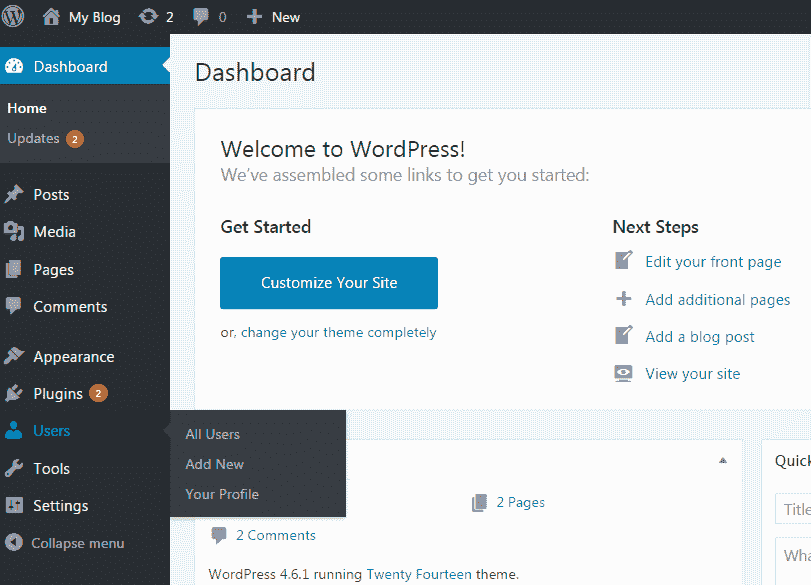
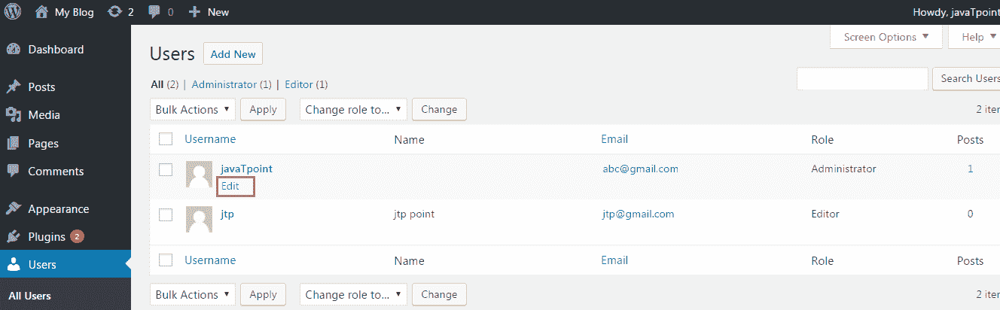
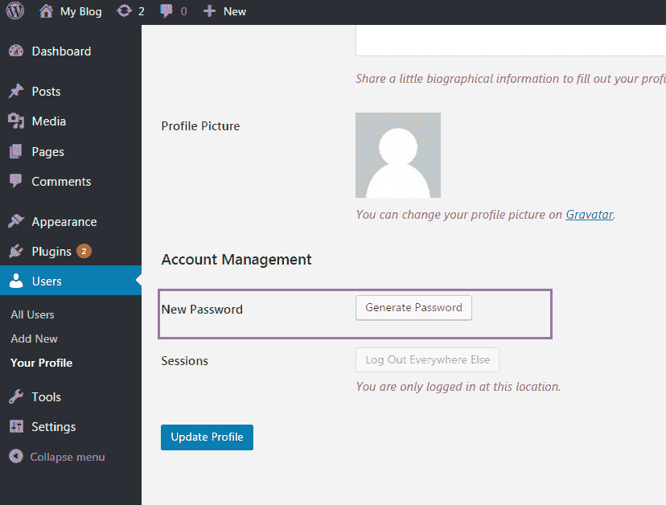
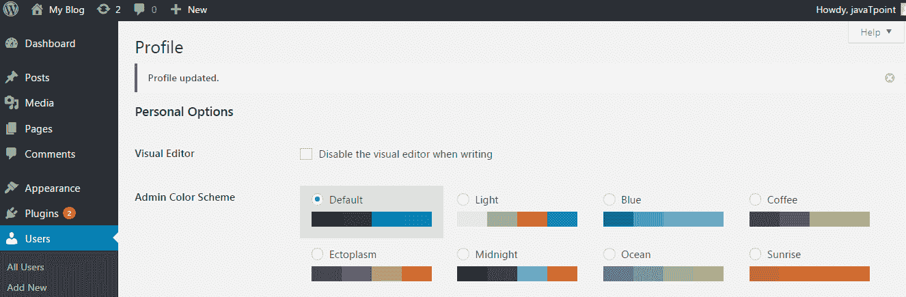
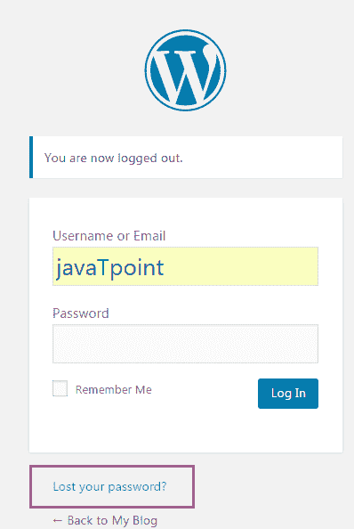
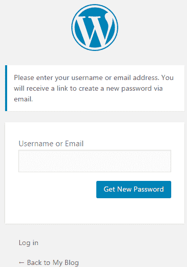
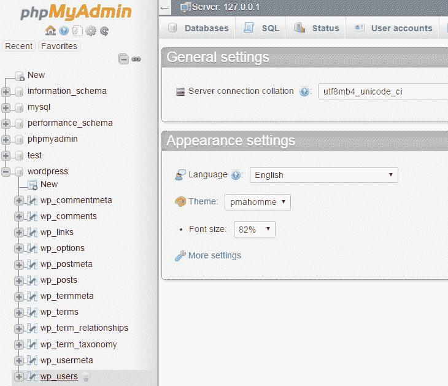
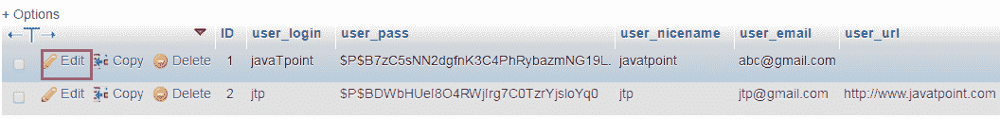
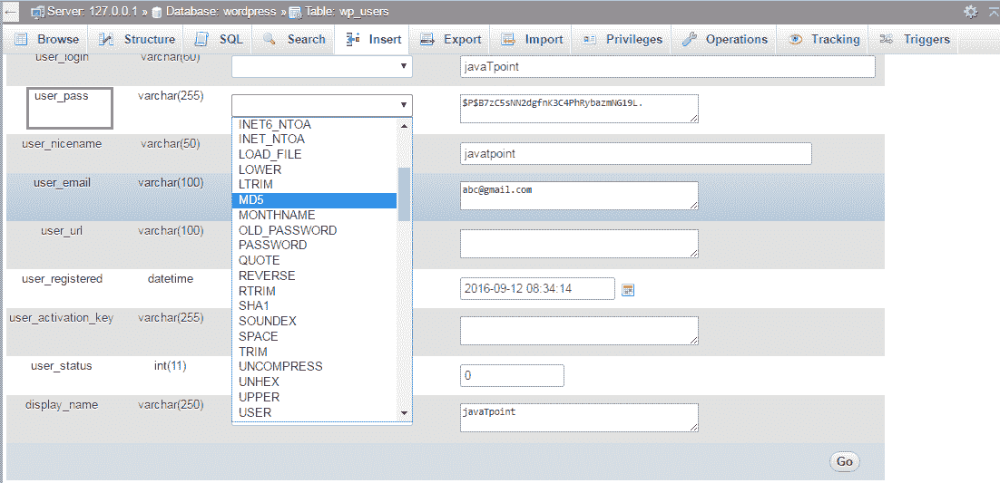

# 如何在 WordPress 中重置密码

> 原文:[https://www . javatpoint . com/如何重置 wordpress 中的密码](https://www.javatpoint.com/how-to-reset-password-in-wordpress)

如果您忘记或丢失了帐户密码，WordPress 会为您提供一个选项，通过不同的方法重置密码。

在 WordPress 界面，密码可以通过邮件恢复。但是在一些主机上，电子邮件不能正常工作，使用其他方法。

重置 WordPress 密码有四种方法。

*   从仪表板更改密码。
*   通过电子邮件重置密码。
*   通过 phpMyAdmin 通过数据库手动重置密码
*   使用紧急密码重置脚本。

* * *

## 从仪表板更改密码

按照以下步骤从仪表板重置密码。

1)登录您的 WordPress 帐户。

2)从仪表板菜单中单击用户。

3)将鼠标悬停在您的管理员用户名上，然后单击编辑，如下图所示。

4)向下滚动到底部，输入您的新密码，然后单击更新配置文件按钮。

5)您将收到一条消息，您的配置文件已更新，如下图所示。

* * *

## 通过电子邮件重置密码

按照以下步骤通过电子邮件重置密码。

1.  转到你的 WordPress 登录页面。

3.  点击**密码丢失？**链接。
4.  输入您的 WordPress 用户名或电子邮件，然后点击**获取新密码。**

6.  在描述的电子邮件中，您会收到一封来自 WordPress 的密码重置电子邮件。电子邮件中会给出一个链接来重置您的密码，点击该链接。
7.  输入新密码，确认后点击**重置密码。**

* * *

## 通过 phpMyAdmin 手动重置密码

按照以下步骤通过 phpMyAdmin 手动重置密码。

1.  从服务器转到 phpmyadmin
2.  点击你的 WordPress 数据库的名称。
3.  将会显示你的 WordPress 数据库的表格列表。选择 **wp_users** 表。

5.  在你的 WordPress 管理用户上点击**编辑**。

7.  现在在 **User_pass** 字段，写下你想要的密码，从下拉列表中选择 MD5，如下图快照所示。

9.  输入新密码后点击**开始。**
10.  phpMyAdmin 将向您发送一条成功更新数据库记录的消息。

* * *

## 使用紧急密码重置脚本。

如果以上选项不起作用，试试这个。这是一个 PHP 脚本，不是插件。

**记分**

*   要使用此脚本，需要管理员用户名。
*   脚本更新管理员的密码，并向管理员的电子邮件发送电子邮件。
*   如果你碰巧没有收到电子邮件，你的密码仍然会被更改。
*   脚本需要放在 WordPress 安装的根目录下。
*   出于安全原因，脚本需要在完成后删除。

**如何使用紧急复位脚本**

*   从应急**复制脚本密码重置脚本链接**https://codex . WordPress . org/用户:MichaelH/孤儿 _ Plugins _ 需 _ 领养/应急
*   将此脚本放入 WordPress 安装根目录下名为**emergency.php**的文件中。
*   用链接 http://example.com/emergency.php 打开你的浏览器
*   输入管理员用户名和新密码，然后单击更新选项。更改密码消息将会出现，一封包含更改密码信息的电子邮件将被发送到管理员的电子邮件中。
*   一定要从你的服务器上删除**emergency.php**文件，因为其他人可以用它来更改你的密码。