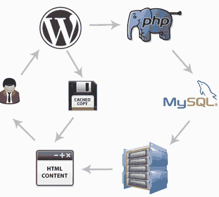
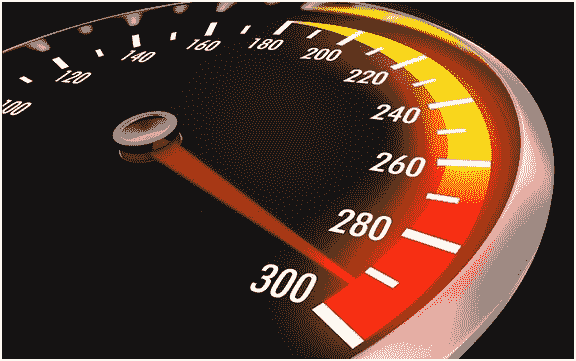
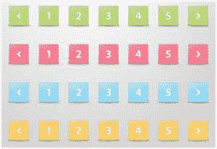
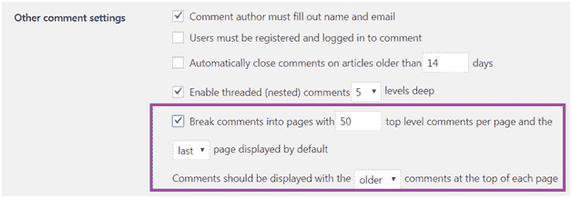
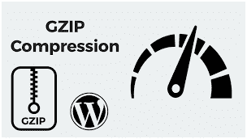
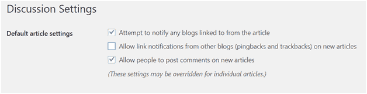

# 如何优化 WordPress 性能

> 原文：<https://www.javatpoint.com/how-to-optimize-wordpress-performance>

**WordPress 优化**

你应该优化你的 WordPress 站点和服务器，以获得最好的结果。这个东西对于所有的网站都是必要的，不管是包含大流量还是小流量。

它提高了你的网站的速度，这为你的用户提供了很好的体验，并提高了你的排名，因为加载时间也被考虑在搜索引擎中。

用户可以通过很多技巧来优化 WordPress 网站的性能。我们将在本教程中看到其中的一些。

1.  选择一个好的网络主机
2.  使用缓存插件
3.  使用简单的主题/框架
4.  使用 CDN
5.  优化图像以提高速度
6.  将长帖子分成更小的页面
7.  将注释拆分成页面
8.  删除非活动插件
9.  保持网站更新
10.  不要上传视频到 WordPress 网站
11.  优化 WordPress 数据库
12.  启用 Gzip 压缩
13.  安装编码良好的插件
14.  尽可能用 HTML 代码替换 PHP
15.  删除旧帖子修订版
16.  关闭引用通告和 pingbacks
17.  使用响应性设计
18.  头部有 CSS，身体有 JS(去掉不必要的 Jscripts)

* * *

## 选择一个好的网络主机

你的网站的性能很大程度上取决于你选择的网络主机。所以选择网络主机是一个非常重要的决定。如果你的网站托管服务不太好，那么其他提高网站性能的技巧可能就不起作用了。

对你选择的主机做一个完整的研究。阅读专家的评论和意见。与其选择便宜的，在质量上妥协，不如多付一些钱。

* * *

## 使用缓存插件

缓存插件向用户的浏览器提供页面的缓存版本，而不是动态生成每个页面。

之所以重要，是因为 [WordPress](https://www.javatpoint.com/wordpress-tutorial) 是写在 [PHP](https://www.javatpoint.com/php-tutorial) 上的，这是一种服务器端编程语言。这意味着每当有人访问你的网站时，WordPress 都会运行一个进程来获取信息，然后将其显示在用户的浏览器上，这非常耗时，并且会降低你的网站速度。

* * *

## 使用快速的主题/框架

你安装的 WordPress 主题应该是快速且编码良好的。不要选择一个有很多你不需要的功能的主题，它会对你的网站产生负面影响。

大型主题使用大量的 [CSS](https://www.javatpoint.com/css-tutorial) 、 [JavaScript](https://www.javatpoint.com/javascript-tutorial) s、PHP 和 Iframes，加载时间很长。如果你想使用复杂的主题，尽量减少它的编码，或者雇佣一个开发人员来发挥主题的最佳效果。

默认的 WordPress 主题是最好使用的，因为它们编码良好，负载较轻。

* * *

## 使用 CDN

CDN 代表**C**content**D**elit**N**网络。它是一个由地理位置分散的服务器组成的网络，根据用户在网站上的地理位置提供缓存内容。

网站的静态资源，如图像、CSS 文件和脚本，会阻止页面显示在用户的浏览器中。CDN 可以通过从世界各地的壁橱服务器向用户提供静态文件来解决这个问题。由于这一点，主服务器上的负载也减少了，因此给用户带来了更好的结果。

* * *

## 优化图像以提高速度

图像是较重的元素之一，在您的站点中加载需要最长的时间。大多数网站的每一页都有很多图片。

在使用图像之前，请确保它们针对网络进行了适当的优化。

* * *

## 将长帖子分成更小的页面

对于一篇有很多图片的长文章，最好把它们拆分成多页。WordPress 对此有一个内置的功能。

只需加上 **<！？下一页- >** 在你想要分割页面的任何地方标记你的文章。

* * *

## 将注释拆分成页面

有些文章可能会收到很多评论。在单个页面中加载所有评论将花费大量的加载时间。建议将注释分成多个页面，以减少加载时间。

WordPress 对此的内置解决方案是转到**设置>讨论**并勾选框**将评论分成页面。**

* * *

## 删除非活动插件

不再使用的插件需要快速卸载。许多用户在安装了插件后忘记了，这些插件甚至不再在他们的网站上使用了。

它们会增加你的网站规模，降低你网站的速度。

* * *

## 保持网站更新

WordPress 会定期自动更新网站。更新有助于修复错误、安全问题，并提供一些新功能。

定期更新你的网站是很重要的。所有插件和主题也应该定期维护和更新。不定期更新您的网站可能会导致您的网站出现一些安全问题。

* * *

## 不要上传视频到 WordPress 网站

直接上传视频到你的 WordPress 网站会消耗大量带宽。WordPress 无法针对高性能优化这些视频质量。

最好是把 YouTube、DailyMotion、Vimeo 等视频托管网站的视频嵌入 WordPress。它提高了网站的页面加载速度。

* * *

## 优化 WordPress 数据库

当你开始使用你的 WordPress 网站一段时间后，你的 WordPress 数据库可能会有一些你不再需要的未使用的数据。您的数据库需要优化数据库表以获得更好的性能。

有一些插件可以让你通过删除垃圾、垃圾评论、孤立元等来清理你的 WordPress 网站。它还优化了数据库表结构，并为您提供了快速响应的数据库。

* * *

## 启用 Gzip 压缩

向访问者提供网站的压缩版本会减少加载时间，因为它的大小更小。

您可以从您的 cPanel(如果您的主机允许的话)或从 WordPress 插件启用 Gzip 压缩。您也可以从启用它。htaccess 文件。

* * *

## 安装编码良好的插件

有很多可用的 WordPress 插件，但是它们都没有很好的编码。总是选择支持最新 WordPress 版本并且高度优化的插件。

开发不良的插件不仅会降低你的网站速度，还会影响其他插件的功能。

* * *

## 尽可能用 HTML 代码替换 PHP

普通的 HTML 代码比网络服务器上的 PHP 代码加载得快得多。如果可能的话，在你的网站上用 HTML 代码替换一些 PHP 代码。

HTML 加载时间比 PHP 快 20 倍左右。

* * *

## 关闭引用通告和 pingbacks

每当有人链接到你的网站，就会创建一个引用通告，利用你的服务器和数据库资源，最终影响你网站的速度。

所以当你不需要引用通告的时候，只需要从**设置>讨论中禁用它们，**取消选中引用通告和 pingbacks 框。

* * *

## 使用响应性设计

响应式设计用于为小屏幕设备加载更少的资源，为大屏幕加载高分辨率图像。这样，小屏幕用户就不会得到沉重的图像，大屏幕用户也不会得到较小的高度压缩的图像。

* * *

## 头部 CSS，身体 JS(去掉不必要的 JavaScripts)

在 HTML 编码的[头标签中链接 CSS 样式表。在 Head 标记之外使用它可以防止浏览器在页面加载后立即显示页面内容。](https://www.javatpoint.com/html-head)

在 [HTML](https://www.javatpoint.com/html-tutorial) 编码的 Body 标签中使用 JS。JavaScript 标记停止页面的渐进加载。每当浏览器遇到 JavaScript 标记时，它都会在加载页面的其余部分之前尝试解释它。所以建议在页面末尾使用 JavaScript 标签。

这个技巧不会减少你的网站的大小，但它将有助于加载你的网站更快一点。

* * *