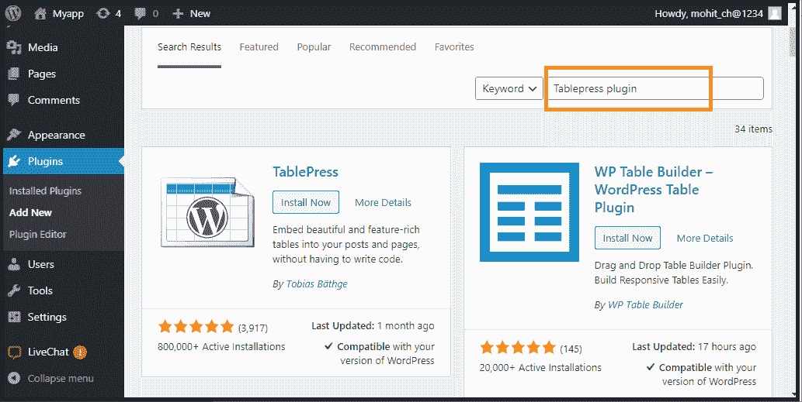

# WordPress 表格

> 原文:[https://www.javatpoint.com/wordpress-table](https://www.javatpoint.com/wordpress-table)

WordPress 表格是一种以表格格式显示数据的简单方法。过去，我们使用 HTML 代码或表格插件在 WordPress 页面或帖子中创建表格。在本主题中，我们将讨论如何在 WordPress 站点和页面中创建一个表格，而不使用 [HTML](https://www.javatpoint.com/html-tutorial) 代码或表格插件。

## 在写字板编辑器中创建表格

如果我们想在 [WordPress 站点](https://www.javatpoint.com/how-to-create-wordpress-site)、[页面](https://www.javatpoint.com/wordpress-pages)、[帖子](https://www.javatpoint.com/wordpress-posts)或博客中创建表格，我们可以使用 [WordPress](https://www.javatpoint.com/wordpress-tutorial) 块编辑器。

首先，我们需要创建一个帖子，页面，或编辑一个现有的页面或网站。在 WordPress 块编辑器中，点击**加号(+)** 按钮在页面上添加新块，然后选择**“表格”**选项。

我们可以通过选择格式选项找到**“表格”**选项，或者直接在**“搜索块”**栏中键入其名称。

现在，系统会提示我们选择表格中要保留多少**行**和**列**。默认情况下，这两个数字都是两行两列。

在 WordPress 网站中，我们可以随时添加或删除表格的行和列。在这里，我们可以根据需要选择任意的行和列。

我们可以输入表格单元格，它们会根据每个单元格中的内容自动调整大小。如果我们想为表格单元格选择一个固定的宽度，我们可以将此选项设置在右侧。

我们还可以在表格中添加表格页眉或页脚部分。让我们举个例子来理解这一点:

我们在表格中添加了一个标题，并在**“颜色设置”**选项卡下将背景颜色设置为灰色。

如果我们想在表格中添加新的行或列，请单击表格单元格添加它们。之后，点击**“编辑表格”**按钮。现在，我们可以在表中添加一个新的列和行。

同样，我们也可以删除行和列。如果要删除单元格，点击要删除的表格单元格，然后从**“编辑表格”**菜单中选择**“删除行”**或**“删除列”**选项。

默认情况下，表列中的文本向左对齐。通过点击列，我们可以更改此对齐方式，然后点击**“更改列对齐方式”**按钮。

我们可以通过点击**“更改对齐方式”**按钮并从列表中选择一个选项来更改整个表格页面或帖子内的对齐方式。

现在该表被设置为**“宽宽度”**，就像它出现在网站上一样。

如我们所见，柱子延伸到该区域的左右边缘之外。古腾堡编辑器中开发的表格工具为我们提供了很多表格显示方式的多样性。但是，表块没有一些高级功能，如自定义排序、搜索过滤等。它不允许我们在不同的网站区域使用单个表格，包括侧边栏小部件或其他网站。如果我们想构建高级表格，需要使用 WordPress 表格插件。

## 使用 TablePress 插件创建表格

它是市场上最好的表格插件之一，可以轻松创建和管理表格。这个插件的重要之处在于，我们可以单独编辑我们的表，甚至可以添加许多行和列。如果我们使用一个旧的经典 WordPress 编辑器，它没有表功能，那么 TablePress 插件也是必需的。

TablePress 让我们可以轻松地构建和处理漂亮的表格。有了快速的短代码，我们可以将表格插入页面、帖子或文本小部件。表可以包含任何数据类型，包括要计算的公式。额外的 [JavaScript](https://www.javatpoint.com/javascript-tutorial) 库为网站访问者增加了很多功能，比如搜索、排序、分页等。

## 安装 TablePress 插件

我们可以使用以下步骤来安装 WordPress 表插件。

**第一步:**首先进入 **[WordPress 仪表盘](https://www.javatpoint.com/wordpress-dashboard)** 选择**【插件】**选项。

**第二步:**接下来，进入搜索框，输入想要安装的插件名称。

**第三步:**找到插件后，点击**“立即安装”**按钮。

**第四步:**完成所有**安装**过程后，**激活**插件。

## 如何使用 TablePress 插件创建表格？

我们可以按照以下步骤使用 TablePress 插件创建一个表:

**第一步:**首先进入 **WordPress 仪表盘**点击 **TablePress** 选项。

**第二步:**接下来，点击**“添加新表格”**按钮创建表格。

**第三步:**之后，我们需要键入表的名称，然后选择我们想要的行和列。我们可以随时在表格单元格中添加或删除行和列。

**第 4 步:**插入表格名称、行和列后，点击**“添加表格”**按钮创建表格。

在这里，我们可以看到所有的表格信息和一个可以添加内容的区域。

**第 5 步:**同样，在表格单元格中键入行号和列号。我们可以使用上面的箭头对表格列进行排序。这些排序将按照数字顺序和字母顺序进行。

一些高级功能显示在**“表格内容”**区域下方。在**“表格操作”**中，我们可以在表格单元格中插入、删除和复制行。

在**“表格选项”**中，我们还可以在表格中包含一个不会与数据一起排序的页眉或页脚行。我们还可以决定在哪里显示表名和描述。

**第 6 步:**我们可以在**“数据表 JavaScript 库的特性”**部分修复几个选项。它帮助我们创建了一个可以被访问者搜索、过滤和排序的响应表。

**第七步:**完成所有流程后，点击**“保存更改”**按钮。

如果我们以后想修改表，可以直接使用 WordPress 仪表盘中的 TablePress 来修改表。表格会在我们使用过的任何页面或帖子上自动更新。TablePress 还可以从 CSV 和电子表格文件中导入数据。同样，我们也可以将数据从 TablePress 表传输到 CSV 文件，我们可以使用任何电子表格软件(如谷歌工作表或微软 Excel)打开该表。

* * *