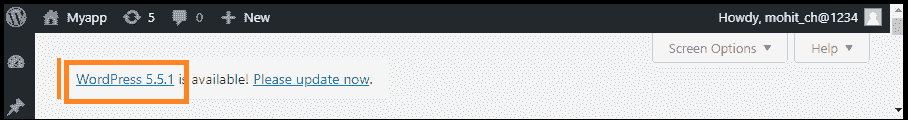
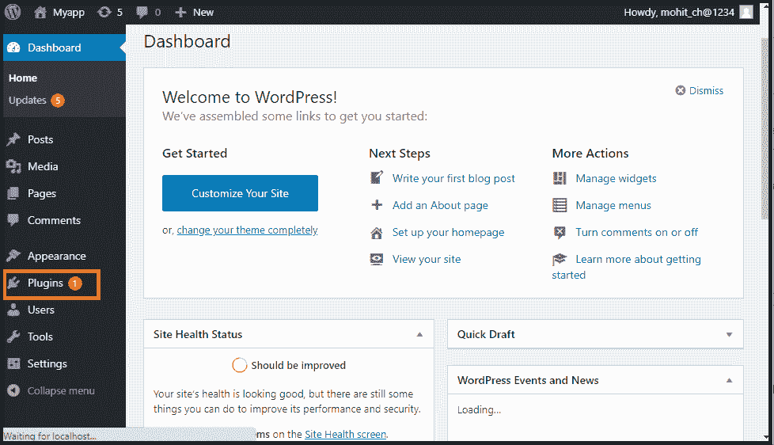
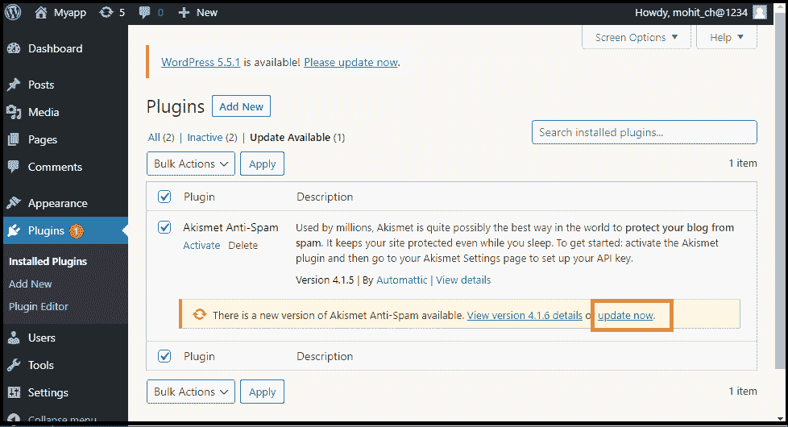
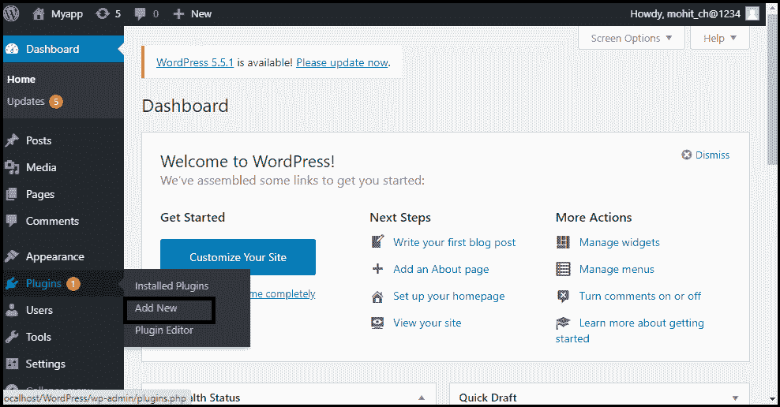
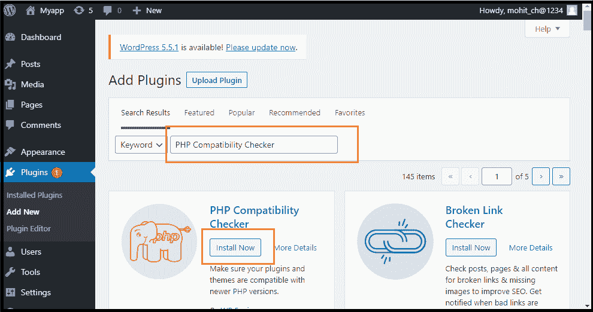
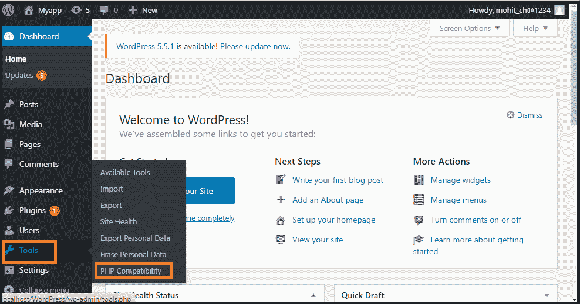
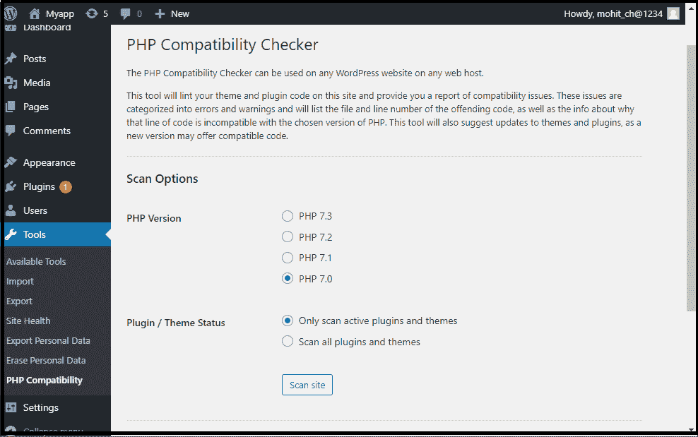
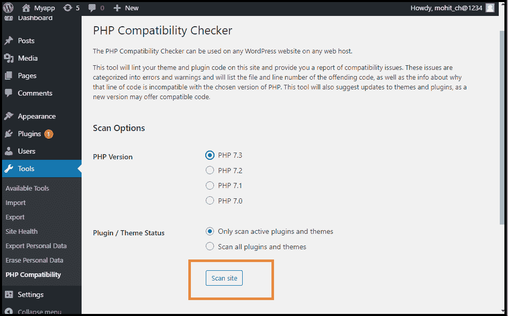
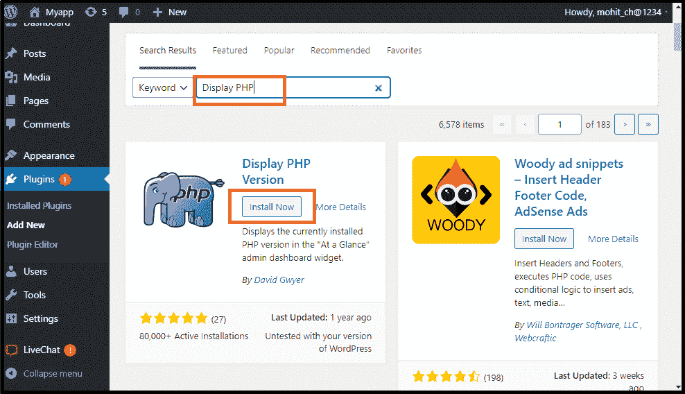
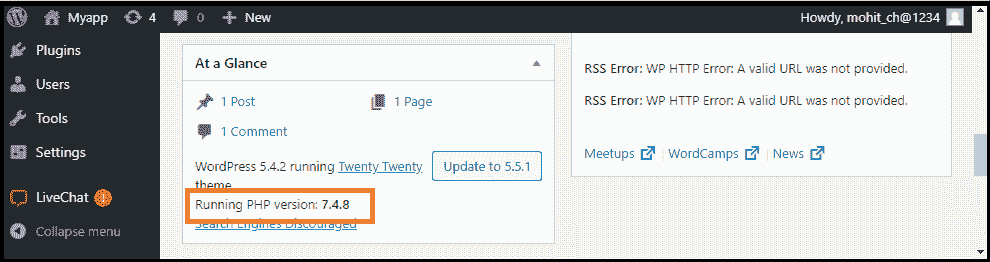

# 如何在 WordPress 中更新 PHP？

> 原文：<https://www.javatpoint.com/how-to-update-php-in-wordpress>

WordPress 为任何人创建 WordPress 网站提供了一种简单的方法，而不需要知道太多的代码。然而，WordPress 网站是建立在编码语言上的，比如 PHP。

运行网站不需要详细了解 PHP，但是我们应该确保我们运行的是 PHP 语言的更新版本。这是因为黑客正在操纵以前的 PHP 版本来入侵网站。例如，他们可以通过改变我们的主页、显示恶意广告以及将访问者重定向到恶意网站来破坏我们的网站。如果 WordPress 网站被黑客入侵，谷歌会迅速将其列入黑名单，我们的网络主机会暂停该账户。通过切换到最新的 PHP 版本，我们可以提高网站的安全性、性能、 [SEO](https://www.javatpoint.com/seo-tutorial) ，提供更好的用户体验。

在本文中，我们将讨论如何在 [WordPress](https://www.javatpoint.com/wordpress-tutorial) 中更新 [PHP](https://www.javatpoint.com/php-tutorial) 。首先，我们将知道为什么我们需要在 WordPress 中更新一个 php 版本。

## 为什么我们需要在 WordPress 中更新网站 PHP 版本？

有各种各样的理由可以更新网站上的 php 版本。其中一些如下:

### 安全

PHP 是一种开源编程语言。这意味着任何人都可以改变、提高或促进语言发展。这些因素使得 PHP 语言成为一个诱人的黑客目标。如果语言显示了漏洞，开发人员需要修复它并快速发布新的语言版本。当我们更新网站上的 PHP 版本时，漏洞被移除，网站受到保护。请注意，在以前的版本中没有安全措施。仅仅保护网站免受某些黑客的攻击是不够的。

### 搜索引擎优化

数据显示，如果加载一个页面需要 3 秒钟以上，几乎 40%的访问者会从网站上掉下来。此外，谷歌将加载速度作为排名因素之一。一些 PHP 更新将更快地加载网站。这意味着网站可以很好地留住访问者。它有助于提高搜索结果的排名，增加转化率和销售额，并改善用户体验。

### 速度和性能

开发人员总是致力于改进和增强 PHP。他们发布了带有新功能和改进的新版本。在我们升级到最新版本后，网站将看到加载速度和性能的提高。

### 高性能网站

升级到最新的 PHP 版本将使网站速度提高四倍。更快的网站提供更好的用户体验，因此访问者可以采取有效的行动，包括注册邮件列表或评论最新的博客文章。谷歌在给网站评级时也考虑了页面加载时间，所以一个 PHP 更新会提高搜索引擎优化，给网站带来更多的人。

## 更新前

如果我们想更新 [WordPress 版本](https://www.javatpoint.com/wordpress-versions)，在此之前，我们需要做一些工作，如下所示:

### 备份 WordPress 网站

在更新网站之前，总是需要创建一个备份，这有助于我们在不太可能的情况下出错。创建网站的备份可以确保我们可以随时回到网站的早期版本。

### 更新 WordPress

为了确保更新 PHP 版本没有问题，我们必须检查 WordPress Core 安装是否是最新版本。如果我们运行的是一个旧的 WordPress 版本，我们必须更新最新的 PHP 版本，因为它可能会导致不一致，并使网站无法使用。

如果我们使用的是旧的 PHP 版本，我们必须用它的最新版本来更新它。为此，请转到 WordPress 仪表板。

如果有新版本可用，会重定向到最新版本，然后按**“立即更新”**按钮。

### 更新所有主题和插件

如果我们使用第三方 WordPress 主题和插件，就不能保证它们与每个 PHP 版本兼容。

如果我们使用一个经常更新的通用主题或插件，我们不太可能遇到任何重大问题。

为了尽量减少兼容性问题，我们应该检查所有主题和插件的最新更新是否可用。我们可以通过以下步骤做到这一点:

**第一步:**首先，如果我们已经有一个账户，我们需要登录仪表盘中的 **WordPress 账户**。

**第二步:**现在，进入 **WordPress 仪表盘**并选择**“插件”**选项。

**第三步:**接下来，点击**“更新插件”**按钮，更新所有插件和主题。

现在，我们可以看到所有可用的更新。

当我们更新插件和主题时，我们必须通过点击**再次检查**按钮来验证我们正在运行 WordPress 的最新版本。

### 检查 PHP 兼容性

如果我们运行所有主题和插件的最新版本，我们可能会检查任何未解决的 PHP 兼容性问题。使用免费的 PHP 兼容性检查器，我们可以对照 PHP 版本检查插件和主题。使用以下步骤来使用 PHP 兼容性检查器。

**第一步:**首先进入 **WordPress 仪表盘**选择**“插件”**选项。之后，点击**“新增”**按钮。

**第二步:**现在，搜索 **PHP 兼容性检查器**。它是免费提供的。

**第三步:**一旦插件出现在屏幕上，点击**“立即安装”**按钮并激活它。

**第四步:**在 WordPress 左侧菜单中，进入**【工具】**点击**【PHP 兼容性】**。

**第五步:**现在，选择我们要升级的**【PHP】**的最新版本，通常会是最新版本。

**第六步:**这里在以下选项中选择一个:第一个选项是**“只扫描活动插件和主题”**，第二个是**“扫描所有插件和主题”**。

**第 7 步:**之后，点击**“扫描站点”**按钮。

它将扫描和报告与插件和主题的兼容性问题相关的问题。假设 PHP 兼容性检查器检测到一个问题。在这种情况下，我们可以寻找一个与最新版本的 PHP 兼容的替代插件或主题，或者我们可以联系开发人员，看看他们是否想升级对 PHP 的支持。

## 如何在 WordPress 中查看 PHP 版本？

在更新最新版本的 PHP 版本之前，检查当前运行的是哪个 PHP 版本非常重要。因为更新 PHP 版本会产生一些问题，尤其是如果我们很久没有更新的话。它可能会造成主题和插件的问题，导致网站出现故障或停止工作。我们可以使用 [WordPress 插件](https://www.javatpoint.com/wordpress-plugins)查看网站的 PHP 版本。

### 使用 WordPress 插件

使用以下步骤检查 WordPress 中的 PHP 版本。

**第一步:**首先，我们需要安装一个插件。例如，我们安装了一个名为**显示 PHP** 插件的插件。它可以在 WordPress 库中免费获得。

**第二步:**安装并激活插件后，转到 **[WordPress 仪表盘](https://www.javatpoint.com/wordpress-dashboard)** 然后转到**主页**。之后进入**“一目了然”**选项( **WordPress 仪表盘> >首页> >一目了然**)。

在这里，我们可以看到我们目前使用的 PHP 版本的网站。

* * *