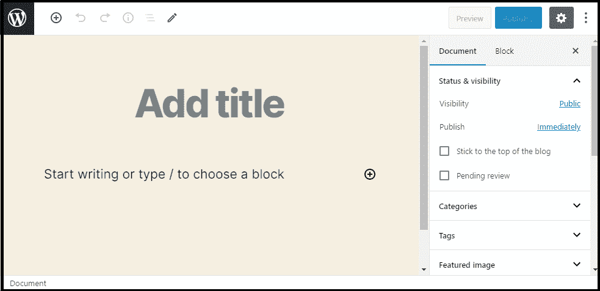
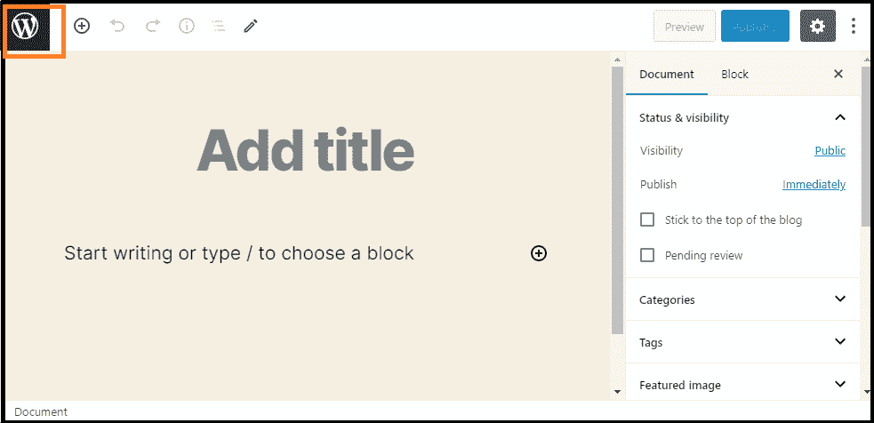
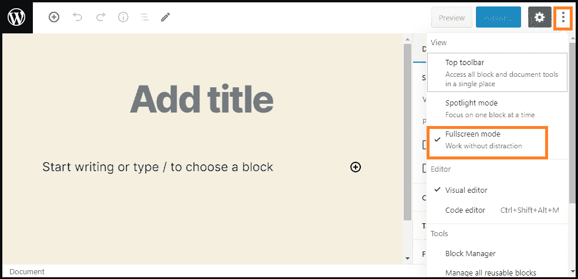
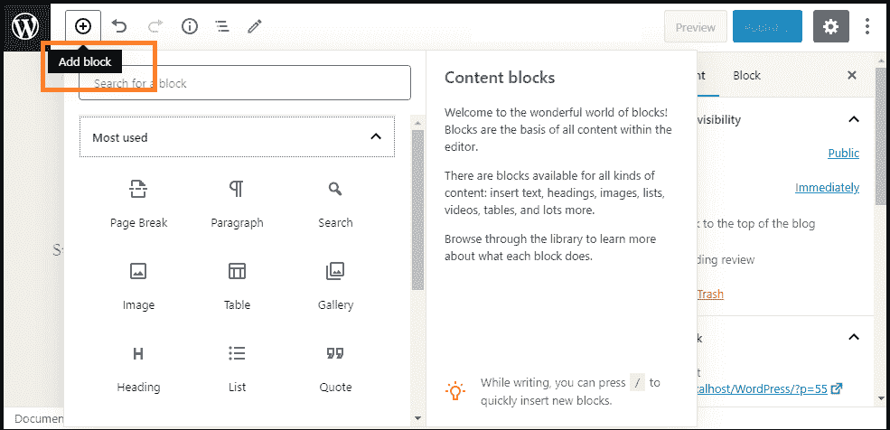
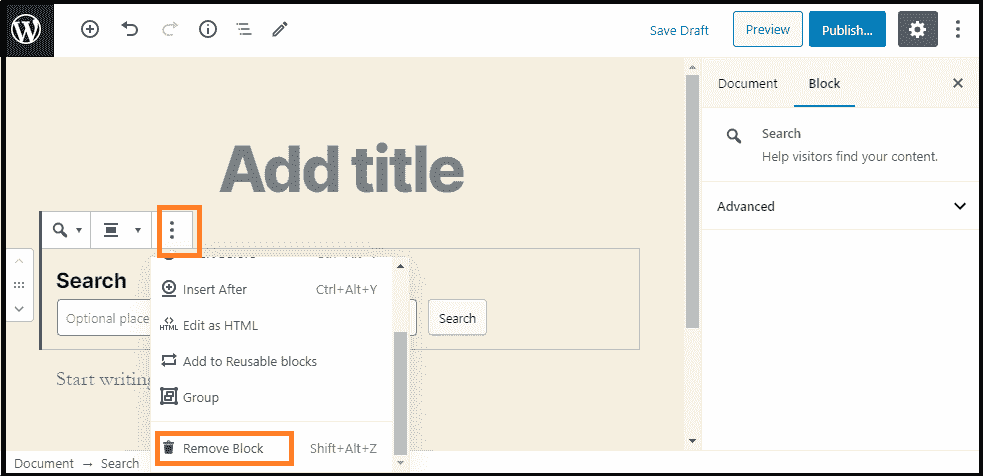

# 文字记者编辑器

> 原文：<https://www.javatpoint.com/wordpress-editor>

WordPress 编辑器是一种全新的出版体验。我们可以使用 WordPress 编辑器创建帖子和媒体丰富的页面，并轻松处理它们的布局。而不是想着对齐排列**文字、照片**、**引用**，一个网站或者帖子上的所有元素都有自己的区块。每个块都可以被移动、编辑和定制，然后编辑器将显示它们在实际站点上的视觉元素。在点击**“发布”**按钮之前，我们可以通过点击**预览**按钮来确认。

## 编辑的工作空间

每当我们点击 WordPress 上的**帖子**或**页面**菜单选项时，WordPress 编辑器的工作区会显示其最新版本，类似于下面的截图:

## 如何访问管理菜单？

我们可以通过点击出现在屏幕顶部的 **WordPress 标志**进入管理菜单。

#### 注意:它将允许我们离开页面或帖子。

## 如何在 WordPress 中关闭全屏模式？

如果我们想关闭 [WordPress](https://www.javatpoint.com/wordpress-tutorial) 上的全屏模式，我们可以使用屏幕右上角的**三点菜单**取消全屏模式。

当我们选择在浏览器的本地存储中存储条目的选项时，并且在将来，如果我们想要切换浏览器，它不提供显示选项。在这种情况下，我们必须再次设置我们的偏好。我们换电脑的时候也是这样。

safari 浏览器的用户一次只能体验一次默认的重置设置，因为 Safari 浏览器会不时配置自己删除本地存储条目。

WordPress 的领先开发人员探索了管理用户界面的理想方法，并在未来的更新中处理这些不一致的地方。目前，我们可以使用块全屏模式控制插件来调整默认行为，并保持设备之间的全屏选项一致。

## 使用块编辑器

有多种可用功能可用于使用块编辑器。

### 阻碍

这些块用于转换创建内容的方法。它将单个文档转换成一个集合，该集合具有离散元素的显式、易于调整的结构。块编辑器为我们提供后期构建和轻松的页面体验。我们可以轻松添加和优化几个需要**嵌入、自定义 HTML 代码**和**短码**的视觉和媒体元素。

### 添加块

我们可以从“添加块”选项中选择各种各样的块，并根据类别和当前使用情况进行管理。每个块都可以独立于其他块进行编辑或移动，并对布局和功能提供更好的控制。一般来说，块自带配置。我们可以通过使用**加号(+)**按钮来添加一个块。

### 配置块

每个编辑器块都有自己的配置。要找到块配置，我们需要选择一个**块**，它将立即显示在块编辑器顶部的工具栏。通常，在块编辑器顶部看到的设置为配置和调整块类型提供了添加选项。我们可以在块编辑器边栏中切换当前块的设置和完整文档的设置。

文档设置允许我们添加标签和类别，选择特色图片，查看和更改我们的帖子状态等。这些是我们应用于整个页面或文章的功能。

### 移除块

如果我们想从块编辑器中删除一个块，选择**块**并点击**三点**菜单按钮。在下图中，我们可以看到红色矩形框中删除设置中的块的选项。

* * *