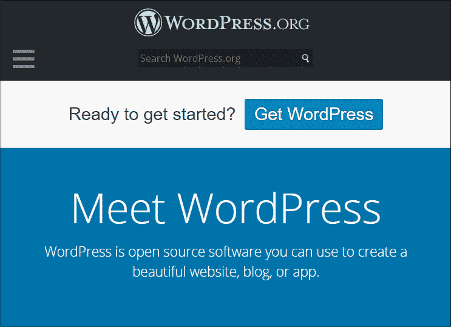

# 备选方案

> 原文:[https://www.javatpoint.com/wordpress-alternatives](https://www.javatpoint.com/wordpress-alternatives)

WordPress 是一个**简单、易管理、易学习、免费、开源、用户友好、现代、多功能、功能强大的 CMS(内容管理系统)**平台，用于创建美观响应的网站或博客。2003 年由**马特·莫楞威格**和**迈克·利特尔**推出，现已成为最受欢迎的网络内容发布平台之一。它允许网站编辑、所有者和作者在没有任何编程知识的情况下在网上发布他们的内容。

WordPress 用于建立企业(小型和大型)、电子商务、博客、社交网络、论坛、活动和电子学习网站。

要了解更多关于 WordPress 的信息，请点击给定的链接:[https://www.javatpoint.com/wordpress-tutorial](https://www.javatpoint.com/wordpress-tutorial)

虽然 WordPress 是创建网站的最佳平台之一，但市场上也有一些最好的 WordPress 替代产品，用于构建有吸引力、美观、响应迅速且好看的网站-

最常用的 WordPress 替代品列表如下-

1.  [购物资料](#Shopify)
2.  [Wix](#Wix)
3.  [博主](#Blogger)
4.  [Drupal](#Drupal)
5.  [Joomla](#Joomla)
6.  [韦布利](#Weebly)
7.  [幽灵](#Ghost)
8.  [中等](#Medium)
9.  壁球
10.  摇晃
11.  [大贸易](#BigCommerce)
12.  [CMS 枢纽](#CMS-Hub)

* * *

### 1\. 购物

[Shopify](https://www.javatpoint.com/wordpress-vs-shopify) 是最好的 [WordPress](https://www.javatpoint.com/wordpress-tutorial) 替代品之一，用于构建**在线商业网站和电商商店**。它允许我们在网站上添加付款选项来发送和接受付款。它包括各种**现成的模板、应用程序、付费扩展和集成选项**，以非常少的工作量快速轻松地创建在线网站。它更适合创建电子商务网站。

**Shopify 的优点**

*   Shopify 提供了更简单和优秀的支付网关选项，并可以轻松地与 PayPal 集成。
*   它有无限的磁盘空间，所以它允许我们向网站添加无限数量的项目。
*   它提供全天候的客户支持。
*   它提供了一整套商业工具，包括电子邮件、登录页、博客等等。
*   Shopify 非常容易设置和学习。
*   它是搜索引擎优化友好的。

**Shopify 的缺点**

*   与 WordPress 相比，Shopify 并不灵活。
*   与 WordPress 相比，它不能提供有效的博客功能。
*   相当贵。

**价格**

Shopify 可通过以下计划获得-

**基本 Shopify -** Shopify 基本计划每月 29 美元和**每年 313.20 美元。**

**Shopify -** Shopify 在**每月 79 美元**和**每年 853.20 美元**处提供。

**Advanced Shopify -** 其 Advanced Shopify 计划每月 299 美元和**每年 3，229.20 美元**。

**Shopify Plus -** 其 Shopify Plus 计划的价格为**每月 2000 美元**和**每年 24000 美元**。

**网站:**

点击给定链接访问 Shopify 官网创建电商商店销售产品:[https://www.shopify.in/](https://www.shopify.in/)

* * *

### 2.威克斯

Wix 是最好的**用户友好的基于云的 CMS** 平台之一。这是一个**易于学习的**平台，允许我们为小企业创建灵活的设计网站。发布于 **2006** 。它允许我们使用简单的拖放菜单快速添加模板、图像、内容、链接等到网站。

**威克斯**的优点

*   Wix 允许我们在网站上添加免费动画。
*   对初学者来说，这很容易学。
*   它提供了简单的拖放功能来创建网站。
*   创建网站不需要编程知识或编码技能。
*   它可以轻松地与贝宝等在线支付解决方案集成。

**Wix**的缺点

*   Wix SEO 性能不如 WordPress。
*   它不适合移动设备，因为它提供的加载速度很差。
*   它包括带有免费计划的广告。
*   有时用户不能修改可用的模板。
*   有限的设计可用于移动站点。

**威克斯定价**

Wix 既有免费版本，也有付费版本。

**免费-** Wix 免费计划可供用户使用，但其免费计划不包括在线支付选项和 Google Analytics

**标准组合计划-** 其标准组合计划在**每月 16 美元-每月 26 美元。**

**网站**

点击给定链接访问威克斯官方网站-[https://www.wix.com/](https://www.wix.com/)

* * *

### 3.写日志（部落格）的人

[博主](https://www.javatpoint.com/blog)是全球最受欢迎的博客平台之一。这是一个免费、开源、易用、轻量级的 WordPress 替代品，由 T2 皮拉实验室于 1993 年开发，谷歌于 2003 年拥有 T4。它是 WordPress 最好的竞争对手之一，为内容创作提供了一个简单的平台。它用于**在博客中创建、组织和发布内容**。由于谷歌拥有[博主](https://www.javatpoint.com/wordpress-vs-blogger)，所以用户可以将其链接到其他各种谷歌产品。

**博主的优点**

博主的优点列表如下-

*   它非常容易使用。
*   它有很好的货币化选择，即谷歌广告。它帮助我们从博客中赚更多的钱。
*   它是一个免费使用的平台。
*   初学者很容易学会。
*   它很容易与 Google+集成。
*   它是一个极其可靠、轻量级、易于使用的平台。

**博主的缺点**

*   Blogger 的模板和设计选项有限。
*   它没有外部插件。

**定价**

**免费-** 博主可免费使用。

**网站**

点击给定链接，使用博主创建博客:[https://www.blogger.com/](https://www.blogger.com/)

* * *

### 4.获得

[Drupal](https://www.javatpoint.com/wordpress-vs-drupal) 是最好的[内容管理系统(CMS)](https://www.javatpoint.com/cms-full-form) 平台，用于**创建强大的响应性动态网站**。它主要被政府和私人公司用来创建漂亮的**响应网站、投资组合网站、商业网站、非政府组织网站以及更多**。

Drupal 的主要特点是它提供了一个高级管理面板，包含五个部分:**内容、人员、结构、外观和配置。**

**Drupal 的优点**

Drupal 有以下优点-

*   Drupal 用于创建动态设计。
*   它被一个大型社区(成千上万的用户和开发者)使用。
*   就安全性而言，它是最好的平台。
*   它使用 Drupal 大管道技术，帮助我们更快地加载网站。
*   Drupal 帮助我们轻松管理 SEO 设置和管理。

**Drupal 的缺点**

*   与 WordPress 相比，Drupal 需要更多的技术知识。
*   安装和使用相当困难。
*   很难管理 Drupal 的管理面板。
*   这是一个对初学者不太友好的平台。
*   它的博客模块不如其他平台好。

**Drupal 定价**

Drupal 是一个**免费、**开源的 CMS 平台。

**网站**

点击给定的链接创建高度安全和响应的网站-[https://www.drupal.org/](https://www.drupal.org/)

* * *

### 5.网站架站软件

[Joomla](https://www.javatpoint.com/joomla) 是一个**强大、免费、多用途、热门、开源、强大、灵活的 CMS 平台**构建在 model view controller web 应用框架之上。它允许我们创建复杂的网站，定制帖子，管理多个用户，并以多种语言发布我们的内容。Joomla 的一些核心特性是:它包括一个强大的 PHP 应用程序构建框架。它有内置的缓存管理，并包含 15 个自定义字段类型。

**Joomla 的优点**

Joomla 有以下优点-

*   Joomla 包含了数千个免费的主页插件。
*   学习和理解 Joomla 非常容易。
*   它帮助我们使用强大的工具来提高搜索引擎优化排名。
*   与 WordPress 相比，它是一个高度安全的平台。
*   它被大量的用户和开发者使用。
*   它帮助我们快速创建网站。

**Joomla 的缺点**

*   在 Joomla 中，运行插件是非常困难的。
*   有时候很难理解。

**Joomla 定价**

Joomla 既有免费版本，也有付费版本。它的付费版起价为每年 199 美元。

**Joomla 网站**

点击以下链接，使用 Joomla-[https://www.joomla.org/](https://www.joomla.org/)创建灵活、安全、响应迅速的网站

* * *

### 6\. 韦布利

[Weebly](https://www.javatpoint.com/wordpress-vs-weebly) 是 WordPress 令人敬畏的替代品之一，它允许用户使用预先设计的模板、插件、小部件、主题等轻松创建**直截了当的网站**。这是**发布文字、图片、链接等内容的绝佳平台**。创建网站不需要高级功能。它的设计比方形空间更灵活。更适合小企业创建单用途网站。

**威布尔**的优点

威布尔有以下优点-

*   Weebly 提供了一个初学者友好的平台。
*   创建网站只需要很少的时间。
*   基于 Weebly 的网站提供了快速的加载速度。
*   它非常容易学习。
*   它使用下拉编辑器在很短的时间内创建网站。

**威布尔**的缺点

*   在 Weebly 中，没有添加自定义内容的选项。
*   我们很难在 Weebly 网站上添加先进的营销工具。
*   Weebly 的电子商务支持有限。
*   它的定价和搜索引擎优化定制可能会让初学者感到困惑。
*   它的价格很高。

**合理定价**

*   Weebly 高级计划的价格从每月 8 美元到每月 38 美元不等。
*   网站的价格从每年 0 美元到 360 美元不等。
*   网上商店的价格从每年 120 美元到每年 552 美元不等。

**Weebly 网站**

点击给定的链接，使用 Weebly-[https://www.weebly.com/](https://www.weebly.com/)快速轻松地创建网站

* * *

### 7.《人鬼情未了》

Ghost 是一个**开源、快速、安全、简单、响应迅速、功能强大的 CMS 平台**，用于在网络上发布简单的内容。它是创建**内容管理系统网站**的流行的 WordPress 替代方案之一。使用、设置和管理非常简单。这是一个基于 **[节点的](https://www.javatpoint.com/nodejs-tutorial)**博客软件，主要用于创建博客，灵活，简单，轻量级的内容管理系统。

**幽灵的优点**

Ghost 平台的优势列表如下-

*   Ghost 平台帮助我们轻松地将图像、Markdown 和结构良好的 HTML(超文本标记语言)添加到网站中。
*   它提供了一个用户友好的仪表板。所有必要的信息都在右边。
*   初学者使用 Ghost 创建网站非常简单易行。
*   这是一个开发者友好的平台。

**幽灵的缺点**

Ghost 有以下缺点-

*   Ghost 托管的计划成本极高。
*   它仍处于测试阶段。
*   它只适合博客和发布网站。

**幽灵定价**

Ghost 服务器托管计划起价为每月 19 美元。

**幽灵网站**

要使用 Ghost 创建快速、强大且响应迅速的网站，请单击给定的链接-[https://ghost.org/](https://ghost.org/)

* * *

### 8.中等

中是**一个在线、热门、易设置、优秀的**发布平台。这是最简单的 WordPress 替代方案。它提供了一个优秀的编辑环境，这就是为什么小型和大型组织都使用它。它为出版商提供了一个**整洁的环境**。每月有超过 1 亿用户使用。

**中等的优点**

中型平台有以下优点

*   Medium 是一个完全托管的平台，所以我们不需要担心软件。
*   它帮助我们轻松共享内容、图像、gif、标题、视频等，以吸引目标受众。
*   它帮助我们在搜索引擎优化上轻松地对内容进行排名。

**中等的缺点**

*   它不是一个完全的内容管理系统。
*   无法在中型平台上添加自定义域。
*   设计有限。

**中等定价**

中等保费计划起价为每月 5 美元，每年 50 美元。

**中型网站**

点击下面的链接，使用 https://medium.com/创建一个简单的博客

* * *

### 9.方形空间

Squarespace 是受欢迎的付费网站构建平台，用于创建**美丽、时尚、响应迅速的网站**。它为创建网站提供了各种预建模板。它是博客、在线商店和投资组合网站最灵活、最通用的构建平台。

**方形空间的优点**

*   Squarespace 会自动为访问者调整屏幕大小。
*   它使用拖放构建器来创建网站
*   初学者很容易使用 Squarespace 创建网站。
*   它包括一切，如主题，插件，拖放菜单，以及更多我们需要创建一个网站。
*   它提供 24×7 支持。
*   它很容易与谷歌驱动、Adobe 创意套件等集成。

**方形空间的缺点**

*   与 Wix 相比，可用的设计数量更少。
*   它不是一个适合写博客的平台。
*   与 Weebly 或 Wix 相比，很难理解和使用。
*   与其他网站建设者相比，这是昂贵的。
*   它的免费计划不可用。

**平方空间定价**

它的计划从每月 12 美元开始。

**广场网站**

点击给定链接访问广场空间官网-[https://www.squarespace.com/](https://www.squarespace.com/)

* * *

### 10.Tumblr

[Tumblr](https://www.javatpoint.com/tumblr) 是打造专业网站的最佳平台。它允许我们**将我们的博客平台和社交媒体平台**结合起来。它是一个独特的网站构建平台，因为它是社交媒体平台和博客的结合。全球超过 4.27 亿博客使用 Tumblr 作为他们的博客平台。

**Tumblr 的优点**

Tumblr 平台的优势列表如下-

*   Tumblr 为创建网站提供了数百个免费和优质的主题。
*   Tumblr 可以免费使用。
*   它允许我们分享照片、故事、歌曲、图像等等。
*   它可以轻松地与脸书、Pinterest、Instagram 和 Twitter 等社交媒体平台集成。

**Tumblr 的缺点**

*   Tumblr 很容易使用，但很难解释。
*   可用的主题数量较少。

**Tumblr 定价**

Tumblr 是一个供用户免费使用的网站构建器平台。

**Tumblr 网站**

点击给定链接，使用 Tumblr 创建专业网站-[https://www.tumblr.com/](https://www.tumblr.com/)

要了解更多关于 Tumblr 的信息，请点击给定的链接-[https://www.javatpoint.com/tumblr](https://www.javatpoint.com/tumblr)

* * *

### 11.大商业

BigCommerce 用于打造**电商项目**。它是在网上销售产品的最佳平台。它允许我们使用各种支付网关选项，如贝宝、条纹、苹果支付和亚马逊支付。它还允许我们使用第三方应用程序来快速发展我们的业务。

**big commerce 的优点**

大商业有以下优点

*   BigCommerce 不收取交易费。
*   它很容易与电子邮件营销服务集成。
*   它提供了各种搜索引擎优化功能。

**大商业的弊端**

*   与其他网站构建平台相比，主题并不好。
*   无精简版
*   不适合初学者。

**大商务定价**

**免费试用-** BigCommerce 免费试用 15 天。

**标准计划-** BigCommerce 标准计划，每月费用 29.95 美元。

**Plus 计划-** BigCommerce Plus 计划可用，费用为每月 79.95 美元。

**Pro 计划-** BigCommerce Pro 计划可用，每月费用 299.95 美元。

**企业计划-** 其企业计划取决于业务需求。

**大商网站**

点击给定链接，使用 BigCommerce 创建电子商务网站-[https://www.bigcommerce.com/](https://www.bigcommerce.com/)

* * *

### 12.CMS 集线器

顾名思义，CMS Hub 是一个**完全内容管理系统(CMS)网站构建平台**。它包括各种工具，如域管理器、文件管理器、暂存环境、拖放编辑器、博客工具等。它允许我们创建**灵活且结构良好的**内容管理系统网站，营销人员可以轻松编辑。

**CMS 集线器的优点**

CMS 集线器有以下优点-

*   CMS Hub 为我们的网站提供了更多的安全性。
*   它既适合小型组织，也适合大型组织。
*   它允许我们创建灵活且结构良好的内容管理系统网站。
*   编辑内容管理系统中心上的内容非常容易。
*   它允许我们使用拖放编辑器来创建网站。

**CMS 中枢的缺点**

*   它的计划耗资巨大。
*   我们不能在 Windows 上安装 CMS Hub。

**CMS 枢纽定价**

内容管理系统中心既有免费版本，也有付费版本

**免费-** CMS Hub 免费试用 14 天。

**付费-** CMS Hub 付费版起价为每月 300 美元。

**CMS 枢纽网站**

点击给定链接，使用 CMS Hub 创建安全网站-[https://www.hubspot.com/products/cms](https://www.hubspot.com/products/cms)

* * *