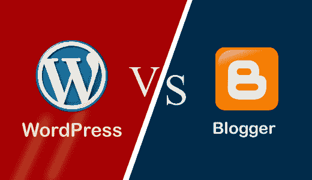

# WordPress Vs. Blogger

> 原文：<https://www.javatpoint.com/wordpress-vs-blogger>

在这一节中，我们将讨论 WordPress 和 Blogger 之间的区别。所以，首先，我们将讨论 WordPress 和 Blogger。

## 什么是 WordPress？

[WordPress](https://www.javatpoint.com/wordpress-tutorial) 是一个免费开源的**内容管理系统(CMS)** 。用**[【PHP】](https://www.javatpoint.com/php-tutorial)**编写，连接 **[MySQL](https://www.javatpoint.com/mysql-tutorial)** 或 **[MariaDB](https://www.javatpoint.com/mariadb-tutorial)** 数据库。它最初是作为博客工具开发的，但现在已经发展成为一个灵活的内容管理系统。它可以用来创建博客、网站和移动应用程序。它也用于使用 [WordPress 插件](https://www.javatpoint.com/wordpress-plugins)创建在线商店。

WordPress 是使用中最流行的内容管理系统(CMS)解决方案之一。被超过 **60** 万个网站使用，其中排名前 10**的 **34%** 万个**万个[网站](https://www.javatpoint.com/website)直至 **2019** 。

WordPress 由它的创始人开发，美国开发者**马特·莫楞威格**和英国开发者**迈克·利特尔**。最初于 2003 年 5 月 27 日**发布。本软件根据**通用公共许可证(GNU)** 获得许可。**

## 什么是博主？

[博主](https://www.javatpoint.com/blog)是一个博客发布平台，由**皮拉实验室**在 **1999** 起家，后来**谷歌**在 **2003** 收购。它有两个部分，分别是**博主**和**博客**。这里 Blogger 是免费的博客发布平台，BlogSpot 是免费的服务提供商。由于谷歌拥有它，谷歌的大多数功能都是默认的，如广告含义、分析和广告词。Blogger 的优势在于新博主可以为博客选择选项。它是免费的，用户友好的，并有许多免费的模板来根据用户的要求定制模板。在这里，用户可以轻松更新他们的博客。除非黑客攻击，否则不会有博客宕机。Blogger 提供了在帖子中添加多媒体的能力，而没有任何存储空间限制。我们可以通过手机应用、[短信](https://www.javatpoint.com/sms-full-form)和[电子邮件](https://www.javatpoint.com/e-mail)访问博主。默认情况下，谷歌在 blogspot.com 子域免费托管博客。如果用户选择高级服务选项，它将托管多个包含所有选项的子域。

## WordPress 和 Blogger 的主要区别

在这里，我们将讨论 WordPress 和 Blogger 的主要区别。

1.  WordPress 支持像**安卓、Windows Phones、iOS** 这样的移动博客。而博主也支持**安卓**和 **iOS** 的移动博客。
2.  在 WordPress 中，用户必须为域名付费，并在博客中添加一个域名。而在 Blogger 中，用户必须为域名付费，并且可以免费添加到博客中。
3.  在 WordPress 中，借助**谷歌 AdSense** 进行监控并不是一件容易的事情，但是我们可以通过免费服务中的附属链接来完成。而在博主中，借助**谷歌 AdSense** 很容易追踪。
4.  博主可以自由使用谷歌硬盘以外的存储。而 WordPress 则有基础、业务、溢价等计划。
5.  我们可以在 WordPress 中使用 WordPress 脚本进行自我托管。而在 Blogger 中自托管是不可能的。
6.  WordPress 支持社交媒体和共享插件，如**脸书、领英、推特**。而博主只支持**谷歌+** 。

## WordPress 和 Blogger 的面对面比较

在这里，我们将以表格的形式讨论 WordPress 和 Blogger 之间的头对头比较。

| 特征 | 博客 | 写日志（部落格）的人 |
| **域名** | 域名在 WordPress 中，我们可能会注册一个域名并将其添加到我们的博客中。默认情况下，它托管 Wordpress.com 子域上的网站。默认情况下，我们可以通过屏蔽来添加自定义域名，但对于高级服务，我们必须选择此选项。 | 我们可能会注册一个域名，并将其添加到我们的博客中。默认情况下，它在 blogspot.com 子域托管网站。我们可以在上面免费添加一个自定义域名。 |
| **主题或设计** | 它允许用户自定义来自 WordPress.com 的免费和付费模板，但不允许用户编辑免费的 HTML 和 CSS。如果我们想编辑 HTML 和 CSS，我们需要购买一个计划。 | 它允许用户自定义免费和付费模板，并允许他们免费编辑 HTML 和 CSS。它的免费模板比 WordPress 少。 |
| **储物空间** | 我们可以创建无限数量的博客，作者不限，默认会给 3 GB 的存储空间。如果我们需要更多的空间，我们需要升级到付费计划。 | 它只允许多达 20 个静态内容页面，并在谷歌驱动器中提供 15 GB 的存储空间。 |
| **自托管** | 我们可以修改 WordPress 脚本，并在任何服务器上托管该脚本，因为它是一个开源平台。 | 我们无法修改脚本或将其托管在他们自己的服务器上。 |
| **图片库** | 它支持图像图库，包括图像编辑工具和图库样式。它对照片博客非常有用，但它只有 3GB 的存储空间。用户需要升级他们建立大型网站的计划。 | 它不支持相册或图像库。但他们可能会在博客文章中使用谷歌 plus 相册，并在博客支持范围内的任何需要的地方使用。 |
| **监控** | 监控是不可能的，因为 WordPress 不允许第三方工具，但我们可以在免费服务中使用附属链接。如果用户选择高级计划选项，他们可能会使用第三方监控工具，如 AdSense。 | 在 blogger 中跟踪流量更容易，因为它附带了 AdSense，我们不能轻易安装谷歌 AdSense、AdWords 等。所以，Blogger 更适合监控，因为它是免费的。 |
| **反垃圾邮件** | WordPress 有自己的反垃圾邮件防范脚本 A kismet，它不允许在网站上发布垃圾邮件内容。 | 它也有反垃圾邮件功能，但不安全。因此，用户需要选择安全的服务来处理垃圾内容。 |

* * *