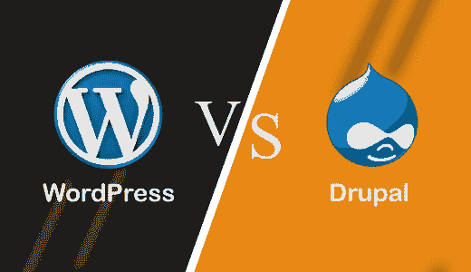

# WordPress vs. Drupal

> 原文:[https://www.javatpoint.com/wordpress-vs-drupal](https://www.javatpoint.com/wordpress-vs-drupal)

Drupal 和 WordPress 都是免费的开源内容管理系统框架。在进行比较之前，我们将简要讨论一下 Drupal 和 WordPress。

## 什么是 Drupal？

Drupal 是一个免费开源的**内容管理系统(CMS)** 框架。它是用 **[PHP](https://www.javatpoint.com/php-tutorial)** 语言写的。它由 **Dries Buytaerti** 开发，最初于 2001 年 1 月 15 日**发布。Drupal 提供了一个**前端**框架，在政治网站、世界经济论坛、大学网站、政府网站等数百万个网站上使用。它帮助我们组织、管理和发布内容。系统还可以使用 Drupal 进行业务协作和知识管理。本软件在**通用公共许可证(GNU)** 下获得许可，这意味着每个人都可以下载并与其他用户共享。**

## 什么是 WordPress？

[WordPress](https://www.javatpoint.com/wordpress-tutorial) 是一个免费开源的**内容管理系统(CMS)** 。用 **PHP** 编写，连接 **[MySQL](https://www.javatpoint.com/mysql-tutorial)** 或 **[MariaDB](https://www.javatpoint.com/mariadb-tutorial)** 数据库。它最初是作为博客工具开发的，但现在已经发展成为一个灵活的内容管理系统。它可以用来创建博客、网站和移动应用程序。它也用于使用 [WordPress 插件](https://www.javatpoint.com/wordpress-plugins)创建在线商店。

WordPress 是使用中最流行的内容管理系统(CMS)解决方案之一。被超过 **60** 万个网站使用，其中排名前 10**的 **34%** 万个**万个[网站](https://www.javatpoint.com/website)直至 **2019** 。

WordPress 由它的创始人开发，美国开发者**马特·莫楞威格**和英国开发者**迈克·利特尔**。最初于 2003 年 5 月 27 日**发布。本软件根据**通用公共许可证(GNU)** 获得许可。**

## Drupal 和 WordPress 的比较

让我们比较一下 Drupal 和 WordPress，如下所示:

*   尽管插件大规模可用，但 WordPress 对搜索引擎优化更友好。Drupal 不如 WordPress 对 SEO 友好。
*   在 WordPress 中，更新内容意味着添加、删除或编辑要容易得多。Drupal 中的 WordPress 也是如此。
*   WordPress 创建和升级网站的时间更少，效率也更高。而 Drupal 需要更多的时间来创建和升级网站，其性能不如 WordPress。
*   WordPress 有一个大小的问题，因为它最初只适用于博客。它无法处理大量内容。Drupal 没有大小问题；它可以轻松地为网站容纳大量数据。
*   WordPress 的功能和选项更少。Drupal 有很多功能，对创建多页网站非常有用。
*   由于使用了很多插件，WordPress 的安全性比较低。而 Drupal 提供了比 WordPress 更好的安全性。
*   因为有免费的主题和插件，WordPress 不太贵。Drupal 比 WordPress 更贵，因为主题需要以更高的价格购买。
*   WordPress 的学习曲线比较少。与 WordPress 相比，Drupal 在创建网站方面需要更多的学习。

## Drupal 和 WordPress 之间的直接比较

在这里，我们将以表格的形式讨论 Drupal 和 WordPress 之间的区别:

| 特征 | 获得 | 博客 |
| **架构** | Drupal 有表示抽象控制架构 | 它有字体控制器架构。 |
| **已编程** | 它是使用 PHP 的 symphony 框架用 PHP 编写的 | 它是用 PHP 编写的，也是基于 MySQL 的。 |
| **多语言** | 它有多种语言版本。 | 它没有多语言版本。 |
| **综合体** | 与 WordPress 相比，它很复杂。 | 很简单。 |
| **应用程序** | 它非常适合基于内容的大型网站。 | 它用于小型网站或应用程序。 |
| **定制** | 它提供了一些定制功能。 | 它的主题和插件有助于更好的定制。 |
| **用户界面** | 与 WordPress 相比，它的用户界面不太友好。 | 它的用户界面更加人性化。 |
| **网站** | Drupal.org | WordPress.org |

* * *