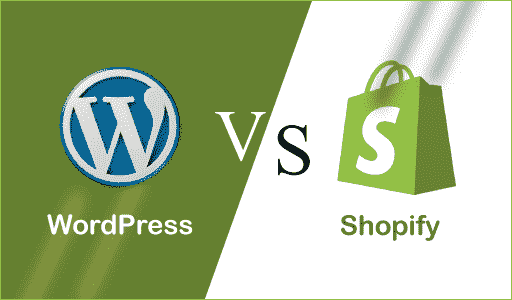

# WordPress vs . WordPress vs . WordPress vs . WordPress vs . WordPress vs . WordPress vs . WordPress vs . WordPress vs . WordPress vs . WordPress vs . WordPress vs . WordPress vs . WordPress vs .Shopify(消歧义)

> 原文：<https://www.javatpoint.com/wordpress-vs-shopify>

WordPress 和 Shopify 都是当前电子商务行业中流行的解决方案。WordPress 和 Shopify 有一些共同的相似之处，但它们之间也有很多不同之处。在这里，我们将讨论 WordPress 和 Shopify 之间的比较。

## 什么是 WordPress？

[WordPress](https://www.javatpoint.com/wordpress-tutorial) 是一个免费开源的**内容管理系统(CMS)** 。用**[【PHP】](https://www.javatpoint.com/php-tutorial)**编写，连接 **[MySQL](https://www.javatpoint.com/mysql-tutorial)** 或 **[MariaDB](https://www.javatpoint.com/mariadb-tutorial)** 数据库。它最初是作为博客工具开发的，但现在已经发展成为一个灵活的内容管理系统。它可以用来创建博客、网站和移动应用程序。它也用于使用 [WordPress 插件](https://www.javatpoint.com/wordpress-plugins)创建在线商店。

WordPress 是使用中最流行的内容管理系统(CMS)解决方案之一。被超过 **60** 万个网站使用，其中排名前 10**的 **34%** 万个**万个[网站](https://www.javatpoint.com/website)直至 **2019** 。

WordPress 由它的创始人美国开发者**马特·莫楞威格**和英国开发者**迈克·利特尔**开发，最初于 2003 年 5 月 27 日**发布。根据**通用公共许可证(GNU)** 许可的软件。**

## 什么是 Shopify？

Shopify Inc .是一家跨国电子商务公司。它是一个用于在线商店和零售销售点系统的电子商务付费工具平台。它为在线零售商提供了服务套件，包括[营销](https://www.javatpoint.com/marketing-tutorial)、支付、交付和客户体验工具，以简化小商户在线商店的运营。它是由**托拜厄斯 Ltke、丹尼尔·韦南德**和**斯科特·莱克**在 **2004** 中开发的。

## Shopify 和 WordPress 的主要区别

在这里，我们将讨论 Shopify 和 WordPress 的主要区别。

1.  WordPress 是免费的，是一个开源的内容管理系统(CMS)，它基于 PHP，使用 MySQL 或 MariaDB 数据库，而 Shopify 是一个电子商务平台。
2.  WordPress 用于在线平台，而 Shopify 可以用于在线和离线平台。
3.  WordPress 的模板数量有限，大多数都不是免费使用的，而 Shopify 提供了大量免费使用的模板。
4.  作为一个开源解决方案，WordPress 对于小型企业来说可能是一个可以接受的选择，而对于 Shopify 来说可能不是这样。
5.  作为一个电子商务平台，Shopify 已经有了一个托管网站，所以它提供了比 WordPress 好得多的安全性。
6.  对于博客平台来说，WordPress 将是比 Shopify 更好的选择。

## 让我们以表格的形式来讨论 Shopify 和 WordPress 之间的直接比较。

| 特征 | 购物 | 博客 |
| **定义** | Shopify 是一个电子商务平台。 | 它是免费的开源内容管理系统。用 PHP 编写，连接 MySQL 或 MariaDB 数据库。 |
| **实施** | 我们可以很容易地在 shopify.com 注册使用 Shopify，并且在快速设置过程后就可以使用了。 | 在 WordPress 中，用户必须经历多个设置，例如购买域、设计实现、网络托管帐户和配置设置过程。 |
| **架构** | Shopify 本质上是一个电子商务平台，开发者可以在这里开始创建一个功能性的电子商务商店。 | 在 WordPress 中，用户必须经历多个设置，例如购买域、设计实现、网络托管帐户和配置设置过程。 |
| **可用性** | Shopify 是一个付费工具，与 WordPress 相对。 | WordPress 是自由软件，可以根据用户的需求进行下载和实现。 |
| **技能集** | 在 Shopify 的情况下，不需要编码技巧。 | WordPress 基于定制和实现过程，因此需要编码、设计和网站构建技能。 |
| **储存** | Shopify 提供无限的文件存储。 | 它的存储取决于网络主机。 |
| **高级功能** | Shopify 可以用于在线和离线平台。 | WordPress 可能只用于在线平台。 |

* * *