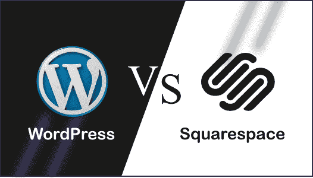

# WordPress 与 Squarespace

> 原文：<https://www.javatpoint.com/wordpress-vs-squarespace>

WordPress 是一个开源的内容管理系统，而 Squarespace 是一个提供软件即服务的网站构建者(SaaS)。在本文中，我们将讨论 WordPress 和 Squarespace 之间的比较。

## 什么是 WordPress？

[WordPress](https://www.javatpoint.com/wordpress-tutorial) 是一个免费开源的**内容管理系统(CMS)** 。用**[【PHP】](https://www.javatpoint.com/php-tutorial)**编写，连接 **[MySQL](https://www.javatpoint.com/mysql-tutorial)** 或 **[MariaDB](https://www.javatpoint.com/mariadb-tutorial)** 数据库。它最初是作为博客工具开发的，但现在已经发展成为一个灵活的内容管理系统。它可以用来创建博客、网站和移动应用程序。它也用于使用 [WordPress 插件](https://www.javatpoint.com/wordpress-plugins)创建在线商店。

WordPress 是使用中最流行的内容管理系统(CMS)解决方案之一。被超过 6000 万个网站使用，其中排名前 10 的**有 **34%** 个**万个网站，直到 **2019** 。

WordPress 由它的创始人开发，美国开发者**马特·莫楞威格**和英国开发者**迈克·利特尔**。最初于 2003 年 5 月 27 日**发布。本软件根据**通用公共许可证(GNU)** 获得许可。**

## 什么是方形空间？

Squarespace 是一家美国私营公司，为网站建设和托管提供软件即服务(SaaS) 。Squarespace 客户使用预先构建的网站模板和拖放组件来创建网页。它是由**安东尼·卡萨莱娜**在马里兰大学**上学时开发的一项博客托管服务。它最初于 2004 年发布，直到 2006 年只有一名员工。它最初是作为博客创建者开发的。它不断增长的工具和服务帮助许多电子商务公司成名。**

## 方形空间和 WordPress 的面对面比较

在这里，我们将讨论 Squarespace 和 WordPress 之间的头对头比较。

| 特征 | 方形空间 | 博客 |
| **易用性** | 这是一个用户友好的拖放网站构建器平台，在这里我们可以轻松创建一个网站，而无需深入了解这个平台，也无需任何人的帮助。 | 如果我们是初学者，使用深度学习曲线。我们需要知道代码是如何在 WordPress 中运行的，或者可以雇佣任何人来寻求帮助。 |
| **灵活性** | 它不太灵活，但所有的工具和功能都受到严密的控制、监控和测试，以确保始终 100%工作。 | 它非常灵活和可定制，尤其是插件。如果他们崩溃了，可能会有很大的问题。 |
| **功能** | 它有广泛的内置功能，质量更好，覆盖面更广。它定期更新并包含新功能。 | 它的内置功能范围有限，并且更多地依赖第三方插件来获得额外的功能。 |
| **应用和插件** | Squarespace 不需要安装任何外部应用程序和插件，因为它们已经完全集成。它的插件数量最少，风险也较小。 | 与 Squarespace 相比，它的插件范围更广。它有成千上万的插件安装在 WordPress 网站上。它有更多的选择，但在选择时要小心。 |
| **SEO** | 搜索引擎优化功能已经在 Squarespace 中得到管理和内置。 | 与 Squarespace 相比，WordPress 拥有更强大的搜索引擎优化工具。我们可以通过在 WordPress 上安装搜索引擎优化插件来选择像 Yoast 这样强大的工具。 |
| **持续维护** | 这是一个“封闭”的环境，他们控制平台的所有方面，并为我们执行所有的更新和维护工作。 | WordPress 需要频繁的维护，尤其是当他们的开发人员更新平台和主题时。在 WordPress 中，我们负责维护网站的所有方面。 |
| **安全** | Squarespace 为我们管理所有的安全和更新。如果有任何安全问题，专家会处理。 | 在 WordPress 中，我们负责维护网站的安全。 |
| **帮助和支持** | 它为专门的支持团队提供有组织的教程。我们还可以通过电子邮件或实时聊天获得帮助。 | 它为一个大型社区提供资源和教程，但管理不善。大多数用户向开发者付费寻求帮助。 |
| **定价** | 它提供四种保费计划，从每月 12 美元到 40 美元不等。 | 它的价格从 200 美元到 1500 美元不等，取决于各种因素，如主机、主题、插件、招聘帮助等。 |

* * *