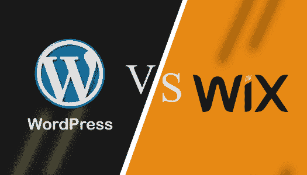

# WordPress vs . WordPress vs . WordPress vs . WordPress vs . WordPress vs . WordPress vs . WordPress vs . WordPress vs . WordPress vs . WordPress vs . WordPress vs . WordPress vs . WordPress vs .维 x

> 原文:[https://www.javatpoint.com/wordpress-vs-wix](https://www.javatpoint.com/wordpress-vs-wix)

WordPress 和 Wix 都是用来创建网站的，但是它们有完全不同的网站创建方法。WordPress 是一个内容管理系统，而 Wix 是一个网站构建器。在这个主题中，我们将讨论 WordPress 和 Wix。

## 什么是 WordPress？

[WordPress](https://www.javatpoint.com/wordpress-tutorial) 是一个免费开源的**内容管理系统(CMS)** 。用**[【PHP】](https://www.javatpoint.com/php-tutorial)**编写，连接 **[MySQL](https://www.javatpoint.com/mysql-tutorial)** 或 **[MariaDB](https://www.javatpoint.com/mariadb-tutorial)** 数据库。它最初是作为博客工具开发的，但现在已经发展成为一个灵活的内容管理系统。它可以用来创建博客、网站和移动应用程序。它也用于使用 [WordPress 插件](https://www.javatpoint.com/wordpress-plugins)创建在线商店。

WordPress 是使用中最流行的内容管理系统(CMS)解决方案之一。被超过 **60** 万[网站](https://www.javatpoint.com/website)使用，其中 **34%** 的前 **10** 万网站直到 **2019** 。

2003 年 5 月 27 日，WordPress 由创始人美国开发者马特·莫楞威格和英国开发者 T2 在 T4 开发。本软件根据**通用公共许可证(GNU)** 获得许可。

## Wix 是什么？

Wix.com 有限公司是一家以色列软件有限公司，为用户提供基于云的网络开发服务。它允许用户使用在线拖放功能建立 [HTML5](https://www.javatpoint.com/html5-tutorial) 网站和移动网站。由 **2006** 中**纳达夫·阿布拉哈米、佐拉·卡普兰**、**阿维沙伊·阿布拉哈米**开发。

通过使用 **Wix 开发的**和**第三方**应用，用户可以在其网站上包括社交插件、[在线营销](https://www.javatpoint.com/online-marketing)、电子邮件营销、电子商务、交流形式和社区论坛。Wix 开发者基于 freemium 商业模式，通过高级升级获得收入。

## WordPress 和 Wix 的主要区别

现在我们来讨论一下 WordPress 和 Wix 的主要区别。

1.  WordPress 是一个免费的开源内容管理系统，而 Wix 提供了一个基本的免费网站，功能有限。如果我们想使用 Wix 中的所有功能，我们需要使用高级服务。
2.  WordPress 没有官方支持，但它有许多论坛和社区支持，而 Wix 通过电话、视频、电子邮件等获得了全面的客户支持。
3.  如果我们有 HTML 和 CSS 的基础知识，WordPress 主题是可以定制的，而 Wix 主题可以在没有任何 web 编程知识的情况下轻松定制。

## Wix 和 WordPress 之间的直接比较

在这里，我们将以表格形式讨论 Wix 和 WordPress 之间的面对面比较:

| 特征 | 威克斯 | 博客 |
| **易用性** | 它非常容易使用和学习。它提供了拖放界面工具，我们可以通过它来选择和定制网站上的元素。我们不需要为此学习或编写任何代码。 | 它很容易学习和使用，但我们必须熟悉网站的各个部分以及如何使用它们。我们需要定制主题，并按照自己的意愿编写内容。它没有拖放功能。 |
| **设计和布局** | 它有很多很好的视觉模板，反应灵敏，可以进一步定制，比如重新排列元素、设计等。它有一个缺点，一旦我们选择了一个模板，我们就可以在将来更改它。 | 它也有各种免费主题以及高级主题。正如我们所知，免费主题和插件的支持有限，而高级主题提供各种功能并定制网站和切换到不同的主题。 |
| **应用和插件** | 定制是有限的，但所有的功能和特性都受到严密的监控、控制和测试，以确保正常运行。 | 它非常灵活且可定制，但如果定制软件或插件出现故障，可能会有问题。 |
| **电商** | 销售功能内置于其任何电子商务计划中。这对销售几个产品有好处。 | 它提供各种模板；因此，我们可以用一个帮助我们销售产品、商品、订阅等的电商插件来建立我们自己的电子商务在线商店。WordPress 提供了比 Wix 更多的选项来完成网站。 |
| **写博客** | 它支持标签、投稿作者和移动博客等类别。它提供一个免费的媒体库。 | 它还支持类别，如标签与特色图像，私人帖子和帖子回溯。 |
| **SEO** | 它有基本的搜索引擎优化工具，包括一些高级功能的无限或更高的软件包通过网站助推器。 | 它还配备了基本的搜索引擎优化工具，并支持 Yoast 搜索引擎优化插件，该插件具有网站的全部高级功能，溢价为 69 美元。 |
| **客户支持** | 它还有一个官方支持论坛，提供各种主题、视频、电子邮件和电话支持。Wix 网站为每个元素提供了一个支持图标。 | 它没有官方支持，但它有各种在线论坛，有网络开发者的社区。 |
| **定价和持续承诺** | 它有七个保费计划，从每月 13 美元到 49 美元不等。我们也可以免费使用它，但它有一些限制。 | 它的价格从 200 美元到 1500 美元不等，取决于各种因素，如主机、主题、插件、招聘帮助等。 |

* * *