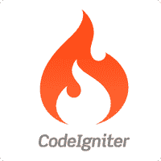

# CodeIgniter 教程

> 原文:[https://www.javatpoint.com/codeigniter-tutorial](https://www.javatpoint.com/codeigniter-tutorial)

CodeIgniter 教程提供了 CodeIgniter 的基本和高级概念。我们的 CodeIgniter 教程是为初学者和专业人士设计的。

CodeIgniter 是一个高性能的 PHP 框架，用于开发基于 MVC 的 web 应用程序。

我们的 CodeIgniter 教程包括所有主题，如 CodeIgniter 架构、版本、模型、文件系统、url、模型、视图、控制器、数据库配置、保存记录、查看记录、删除记录、更新记录、crud 示例、身份验证示例等。

* * *

## 代码点火器索引

* * *

**CodeIgniter 教程**

*   [CodeIgniter 教程](codeigniter-tutorial)
*   [什么是 CodeIgniter](what-is-codeigniter)
*   [CodeIgniter 许可证](codeigniter-license)
*   [CodeIgniter 版本](codeignitor-versions)
*   [代码点火器功能](features-of-codeigniter)
*   [代码点火器安装](codeigniter-installation)
*   [CodeIgniter 文件系统](file-structure-in-codeigniter)
*   [CodeIgniter 架构](codeigniter-architecture)
*   [CodeIgniter MVC](codeigniter-model-view-controller)
*   [车型](codeigniter-models)
*   [视图](codeigniter-views)
*   [控制器](codeigniter-controller)

**代码点火器示例**

*   [代码点火器第一个例子](codeigniter-first-example)
*   [编码签名 URL](codeigniter-url)
*   [CodeIgniter 创建站点](basic-site-creation-in-codeigniter)
*   [代码点火器方法](codeigniter-methods)
*   [代码点火器助手](codeigniter-helper)
*   [代码点火器库](codeigniter-library)
*   [代码点火器网址路由](codeigniter-url-routing)
*   [代码点火器挂钩](codeigniter-hooks)
*   [置信区间通过参数](codeigniter-passing-parameter)
*   [代码点火器驱动程序](codeigniter-driver)

**CodeIgniter 数据库**

*   [CodeIgniter 数据库](codeigniter-database-configuration)
*   [CI 数据库插入](codeigniter-database-insert-record)
*   [配置项数据库选择](codeigniter-database-select-record)
*   [CI 登录表单](codeigniter-login-form)
*   [CI 数据库登录表](codeigniter-database-login-form)

**CodeIgniter 安全**

*   [CI 安全等级](codeigniter-security-class)
*   [csrf](codeigniter-preventing-enabling-from-csrf)

**CodeIgniter 面试**

*   [CI 面试问题](codeigniter-interview-questions)

* * *

## 先决条件

在学习 CodeIgniter 之前，您必须具备 PHP 的基本知识。

## 观众

我们的 CodeIgniter 教程旨在帮助初学者和专业人士。

## 问题

我们保证您在本 CodeIgniter 教程中不会发现任何问题。但是如果有任何错误，请在联系表格中发布问题。