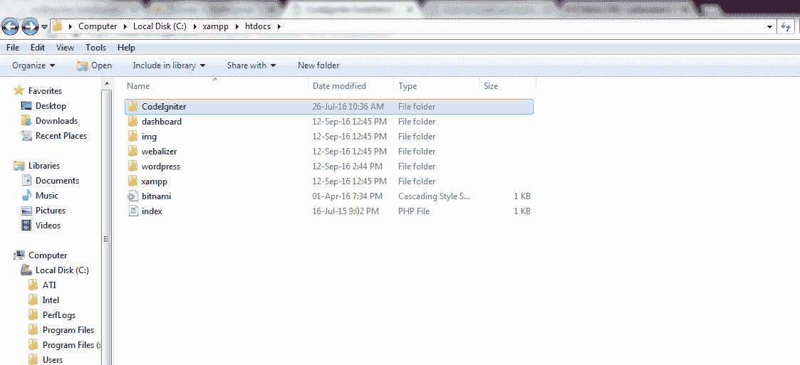

# CodeIgniter 安装

> 原文:[https://www.javatpoint.com/codeigniter-installation](https://www.javatpoint.com/codeigniter-installation)

按照给定的步骤安装 CodeIgniter:

**1)从其官网下载 CodeIgniter。**

从其官方网站下载当前版本的 CodeIgniter

https://www.codeigniter.com

**2)解压 CodeIgniter 包。**

下载的 CodeIgniter 将采用 zip 格式。复制它并将其放入您的 htdocs 文件夹中。解压并重命名。我们将其命名为 **CodeIgniter。**

**3) CodeIgniter 用户指南**

在浏览器上，键入 **localhost/CodeIgniter/** (在解压缩文件夹的 localhost 类型名称之后)。如果出现上面的快照页面，则表示您的文件已成功安装。

**4)用任意文本编辑器在 application/config/config.php 文件中设置基础 URL。**

**5)您需要建立与数据库的连接。转到路径 application/config/database . PHP 文件。**

查看上面的快照，填写关于您的数据库的详细信息，如主机名、用户名、密码和数据库名称。