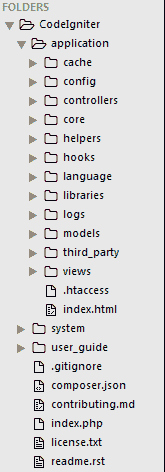
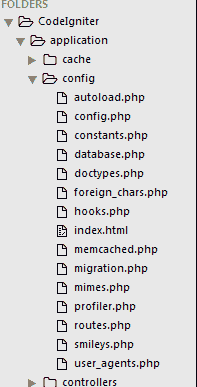
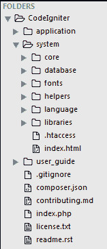

# CodeIgniter 中的文件结构

> 原文:[https://www.javatpoint.com/file-structure-in-codeigniter](https://www.javatpoint.com/file-structure-in-codeigniter)

解压缩 CodeIgniter 文件夹后，您将获得 CodeIgniter 文件的文件层次结构，如下所示。

CodeIgniter 文件结构主要分为三部分:

*   应用
*   系统
*   用户指南

* * *

## 应用

应用程序文件夹是您开发项目的主要开发文件夹。它包含您的模型、视图、控制器、配置和许多其他文件。它包含您正在处理的项目的所有代码。

*   **缓存** -缓存存储处理后的数据，以便这些数据可以很容易地加载，以备将来使用。它提高了您的页面访问速度。
*   **配置** -配置文件夹包含如下所示的配置文件。这些文件允许配置 CodeIgniter 应用程序。

看上面的快照，**autoload.php**文件将加载你的库，助手或者你可以定义自定义文件，这样你就不用在你的项目中一次又一次地调用它们。在**config.php**文件中，我们设置了我们的基本网址等。在**database.php**文件中，我们需要配置我们的数据库设置，以便从我们的项目中连接它。在**routes.php**文件中，您可以设置您的默认控制器页面。

*   **控制器** - Web 应用流程由控制器控制。所有服务器端功能都由控制器处理。简而言之，它控制 CodeIgniter 应用程序。如果控制器出现故障，与之相关的所有工作也将失败，就像计算机中的中央处理器一样。

控制器类文件的名称总是以大写字母开头。例如，它将被命名为 Main.php，而不是 main.php。

*   **Core** - CodeIgniter 有一些核心类，这些类组成了 CodeIgniter 框架，保存在 Core 文件中。

一般来说，不需要更改这些类，但是如果您正在修改类，请在“应用程序/核心”文件夹中创建一个与“系统”文件夹中的核心类文件名同名的类。

*   **助手** -一个助手帮助你完成 CodeIgniter 中的任务。例如，

**$本- >加载- >助手('表单')；**将创建一个与 CodeIgniter 完美配合的表单。和

**$本- >加载- >助手('日期')；**将在您的应用程序中为您提供日期功能。

*   **挂钩** -该文件夹干涉应用程序流程的内部工作。
*   **语言** -在这个文件夹的帮助下，你可以创建特定语言的文本文件，并且可以在你的项目中使用它们。
*   **库** -在这个文件夹中你可以存储你为你的应用开发的库。
*   **日志** -如果您的 CodeIgniter 应用程序正在显示一些错误或异常处理消息，并且您没有得到它们是什么，您可以在此文件夹中查找它们的解释。
*   **模型** -模型用于加载数据库查询。控制器请求模型加载数据库查询，模型响应它，然后控制器使用它。
*   **第三方** -第三方插件存储在这个文件夹中，在应用中使用。
*   **视图** -包含你所有的 html 文件。控制器从视图加载文件，然后给出输出。

* * *

## 系统

CodeIgniter 应用程序的所有操作都发生在这里。它包含使编码变得容易的文件。

*   **核心** -包含 CodeIgniter 核心类。请勿对此文件夹进行任何更改。
*   **数据库** -包含数据库驱动和其他实用程序。
*   **字体** -包含字体相关信息。
*   **助手** -包含网址、日期、cookie 等默认助手。
*   **语言** - CodeIgniter 支持多语言 web 应用。它包含默认语言文件。
*   **库** -包含日历、文件上传、电子邮件等库。您创建的库将保存在“应用程序/库”中。在这里，将只存储标准库。

* * *

## 用户指南

这是离线 CodeIgniter 指南。它伴随着每一个 CodeIgniter 下载版本。如果有任何疑问，您可以阅读其用户指南。你可以在这里学习 CodeIgniter 的所有函数、库、助手。在开始使用 CodeIgniter 之前，请仔细阅读本指南一次。

最后但同样重要的是，你可以看到一个文件**index.php。**这里可以设置应用环境和错误等级。如果唐，最好不要碰这个文件？我没有足够的知识。