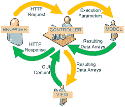

# 模型-视图-控制器

> 原文:[https://www . javatpoint . com/codeigniter-model-view-controller](https://www.javatpoint.com/codeigniter-model-view-controller)

CodeIgniter 框架基于 MVC 模式。MVC 是一个软件，它给你一个独立于展示视图的逻辑视图。因此，网页包含最少的脚本。



## 模型

模型由控制器管理。它代表你的数据结构。模型类包含一些函数，通过这些函数可以在数据库中插入、检索或更新信息。

**需要注意的几点**

默认情况下，如果您没有在网址中编写任何第二个方法，则总是加载**索引**方法。例如，如果您的方法是

```php
public function index()

```

然后你的网址会像

```php
abc.com/index.php/file/index/

```

运筹学

```php
abc.com/index.php/file/

```

但是如果你的方法是

```php
public function xyz()

```

然后你的网址会像

```php
abc.com/index.php/file/xyz/

```

## 视角

视图是呈现在用户面前的信息。它可以是一个网页或网页的一部分，如页眉和页脚。

## 控制器

控制器是模型和视图之间的中介，处理 HTTP 请求并生成网页。控制器收到的所有请求都被传递给模型和视图来处理信息。它是您在 web 应用程序上的每一个请求的中心。

**需要注意的几点**

*   控制器文件必须以大写字母开头命名。
*   类名也应该以大写字母开头，并且应该与文件名相同。
*   给定的 calss 扩展到 CI_Controller，以便它继承它的所有方法。

如果您认为模型对您没有用或者它们更复杂，那么您可以忽略它们，并使用控制器和视图来构建您的项目。