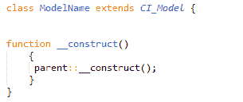
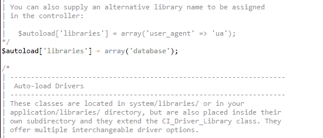

# 模型

> 原文:[https://www.javatpoint.com/codeigniter-models](https://www.javatpoint.com/codeigniter-models)

* * *

# 什么是模型

在任何应用程序中，您都需要调用一个函数来从数据库中检索一些信息。模型的职责是处理所有数据逻辑和表示，并在视图中加载数据。存储在**应用/模型中。**



看上面的快照，这是一个模型文件的基本结构。

这里，模型名称是模型文件的名称。请记住，类的第一个字母必须是大写字母，然后是其他小写字母，并且它应该与您的文件名相同。它扩展了基本的 CodeIgniter 模型，这样父模型文件的所有内置方法都会继承到新创建的文件中。

模型文件名将以大写字母保存在**应用/模型文件夹中。**例如，如果上面的模型名是你的类，那么你的文件名将是 ModelName.php

* * *

# 加载模型

模型用以下代码加载到控制器的文件中，

```php
$this->load->model('ModelName');

```

如果你的模型文件位于模型文件夹的子目录中，那么你必须提到完整的路径。例如，如果您的文件位置是应用程序/控制器/模型/项目/模型名称。然后，您的文件将如下所示被加载，

```php
$this->load->model('project/ModelName');

```

* * *

## 将模型连接到数据库

加载模型并不意味着它会自动连接到您的数据库。连接数据库有不同的方法。

**。自动连接**功能将在每次页面加载时自动加载您的数据库。要启用它，请在 autoload.php 文件的数组库中添加单词“database”。



**通过在页面中需要的地方添加该代码，手动连接**数据库。

```php
$this->load->database();

```