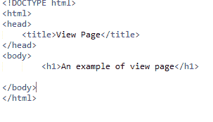
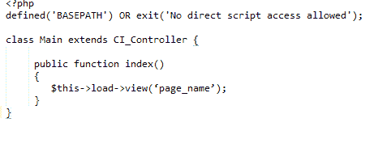
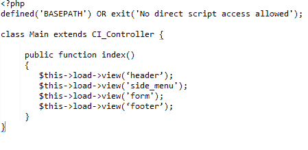

# 视图

> 原文：<https://www.javatpoint.com/codeigniter-views>

* * *

# 什么是观点

视图文件夹包含所有的标记文件页眉、页脚、侧边栏等。它们可以通过嵌入控制器中的任何位置来重用。它们是显示在用户浏览器上的界面设计，不能直接调用，必须加载到控制器的文件中。

* * *

## 查看语法

创建一个文件并将其保存在应用程序/视图文件夹中。例如，我们创建了一个文件 Firstview.php，



* * *

## 加载视图

无法直接访问视图。它总是加载到控制器文件中。下面一行用于加载视图页面。

```php
$this->load->view('page_name');

```

将视图的页面名称写在括号中。不需要指定**。php** 除非你正在使用一些其他的扩展。

现在，转到您的控制器文件**(Main.php)**并编写如下所示的代码。



* * *

## 加载多个视图

您的视图可能包含几个文件，如页眉、页脚、侧面菜单、表单等。有时您可能需要同时加载多个文件。这样的话，只需多次调用**$ this->load->view()**即可。

