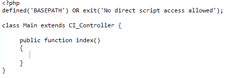

# 控制器

> 原文:[https://www.javatpoint.com/codeigniter-controller](https://www.javatpoint.com/codeigniter-controller)

* * *

## 什么是控制器

控制器是模型和视图之间的中介，处理 HTTP 请求并生成网页。控制器收到的所有请求都被传递给模型和视图来处理信息。它是 web 应用程序中每个请求的中心。

考虑跟随 URI，

```php
abc.com/index.php/front/

```

在这个 URI，CodeIgniter 将尝试找到 Front 文件和 Front 类。

* * *

## 控制器语法



看上面的 snaphsot，控制器的文件名是**Main.php**(首字母必须大写)，类名是 **Main** (首字母必须大写)。

* * *

# 什么是默认控制器

当 URL 中没有提到文件名时，默认情况下将加载默认控制器中指定的文件。默认是**Welcome.php**安装 CodeIgniter 后看到的第一页。

带网址

```php
localhost/codeigniter/

```

Welcome.php 将被加载，因为没有在网址中提到文件名。

虽然根据您的需要，您可以在文件**中更改默认控制器**

```php
$route['default_controller'] = ' ';

```

在这里，指定默认情况下要加载的文件名。

* * *

## 类构造函数

要使用构造函数，您需要提到下面的代码行，

```php
Parent::__construct()

```

我们需要手动调用父构造函数，因为本地构造函数将覆盖父控制器中的构造函数。