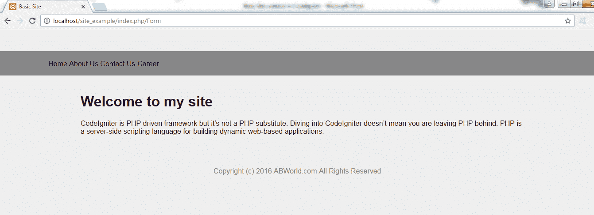

# CodeIgniter 中的基本站点创建

> 原文:[https://www . javatpoint . com/basic-site-creation-in-codeigniter](https://www.javatpoint.com/basic-site-creation-in-codeigniter)

在这里，我们将学习如何在 CodeIgniter 的帮助下创建一个基本站点。

在控制器文件夹中，我们将创建一个名为**Form.php**的文件

```php
<?php defined('BASEPATH') OR exit('No direct script access allowed');

class Form extends CI_Controller {

	public function index()
	{
		$this-??>load->view('header');
		$this->load->view('nav');
		$this->load->view('content');
		$this->load->view('footer');
	}
}	
?>

```

我们为页眉、导航、内容和页脚创建了不同的文件，所有这些文件都被加载到 contoller 的文件中。

文件**header.php**在**应用/视图**

```php

	<title>Basic Site</title>

```

文件**nav.php**在**应用/视图**

```php
<div id="container">
	<div id="nav">
		<ul>
			<li><a href="#">家</a></li>
			<li><a href="#">关于我们</a></li>
			<li><a href="#">联系我们</a></li>
			<li><a href="#">职业</a></li>
		</ul>
	</div>
</div>
<p>文件<strong>content.php</strong>在<strong>应用/视图</strong></p>
<div class="codeblock"><pre name="code" class="Php"><div id="content">
		<h1>欢迎来到我的网站</h1>
		<p>CodeIgniter 是 PHP 驱动的框架，但它不是 PHP 的替代品。潜入 CodeIgniter 不会？这并不意味着你将 PHP 抛在脑后。PHP 是一种服务器端脚本语言，用于构建动态的基于 web 的应用程序。</p>
</div>

</pre></div>
<p>文件<strong>footer.php</strong>在<strong>应用/视图</strong></p>
<div class="codeblock"><pre name="code" class="Php"><div id="footer">
		<p>版权所有(c)2016 ABWorld.com 版权所有</p>
	</div>

</pre></div>

```

**最终输出**如下所示，网址为**localhost/site _ example/index . PHP/Form。**

[download this example](src/codeigniter/site_example.zip)