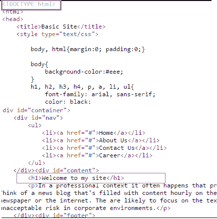

# 代码点火器助手

> 原文:[https://www.javatpoint.com/codeigniter-helper](https://www.javatpoint.com/codeigniter-helper)

* * *

## 什么是帮手

在 CodeIgniter 中，有一些助手可以帮助你完成不同的任务。每个助手文件都是针对特定角色的函数的集合。一些助手是帮助你处理文件的“文件助手”，“文本助手”执行各种文本格式化例程，“表单助手”创建表单元素，“cookie 助手”设置和读取 cookie，“网址助手”帮助创建链接等。

助手不是用面向对象的格式编写的，相反，它们是简单的过程函数，相互独立。

要使用帮助文件，您需要加载它。加载后，它对您的控制器和视图是全局可用的。它们位于 CodeIgniter 中的两个位置。CodeIgniter 将首先在**应用程序/助手**文件夹中寻找一个助手，如果在那里没有找到，它将转到**系统/助手**文件夹。

* * *

## 加载助手

一个助手可以被加载到控制器构造器中，这使得它们全局可用，或者它们也可以被加载到需要它们的特定函数中。

它可以加载以下代码:

```php
$this->load->helper('file_name');

```

在文件名的地方写下你的文件名。

要加载**网址**助手，

```php
$this->load->helper('url');

```

如果您的应用程序全局需要某个助手，您也可以通过在**应用程序/配置/自动加载. php** 文件中添加该助手来自动加载该助手。

* * *

## 加载多个助手

要加载多个助手，请在数组中指定它们，

```php
$this->load->helper(
		array('helper1', 'helper2', 'helper3')
);

```

## html 助手示例

我们将向您展示一个 html 助手的例子，在一个基本的网站页面中使用它。在这里，我们将自动加载我们的助手。

通过**应用程序/配置/自动加载. php** 转到**autoload.php**文件

```php
$autoload['helper'] = array('html');

```

在上面的文件中，命名你的助手，这里是 html。

在**应用程序/控制器**中有文件 Form.php

```php
<?php defined('BASEPATH') OR exit('No direct script access allowed');

class Form extends CI_Controller {

	public function index()
	{
		$this-??>load->view('header');
		$this->load->view('nav');
		$this->load->view('content');
		$this->load->view('footer');
	}
}	
?>

```

在**应用/视图**中有文件 header.php

第一行用 php 标签编码。

```php
<?php echo doctype("html5"); ???>

	<title>Basic Site</title>

```

文件 header.php 的另一半编码如下图所示。

在**应用/视图**中有文件 content.php

这里的标题也是用 php 标签而不是 html 写的。

```php
<div id="content">
		<?php echo heading("Welcome to my site", 1); ???>
		<p>在专业背景下，经常会发生私人或公司客户在实际内容还没有准备好的情况下，要求制作和呈现一份出版物。想象一下，在直播当天，新闻博客每小时都充满了内容。然而，评论者往往会被可理解的内容分散注意力，比如从报纸或互联网上复制的随机文本。很可能会专注于文本，而忽略布局及其元素。除此之外，随意的文字有可能会带来莫名其妙的幽默或冒犯，这在公司环境中是不可接受的风险。</p>
	</div>

```

**最终输出**就像一个普通的页面，如下图所示，网址**本地主机/助手/索引. PHP/表单**。


但是当我们看到它的**开源(通过按 ctrl+u)** 时，你会看到下面的代码，它只是显示了 html 代码，而不是我们上面写的 php 代码。

