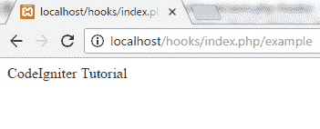
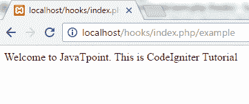

# CodeIgniter 钩子

> 原文：<https://www.javatpoint.com/codeigniter-hooks>

在 CodeIgniter 中，钩子是可以在程序执行前后调用的事件。它允许在 CodeIgniter 执行过程中执行具有特定路径的脚本，而无需修改核心文件。例如，它可以用于需要在控制器执行之前检查用户是否登录的地方。使用 hook 将节省您多次编写代码的时间。

CodeIgniter 中有两个钩子文件。一个是**应用/配置/hooks.php** 文件夹，另一个是**应用/hooks** 文件夹。

在其他语言中，如果您想在每次加载控制器构造函数后运行代码，可以在钩子中指定脚本路径。

* * *

## 启用挂钩

要启用 Hook，请转到**应用程序/配置/config.php** 文件，并将其设置为真，如下所示。

```php
$config['enable_hooks'] = TRUE;

```

* * *

## 定义钩子

钩子可以在**应用程序/配置/钩子. php** 文件中定义。每个钩子被定义为由以下术语组成的数组。

```php
$hook['pre_controller'] = array(
			'class' => 'Classname',
			'function' => 'functionname',
			'filename' => 'filename.php',
			'filepath' => 'hooks',
			'params' => array('element1', 'element2', 'element3')
			);

```

**类** -这里，你必须提到你在 hooks.php 文件中定义的类的名称。如果您使用的是过程函数而不是类，请将其留空。

**功能** -提到你正在调用的功能名称。

**文件名** -在**应用程序/钩子**文件夹中创建的文件名，包含上述类和函数名。

**文件路径** -这里你必须提到包含你的脚本的目录的名称。您的脚本必须位于**应用程序**文件夹中。如果您的脚本位于**应用程序/挂钩**文件夹中，那么您的路径将只是挂钩。但是如果你的脚本位于**应用/hooks/office** 文件夹，那么你的路径将是 **hooks/office。**

**参数** -它包括你想要在脚本中传递的参数，并且是可选的。

* * *

## 对同一个钩子的多次调用

您可以使用多维数组在多个脚本中使用同一个钩子点。

```php
$hook['pre_controller'][] = array(
					'class' => 'Classname1',
					'function' => 'functionname1',
					'filename' => 'filename1.php',
					'filepath' => 'hooks',
					'params' => array('element1', 'element2', 'element3')
					);

 $hook['pre_controller'][] = array(
					'class' => 'Classname2',
					'function' => 'functionname2',
					'filename' => 'filename2.php',
					'filepath' => 'hooks',
					'params' => array('element4', 'element5', 'element6')
					);

```

括号 **[]** 可以让你和多个脚本有相同的勾点。您的执行顺序将与定义的数组相同。

* * *

## 挂钩点

挂钩点列表如下所示。

*   **预系统**

它在系统执行之前很久就被调用了。此时只加载了基准和钩子类。

*   **预控制器**

它会在您的控制器被调用之前立即被调用。至此，所有的类、安全检查和路由都已完成。

*   **post _ controller _ constructor**

它在控制器启动后立即被调用，但在任何方法调用之前。

*   **后置控制器**

它在您的控制器完全执行后立即被调用。

*   **显示 _ 覆盖**

它用于在文件执行结束时发送最后一页。

*   **缓存 _ 覆盖**

它使您能够在输出类中调用自己的函数。

*   **post_system**

在系统执行结束时，在最终页面发送到浏览器后调用它。

* * *

## 钩子示例

1)首先，如上所述，在 CodeIgniter 文件夹中启用钩子。

2)在应用程序/控制器文件夹中创建控制器文件 example.php

```php
<?php defined('BASEPATH') OR exit('No direct script access allowed');
class Example extends CI_Controller {
public function index()
	{
		echo "CodeIgniter Tutorial";
}
}
</pre??>
```

使用网址运行上述程序时，

**http://localhost/hooks/index . PHP/example**，将出现如下输出。



3)在**应用程序/钩子**文件夹中创建钩子文件**exm.php**。

```php
<?php defined('BASEPATH') OR exit('No direct script access allowed');
class Exm extends CI_Controller {
public function tut()
	{
		echo "Welcome to JavaTpoint. This is ";
	}
}
???>

```

4)现在你必须在**应用/配置/钩子**文件夹中定义你的钩子。

```php
<?php defined('BASEPATH') OR exit('No direct script access allowed');

$hook['pre_controller'] = array(
		'class' =??> 'Exm',
		'function' => 'tut',
		'filename' => 'exm.php',
		'filepath' => 'hooks',
		);
?>

```

5)现在再次使用相同的网址运行您的程序，并查看结果。

