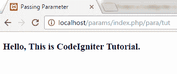

# 在代码点火器中传递参数

> 原文:[https://www.javatpoint.com/codeigniter-passing-parameter](https://www.javatpoint.com/codeigniter-passing-parameter)

现在我们将看到一个将参数从控制器传递到视图的例子。

1)下载 CodeIgniter 并命名。我们将其命名为**参数。**

2)在**应用程序/控制器**文件夹中创建文件**para.php**。

```php
<?php if(!defined('BASEPATH')) exit('No direct script access allowed'); 
class Para extends CI_Controller{
// declaring variables
var $name;
	function __construct(){
	parent::__construct();
// passing value
$this-??>name="CodeIgniter";
}
function tut()
{
$data['name']=$this->name; 
// define variable sent to views
$this->load->view('para_view',$data);
 }
}
?>

```

3)在**应用程序/视图**文件夹中创建一个文件**。**

```php

	<title>Passing Parameter</title>

	<h3>你好，这里是<?php echo $name ; ???>教程。</h3>

```

4)使用网址在浏览器上运行程序

http://localhost/params/index . PHP/para/tun

5)屏幕上将出现以下输出。

