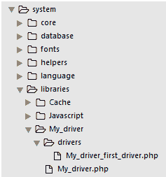
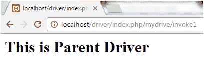
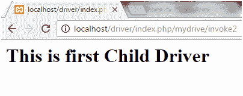

# 代码点火器驱动程序

> 原文:[https://www.javatpoint.com/codeigniter-driver](https://www.javatpoint.com/codeigniter-driver)

CodeIgniter 2.0 及更高版本中引入了驱动程序。

* * *

## 什么是驱动程序

这些是特殊类型的库，有一个父类和许多子类。这些子类可以访问父类，但不能访问它们的兄弟类。它使您能够在控制器内部创建更优雅的类和更优雅的语法。

驱动程序位于 CodeIgniter 文件夹中的**系统/库**文件夹中。

* * *

## 初始化驱动程序

要初始化驱动程序，请编写以下语法。

```php
$this->load->driver('class_name');

```

这里， **class_name** 是你要调用的驱动名称。

例如，要调用驱动程序类 **main_class** ，请执行以下操作。

```php
$this->load->driver('main_class');

```

调用其**方法**，

```php
$this->main_class->a_method();

```

然后可以通过父类直接调用子类，而无需初始化它们。

```php
$this->main_class->first_child->a_method();

	$this->main_class->second_child->a_method();

```

* * *

## 创建自己的驱动程序

在 CodeIgniter 中创建驱动程序有三个步骤。

1.  制作文件结构
2.  制作驱动程序列表
3.  制作驱动程序

* * *

## 制作文件结构

转到 CodeIgniter 的**系统/库**文件夹，新建一个文件夹 My_driver。在这个文件夹中创建一个文件

现在在我的驱动文件夹中创建一个新文件夹，命名为驱动。在这个新文件夹中创建一个文件

将显示以下文件结构。

```php
/libraries
		/My_driver
			My_driver.php
			/drivers
My_driver _first_driver.php

```



在 CodeIgniter 中，驱动程序库结构是这样的，子类不？t 扩展，因此它们不会继承主驱动程序的属性或方法(在本例中是 My_driver)。

*   **My_driver** -是一个班。
*   **My_driver.php** -父驱动
*   **My _ driver _ first _ driver . PHP**-子驱动

* * *

## 制作驱动程序列表

在**系统/库/My_driver** 文件夹的 **My_driver.php** 文件中写下以下代码:

```php
<?php defined('BASEPATH') OR exit('No direct script access allowed');
class CI_My_driver extends CI_Driver_Library
{
	function __construct()
	{
		$this-??>valid_drivers = array('first_driver');
	}
	function index()
	{
		echo "<h1>这是父驱动程序</h1>";
	}
     }

```

在**系统/库/我的驱动程序/驱动程序**中的**My _ driver _ first _ driver . PHP**文件中，编写以下代码:

```php
<?php defined('BASEPATH') OR exit('No direct script access allowed');
class My_driver_first_driver extends CI_Driver
{
	function first()
	{
		echo "<h1??>This is first Child Driver";
	}
     }
?>

```

用以下代码在**应用程序/控制器**中创建一个控制器文件**Mydrive.php**，

```php
<?php defined('BASEPATH') OR exit('No direct script access allowed');
 	class Mydrive extends CI_Controller
 {
 	function __construct()
    {
    		 parent::__construct();
 		 $this-??>load->driver('my_driver');
  	  }
 	public function invoke1()
	{
	   $this->my_driver->index();
}
	public function invoke2()
	{	  
	   $this->my_driver->first_driver->first();
	}
}?>

```

在你的浏览器上运行网址**http://localhost/driver/index . PHP/my drive/invoke 1**



看上面的快照，父驱动程序类在用 invoke1 函数调用。

现在运行 URL，**http://localhost/driver/index . PHP/my drive/invoke 2**



看看上面的快照，子驱动程序类是用 invoke2 函数调用的。