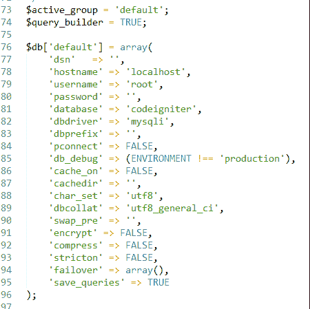
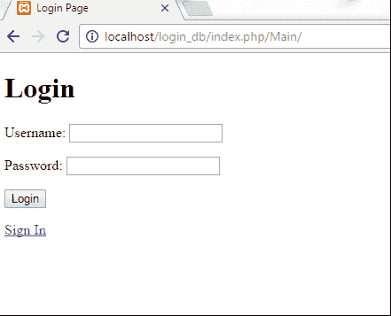
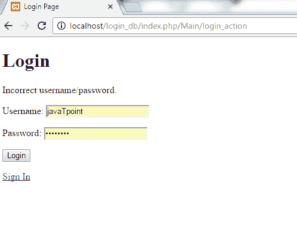

# 登录页面(带数据库)

> 原文：<https://www.javatpoint.com/codeigniter-database-login-form>

在前面的例子中，我们学习了一个只有一个用户名和会话的简单登录页面。

现在，我们将让多个用户使用数据库。用户将会看到一个登录页面。

以下几页是在这个例子中制作的。

在**应用程序/控制器**中

*   Main.php

**在应用/视图中**

*   login_view.php
*   invalid.php
*   data.php
*   signin.php

在**应用/模型**中

*   login_model.php

在第一页，您可以选择**登录**和**登录**。

登录时，如果用户输入了与数据库匹配的正确凭证，那么他将被引导至**data.php**页面。但是如果他输入了错误的信息，那么就会出现不正确的用户名/密码信息。

我们已经将我们的 CodeIgniter 文件夹命名为 **login_db。**我们的表名是**报名**。


我们需要在 login_db CodeIgniter 文件夹中进行一些基本设置。

转到**autoload.php**文件，进行如下设置。


在上面的 snpashot 中，我们已经加载了库和助手。

在**database.php**文件中，填写您的用户名和数据库名称。我们的数据库名是 codeigniter。



现在，我们？我将开始这个例子。

我们在应用程序/控制器文件夹中创建了文件**Main.php**，

```php
<?php defined('BASEPATH') OR exit('No direct script access allowed');

class Main extends CI_Controller {

	public function index()
	{
		$this-??>login();
	}

	public function login()
	{
		$this->load->view('login_view');
	}

	public function signin()
	{
		$this->load->view('signin');
	}

	public function data()
	{
		if ($this->session->userdata('currently_logged_in')) 
		{
			$this->load->view('data');
		} else {
			redirect('Main/invalid');
		}
	}

	public function invalid()
	{
		$this->load->view('invalid');
	}

	public function login_action()
	{
		$this->load->helper('security');
		$this->load->library('form_validation');

		$this->form_validation->set_rules('username', 'Username:', 'required|trim|xss_clean|callback_validation');
		$this->form_validation->set_rules('password', 'Password:', 'required|trim');

		if ($this->form_validation->run()) 
		{
			$data = array(
				'username' => $this->input->post('username'),
				'currently_logged_in' => 1
				);	
					$this->session->set_userdata($data);
				redirect('Main/data');
		} 
		else {
			$this->load->view('login_view');
		}
	}

	public function signin_validation()
	{
		$this->load->library('form_validation');

		$this->form_validation->set_rules('username', 'Username', 'trim|xss_clean|is_unique[signup.username]');

		$this->form_validation->set_rules('password', 'Password', 'required|trim');

		$this->form_validation->set_rules('cpassword', 'Confirm Password', 'required|trim|matches[password]');

		$this->form_validation->set_message('is_unique', 'username already exists');

	if ($this->form_validation->run())
		{
			echo "Welcome, you are logged in.";
		 } 
			else {

			$this->load->view('signin');
		}
	}

	public function validation()
	{
		$this->load->model('login_model');

		if ($this->login_model->log_in_correctly())
		{

			return true;
		} else {
			$this->form_validation->set_message('validation', 'Incorrect username/password.');
			return false;
		}
	}

	public function logout()
	{
		$this->session->sess_destroy();
		redirect('Main/login');
	}

}
?>

```

在**应用/视图**文件夹中，创建 **login_view.php** 文件。

```php

	<meta charset="utf-8"/>
	<title>Login Page</title>

	<h1>注册</h1>

	<?php echo form_open('Main/login_action');

	echo validation_errors();

	echo "<p??>Username: ";
	echo form_input('username', $this->input->post('username'));
	echo "";

	echo "<p>密码:“；echo form _ password(' password ')；回声"</p>";

	echo "";
	echo form_submit('login_submit', 'Login');
	echo "";

 	echo form_close();

 	?>

 	<a href="<?php echo base_url()."index.php/Main/signin"; ?>">Sign In</a>	

```

在**应用/视图**文件夹中，创建**data.php**文件。

```php

	<title/>

	<h1>欢迎，您已成功登录。</h1>

	<?php echo "<pre??>";
	echo print_r($this->session->all_userdata());
	echo "";
	?>

	<a href="<?php echo base_url()."index.php/Main/logout"; ?>">Logout</a>

```

在**应用/视图**文件夹中，创建**signin.php**文件。

```php

	<title>Sign Up Page</title>

	<h1>签到</h1>

	<?php echo form_open('Main/signin_validation');

	echo validation_errors();

	echo "<p??>Username:";
	echo form_input('email');
	echo "";

	echo "<p>密码:“；echo form _ password(' password ')；回声"</p>";

	echo "<p>确认密码:“；echo form _ password(' CP assword ')；回声"</p>";

	echo "<p>";echo form_submit('signin_submit '，' Sign In ')；回声"</p>";

	echo form_close();

	?>

```

在**应用/视图**文件夹中，创建**invalid.php**文件。

```php

	<title>Invalid Page</title>

	<h1>抱歉，您无权访问此页面。</h1>

	<a href="<?php echo base_url()."Main/login"; ?>">Login Again</a>

```

在**应用/模型**文件夹中，制作 **login_model.php** 文件。

```php
<?php class Login_model extends CI_Model {

	public function log_in_correctly() {

		$this-??>db->where('username', $this->input->post('username'));
		$this->db->where('password', $this->input->post('password'));
		$query = $this->db->get('signup');

		if ($query->num_rows() == 1)
		{
			return true;
		} else {
			return false;
		}

	}

}
?>

```

输入网址后

将出现以下页面。



输入要登录的信息。


输入信息后，点击**登录**按钮。我们输入了错误的信息，因此它将显示如下所示的错误消息。



从数据库输入信息后，我们将被引导至**data.php**页面。


点击**登录**按钮。


点击**注销**按钮，你将被引导到主页面。

点击**登录**后，将出现以下页面。


