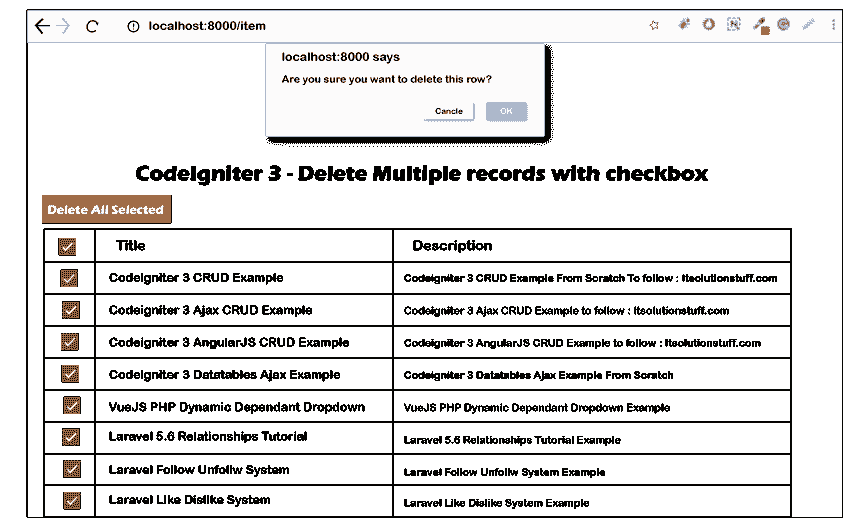

# 使用 Codeigniter 3 中的复选框删除多行

> 原文:[https://www . javatpoint . com/delete-多行-使用复选框-in-codeigniter3](https://www.javatpoint.com/delete-multiple-rows-using-checkbox-in-codeigniter3)

在本节中，我们将学习使用 CodeIgniter 应用程序来使用复选框删除多行。我们可以使用 [jquery ajax](https://www.javatpoint.com/jquery-ajax-method) 删除 [Codeigniter](https://www.javatpoint.com/codeigniter-tutorial) 中的多行。我们总是使用我们的列表页面来删除按钮。但是，如果我们在数据库表的数千条记录中的一些行中添加了错误的数据，删除记录对我们来说将非常困难。在这种情况下，如果我们试图逐个删除一行，将会花费大量的时间和精力。如果我们想让它变得简单，我们可以通过复选框添加或删除多个记录。这将帮助我们一次选中复选框并删除记录。

在下面的示例中，我们将创建一个“项目”表，其中将包含标题和描述列。之后，我们将通过运行 mysql 查询来输入一些伪记录。然后我们将添加两台路由器。将为监听项目创建第一个路由器。将为 [ajax](https://www.javatpoint.com/ajax-tutorial) 请求创建第二个路由器。所有项目都将显示在带有复选框的收听页面上。之后，我们将把代码中选中的项目去掉。当用户点击全部删除按钮时，他们将获得选中复选框的 id，并通过 ajax 方法传递。然后我们将使用这些 id 并删除 ajax 请求中的所有记录。为此，我们应该遵循一步一步的过程，描述如下:

**第一步:**

在这一步中，我们将**创建一个项目表**。为了做到这一点，我们将创建一个数据库，然后我们将使用我们的数据库并创建一个新的表“Item”。我们可以使用 [SQL](https://www.javatpoint.com/sql-tutorial) 查询来创建“项目”表，如下所述:

**项目表:**

```php

CREATE TABLE IF NOT EXISTS `items` (
  `id` int(10) unsigned NOT NULL AUTO_INCREMENT,
  `title` varchar(255) COLLATE utf8_unicode_ci NOT NULL,
  `description` text COLLATE utf8_unicode_ci NOT NULL,
  PRIMARY KEY (`id`)
) ENGINE=InnoDB  DEFAULT CHARSET=utf8 COLLATE=utf8_unicode_ci AUTO_INCREMENT=16 ;

```

成功创建表后，我们将输入一些伪记录。

**第二步:**

第二步，我们将**添加路由器**。为此，我们将创建新的路由器，这样我们就可以列出项目并发送 ajax 请求。为此，我们将打开 router.php 文件，然后添加代码，如下所示:

**应用/配置/路由. php**

```php
<?php
defined('BASEPATH') OR exit('No direct script access allowed');

$route['default_controller'] = 'welcome';
$route['404_override'] = '';
$route['translate_uri_dashes'] = FALSE;

$route['item'] = "item";
$route['itemDelete']['post'] = "item/deleteAll";

```

**第三步:**

第三步，我们将**创建项目控制器**。我们将使用 deleteAll()和 index()创建这个控制器。为此，我们将创建一个 item.php 文件，然后添加代码，如下所述:

**应用程序/控制器/项目. php**

```php
<?php
defined('BASEPATH') OR exit('No direct script access allowed');

class Item extends CI_Controller {

    /**
     * Using this method, we will get all data.
     *
     * It will return Response
    */
    public function __construct() {
       parent::__construct();
       $this->load->database();
    }

    /**
     * Using this method, we will get all data.
     *
     * It will return Response
    */
    public function index()
    {
        $data['data'] = $this->db->get("items")->result();
        $this->load->view('item', $data);
    }

     /**
     * Using this method, we will get all data.
     *
     * It will return Response
    */
    public function deleteAll()
    {
        $ids = $this->input->post('ids');

        $this->db->where_in('id', explode(",", $ids));
        $this->db->delete('items');

        echo json_encode(['success'=>"Item Deleted successfully."]);
    }

}

```

**第四步:**

第四步，我们将**创建视图文件**。为此，将创建 item.php 视图文件。此文件用于显示带有复选框的所有项目。之后，我们将编写 jqery ajax 代码，描述如下:

**应用/视图/项目. php**

```php
<!DOCTYPE html>
<html>
<head>
    <title> CodeIgniter 3 - Delete Multiple records with checkbox </title>
    <link rel="stylesheet" href="https://maxcdn.bootstrapcdn.com/bootstrap/3.3.7/css/bootstrap.min.css" />
    <script src="https://cdnjs.cloudflare.com/ajax/libs/jquery/3.2.1/jquery.min.js"></script>
</head>
<body>
<div class="container">
<div class="row">
    <div class="col-lg-12 margin-tb">
        <div class="pull-left">
            <h2> CodeIgniter 3 - Delete Multiple records with checkbox </h2>
        </div>
    </div>
</div>

<button style="margin-bottom: 10px" class="btn btn-primary delete_all" data-url="/itemDelete">Delete All Selected</button>

<table class="table table-bordered" style="margin-top:20px">

  <thead>
      <tr>
          <th width="50px"><input type="checkbox" id="master"></th>
          <th>Title</th>
          <th>Description</th>
      </tr>
  </thead>

  <tbody>
   <?php foreach ($data as $item) { ?>      
      <tr>
          <td><input type="checkbox" class="sub_chk" data-id="<?php echo $item->id; ?>"></td>
          <td><?php echo $item->title; ?></td>
          <td><?php echo $item->description; ?></td>
      </tr>
   <?php } ?>
  </tbody>

</table>
</div>

<script type="text/javascript">
    $(document).ready(function () {

        $('#master').on('click', function(e) {
         if($(this).is(':checked',true))  
         {
            $(".sub_chk").prop('checked', true);  
         } else {  
            $(".sub_chk").prop('checked',false);  
         }  
        });

        $('.delete_all').on('click', function(e) {

            var allVals = [];  
            $(".sub_chk:checked").each(function() {  
                allVals.push($(this).attr('data-id'));
            });  

            if(allVals.length <=0)  
            {  
                alert("Please select row.");  
            }  else {  

                var check = confirm("Are you sure you want to delete this row?");  
                if(check == true){  

                    var join_selected_values = allVals.join(","); 

                    $.ajax({
                        url: $(this).data('url'),
                        type: 'POST',
                        data: 'ids='+join_selected_values,
                        success: function (data) {
                          console.log(data);
                          $(".sub_chk:checked").each(function() {  
                              $(this).parents("tr").remove();
                          });
                          alert("Item Deleted successfully.");
                        },
                        error: function (data) {
                            alert(data.responseText);
                        }
                    });

                  $.each(allVals, function( index, value ) {
                      $('table tr').filter("[data-row-id='" + value + "']").remove();
                  });
                }  
            }  
        });
    });
</script>

</body>
</html>

```

上面的代码已经可以运行了。执行完这段代码后，我们能够看到以下输出:



* * *