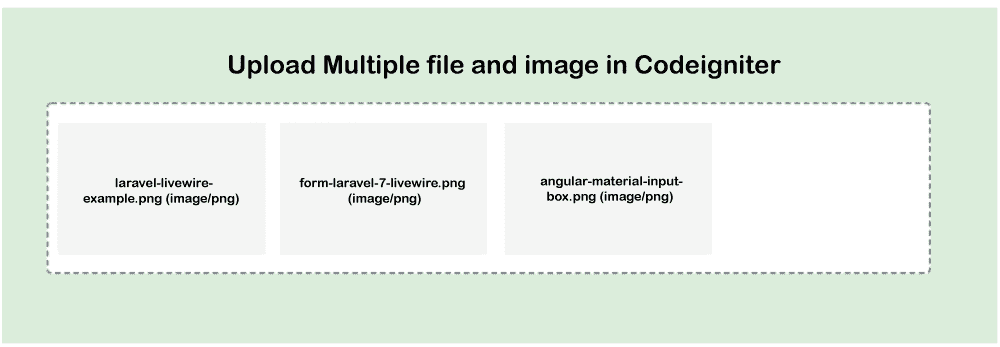

# 在 Codeigniter 中上传多个文件和图像

> 原文:[https://www . javatpoint . com/upload-multi-file-and-image-in-codeigniter](https://www.javatpoint.com/upload-multiple-file-and-image-in-codeigniter)

在本节中，我们将学习如何使用 Codeigniter 上传多个图像和文件。以下示例提供了一种上传多个图像和文件的简单方法。为了上传多个文件，我们将使用 [Codeigniter](https://www.javatpoint.com/codeigniter-tutorial) 中的上传库。该库使用上传目录保存所有文件和图像。上传多个图像和文件的步骤描述如下:

**第一步:**

这一步，我们要去**下载 Codeigniter 3** 。在我们的项目中，我们将下载 Codeigniter 的最新版本，也就是 3。我们可以通过以下链接下载:

```php

https://codeigniter.com/download  

```

**第二步:**

第二步，我们要去**添加路线**。我们将使用我们的路由文件来添加路由。在下面的图片上传示例中，我们将创建路线。为此，我们将使用一个路由文件，并在该文件中添加以下内容。

**应用/配置/路由. php**

```php
<?php
defined('BASEPATH') OR exit('No direct script access allowed');

$route['default_controller'] = 'welcome';
$route['404_override'] = '';
$route['translate_uri_dashes'] = FALSE;
$route['image-upload'] = 'ImageUpload';
$route['image-upload/post']['post'] = "ImageUpload/uploadImage";

```

**第三步:**

第三步，我们要去**创建控制器**。为此，我们将创建一个“ImageUpload”控制器。之后，我们将创建两个函数 index()和 uploadImage()。我们将使用应用程序/控制器/项目. php 路径，这样我们就可以创建 Items.php 文件。创建此文件后，我们将向其中添加以下代码:

**应用程序/控制器/ImageUpload.php**

```php
<?php

class ImageUpload extends CI_Controller {

   /**
    * Manage __construct
    *
    * @return Response
   */
   public function __construct() { 
      parent::__construct(); 
      $this->load->helper('url'); 
   }

   /**
    * Manage index
    *
    * @return Response
   */
   public function index() { 
      $this->load->view('imageUploadForm'); 
   } 

   /**
    * Manage uploadImage
    *
    * @return Response
   */
   public function uploadImage() { 

      $data = [];

      $count = count($_FILES['files']['name']);

      for($i=0;$i<$count;$i++){

        if(!empty($_FILES['files']['name'][$i])){

          $_FILES['file']['name'] = $_FILES['files']['name'][$i];
          $_FILES['file']['type'] = $_FILES['files']['type'][$i];
          $_FILES['file']['tmp_name'] = $_FILES['files']['tmp_name'][$i];
          $_FILES['file']['error'] = $_FILES['files']['error'][$i];
          $_FILES['file']['size'] = $_FILES['files']['size'][$i];

          $config['upload_path'] = 'uploads/'; 
          $config['allowed_types'] = 'jpg|jpeg|png|gif';
          $config['max_size'] = '5000';
          $config['file_name'] = $_FILES['files']['name'][$i];

          $this->load->library('upload',$config); 

          if($this->upload->do_upload('file')){
            $uploadData = $this->upload->data();
            $filename = $uploadData['file_name'];

            $data['totalFiles'][] = $filename;
          }
        }

      }

      $this->load->view('imageUploadForm', $data); 
   }

} 
?>

```

**第四步:**

第四步，我们要去**创建视图**。例如，我们将创建一个 imageUploadForm.php 视图文件。我们将在这个文件中使用助手和 url 助手，这样我们就可以编写 html 表单设计。现在我们将更新以下文件:

**应用/视图/imageUploadForm.php:**

```php
<!doctype html>
<html>
  <head>
   <title> Example of Upload Multiple Files and Images in Codeigniter </title>
  </head>
<body>
    <h1> Upload Multiple file and image in Codeigniter </h1>  
    <strong><?php if(isset($totalFiles)) echo "Successfully uploaded ".count($totalFiles)." files"; ?></strong>

    <form method='post' action='/image-upload/post' enctype='multipart/form-data'>

      <input type='file' name='files[]' multiple=""> <br/><br/>
      <input type='submit' value='Upload' name='upload' />

    </form>

</body>
</html>

```

现在我们上面的代码可以运行了。为了运行这段代码，我们需要创建一个“上传”文件夹。我们将在根目录中创建它。“上传”目录将获得所有上传的图像。这就是为什么我们也需要许可。

现在，我们将使用根目录并运行命令，如下所述:

```php

php -S localhost:8000

```

现在我们将使用我们的浏览器并打开网址，描述如下:

```php

http://localhost:8000/image-upload

```

首先，我们将打开以下配置文件，然后在该文件上设置基本网址，如下所示:

**应用/配置/config.php**

```php

$config['base_url'] = 'http://localhost:8000/';

```

运行上述代码后，我们将得到以下输出:



* * *