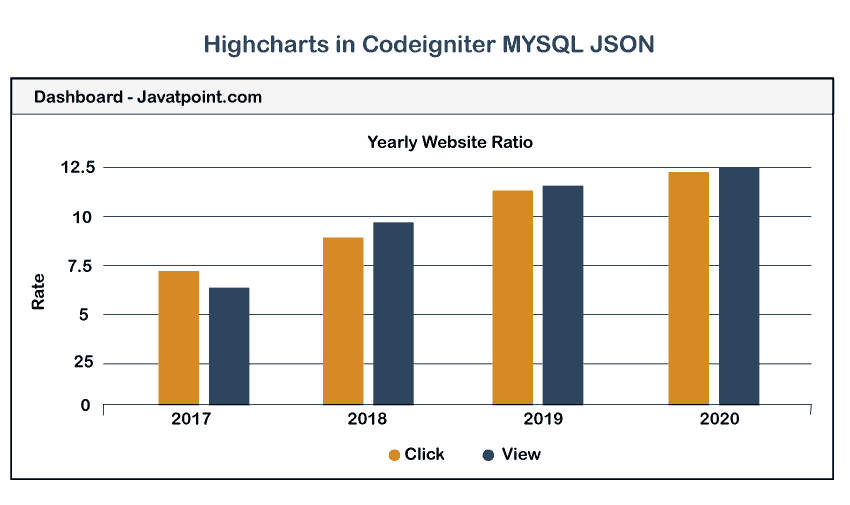

# Codeigniter 3 中的动态图表

> 原文:[https://www . javatpoint . com/dynamic-high charts-in-codeigniter-3](https://www.javatpoint.com/dynamic-highcharts-in-codeigniter-3)

在这一节中，我们将使用 Codeigniter 3，这样我们就可以获得动态高图表。我们将使用 MySQL 应用程序来理解 highcharts 的实现。在 Codeigniter 3 的应用中，我们将使用 highchart js 创建 3d 图表、饼图、条形图、地图图、折线图、面积图等。在我们的 [Codeigniter](https://www.javatpoint.com/codeigniter-tutorial) 项目中，我们将使用 highcharts js，这样我们就可以使用数据库创建一个动态柱形图。对于任何管理面板，基本要求是图表。如果我们为客户开发一个项目，他们总是要求他们的管理仪表板包含图表，这样他们就可以轻松地在我们的新订阅、销售、新用户等之间进行协调。使用图表，我们能够通过使用图表快速、轻松地比较每月、每年等。

在下面的例子中，我们将创建一个柱形图。我们为观众创建它，之后，我们将点击进入的网站。使用这个柱形图，我们可以比较几个月内的访问者数量，我们还可以得到那个月的点击量信息。为此，我们将创建“演示查看器”和“演示点击”表。使用这个表，我们将获得动态的输出。输出来自数据库，它将显示为图表。获取网站高级图表的步骤描述如下:

**第一步:**

在这一步中，我们将进入**创建数据库表**。为此，我们将创建“h_sole”作为新的数据库。如果我们想给它改名，我们可以这样做。之后，我们将描述点击和查看者的柱形图之间的比较。当我们想要应用它时，我们需要创建两个表。一个表将作为“演示查看器”为查看器创建，第二个表将作为“演示点击”为点击创建。这两个表都是使用 [MySQL 查询](https://www.javatpoint.com/mysql-queries)创建的，描述如下:

**创建演示查看器表:**

```php

CREATE TABLE IF NOT EXISTS `demo_viewer` (
  `id` int(11) NOT NULL AUTO_INCREMENT,
  `numberofview` int(11) NOT NULL,
  `created_at` timestamp NOT NULL DEFAULT CURRENT_TIMESTAMP,
  PRIMARY KEY (`id`)
) ENGINE=InnoDB  DEFAULT CHARSET=latin1 AUTO_INCREMENT=10 ;

```

**创建演示 _ 点击表:**

```php

CREATE TABLE IF NOT EXISTS `demo_click` (
  `id` int(11) NOT NULL AUTO_INCREMENT,
  `numberofclick` int(12) NOT NULL,
  `created_at` timestamp NOT NULL DEFAULT CURRENT_TIMESTAMP,
  PRIMARY KEY (`id`)
) ENGINE=InnoDB  DEFAULT CHARSET=latin1 AUTO_INCREMENT=10 ;

```

**第二步:**

在这一步中，我们将进入**进行数据库配置**。为此，我们将添加一些数据库的详细信息，如数据库名称、用户名、密码等，描述如下:

**应用/配置/数据库. php:**

```php
<?php
defined('BASEPATH') OR exit('No direct script access allowed');
$active_group = 'default';
$query_builder = TRUE;
$db['default'] = array(
	'dsn'	=> '',
	'hostname' => 'localhost',
	'username' => 'root',
	'password' => 'root',
	'database' => 'h_sole',
	'dbdriver' => 'mysqli',
	'dbprefix' => '',
	'pconnect' => FALSE,
	'db_debug' => (ENVIRONMENT !== 'production'),
	'cache_on' => FALSE,
	'cachedir' => '',
	'char_set' => 'utf8',
	'dbcollat' => 'utf8_general_ci',
	'swap_pre' => '',
	'encrypt' => FALSE,
	'compress' => FALSE,
	'stricton' => FALSE,
	'failover' => array(),
	'save_queries' => TRUE
);

```

**第三步:**

第三步，我们去**添加路线**。对于图表和渲染视图，我们将添加一条路线。为此，我们将打开名为 routes.php 的文件，然后放入以下代码:

**应用/配置/路由. php:**

```php

$route['default_controller'] = 'welcome';
$route['404_override'] = '';
$route['translate_uri_dashes'] = FALSE;
$route['my-chart'] = "ChartController";

```

**第四步:**

在这一步中，我们将去**创建控制器**。为此，将使用 ChartController 创建一个名为“索引”的方法。为了获取所有数据库数据，我们将编写以下代码。我们将使用这个控制器的文件夹，这样我们就可以创建一个新方法。这样做的代码如下:

**应用程序/控制器/ChartController.php:**

```php
defined('BASEPATH') OR exit('No direct script access allowed');

class ChartController extends CI_Controller {
    /**
     * This method is used to get all the data.
     *
     * @It will return Response
    */
    public function __construct() {
       parent::__construct();
       $this->load->database();
    } 

    /**
     * This method is used to get all the data.
     *
     * @It will return Response
    */
    public function index()
    {
        $query = $this->db->query("SELECT SUM(numberofclick) as count FROM demo_click 
            GROUP BY YEAR(created_at) ORDER BY created_at"); 
        $data['click'] = json_encode(array_column($query->result(), 'count'),JSON_NUMERIC_CHECK);

        $query = $this->db->query("SELECT SUM(numberofview) as count FROM demo_viewer 
            GROUP BY YEAR(created_at) ORDER BY created_at"); 
        $data['viewer'] = json_encode(array_column($query->result(), 'count'),JSON_NUMERIC_CHECK);

        $this->load->view('my_chart', $data);
    }
}

```

**第五步:**

在这一步中，我们将进入**创建视图文件**。为此，我们将使用视图文件夹创建“my_chart.php”作为新的视图文件。之后，我们将使用该文件添加以下代码:

**应用/视图/my_chart.php:**

```php
<!DOCTYPE html>
<html>
<head>
	<title>HighChart</title>
	<link rel="stylesheet" href="https://maxcdn.bootstrapcdn.com/bootstrap/3.3.7/css/bootstrap.min.css">
	<script type="text/javascript" src="https://cdnjs.cloudflare.com/ajax/libs/jquery/3.1.1/jquery.js"></script>
	<script src="https://code.highcharts.com/highcharts.js"></script>
</head>
<body>

<script type="text/javascript">

$(function () { 

    var data_click = <?php echo $click; ?>;
    var data_viewer = <?php echo $viewer; ?>;

    $('#container').highcharts({
        chart: {
            type: 'column'
        },
        title: {
            text: 'Yearly Website Ratio'
        },
        xAxis: {
            categories: ['2016','2017','2018', '2019']
        },
        yAxis: {
            title: {
                text: 'Rate'
            }
        },
        series: [{
            name: 'Click',
            data: data_click
        }, {
            name: 'View',
            data: data_viewer
        }]
    });
});

</script>

<div class="container">
	<br/>
	<h2 class="text-center"> Highcharts in Codeigniter MYSQL JSON </h2>
    <div class="row">
        <div class="col-md-10 col-md-offset-1">
            <div class="panel panel-default">
                <div class="panel-heading">Dashboard - Javatpoint.com</div>
                <div class="panel-body">
                    <div id="container"></div>
                </div>
            </div>
        </div>
    </div>
</div>

</body>
</html>

```

现在我们上面的代码可以运行了。运行后，将生成以下输出:



* * *