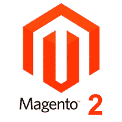

# Magento2 教程

> 哎哎哎:# t0]https://www . javatppoint . com/mageto-2

Magento2 教程提供了 Magento2 软件的介绍。Magento2 是由**Varien Inc .**开发的**内容管理系统**(内容管理系统)。它是一个开源软件，是一个非常有用的在线商业软件。Magento2 是在 **PHP** 和 **Zend 框架**中开发的。Magento2 目前是全球最大的**电商平台**。Magento2 以易于定制和扩展其功能而闻名。

在本 Magento2 教程中，我们将学习 Magento 编码实践，并讨论各种主题，如 Magento2 软件的安装、Magento2 的历史、Magento2 的特性、优缺点和体系结构等。本教程将包含各个部分，每个部分都将包含相关主题，并用适当的截图进行解释。

您将学习如何下载以及如何在本地 *XAMPP 网络服务器*上正确设置自定义 Magento2。本教程还将考虑主要的安装错误。我们将了解如何基于亮度主题创建、设置和激活用户主题。

## 先决条件

在深入学习 Magento2 之前，您必须熟悉在 **XAMPP** 或 **LAMP** 环境中开发。你要有 **HTML** 、 **CSS** 、 **PHP** 、 **XML** 的工作知识，还要有**电商业务**的知识，这样你才能轻松理解概念。如果你没有所有这些基础知识，那么我们会建议你去完成我们的 HTML、CSS 和 PHP 教程。

## 观众

我们的 Magento2 教程是专门为初学者设计的，也包括一些专业人士的高级概念。这里有很多主题可以帮助你轻松学习 Magento2。

## 问题

我们向您保证，在学习 Magento2 教程时，您不会发现任何困难。但是，如果你发现任何类型的错误，那么你可以在我们的评论区发布。

* * *