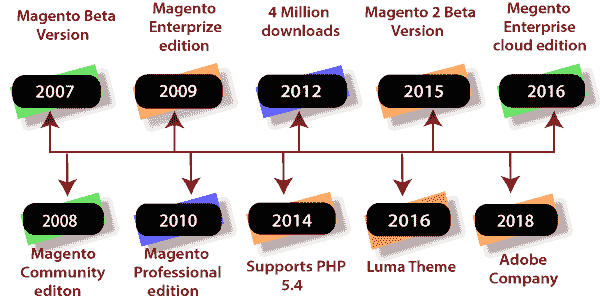

# 马根托 2 的历史

> 原文:[https://www.javatpoint.com/history-of-magento-2](https://www.javatpoint.com/history-of-magento-2)

如今，Magento 2 是最受欢迎的电子商务平台。Magento 于**2007 年 8 月 31 日**发布。它的发展是由瓦瑞因公司旗下的**罗伊·鲁宾**和**约夫·考特纳**开始的。最初，Magento 被认为是著名的电子商务和 osCommerce 的一个子系统。2012 年，约阿夫·考特纳离开了马根托。

创始人开发人员认为，osCommerce 无法在新系统中容纳他们想要的所有功能。所以，他们从它分支出来，从头开始开发一个全新的系统。马根托的简史如下:

| 年 | 描述 |
| [2007](#2007) | 罗伊·鲁宾和尤阿夫·考特纳发布的第一个公开测试版。 |
| [2008](#2008) | 推出了第一个社区版。 |
| [2009](#2009) | Magento 大受欢迎，第一个企业版发布。 |
| [2010](#2010) | 150 万次的 Magento 下载。另外还发布了 Magento 手机版和 Magento 专业版。 |
| [2011](#2011) | 易贝持有马根托 100%的股份。Magento Go 和 Magento U 公布。 |
| [2012](#2012) | 联合创始人 Yoav 离开了 Magento，Magento 专业版取消。 |
| [2013](#2013) | 易贝和马根托走到了一起。 |
| [2014](#2014) | 现在，Magento 支持 PHP 5.4。 |
| [2015](#2015) | **Magento 2** 正式版于【2015 年 11 月 17 日发布。 |
| [2016](#2016) | **Magento Luma** 主题发布，Magento CE 和 EE 为 PHP 7 提供官方支持。它还宣布了与 Adobe 的**合作关系。** |
| [2017](#2017) | 推出了 Magento 2.2、Magento 航运和 Magento 商业智能。 |
| [2018](#2018) | Adobe 收购 Magento，将推出 Magento 2.3。 |

下表给出了马根托的详细历史:

| 年 | 发布的版本 |
| **2007** |
| 8 月 31 日 | 罗伊·鲁宾和尤阿夫·考特纳发布的第一个公开测试版。 |
| **2008** |
| 3 月 31 日 | Magento 1.0 社区版第一次稳定发布。 |
| 6 月 24 日 | Magento 社区版推出。 |
| 十二月二十九日 | 胃酸 CE 1.2 |
| **2009** |
| 3 月 30 日 | Magento CE 1.3 发布。 |
| 4 月 15 日 | 启动了 Magento 企业版。 |
| 十月二十日 | 胃酸 EE 1.6 |
| **2010** |
| 1 月 19 日 | 胃酸 EE 1.7 |
| 1 月 12 日 | 胃酸 CE 1.4 |
| 4 月 14 日 | 胃酸 EE 1.8 |
| 5 月 1 日 | Magento 专业版推出 |
| 5 月 28 日 | Magento 手机发布 |
| 7 月 19 日 | 胃部 1.9 |
| **2011** |
| 2 月 7 日 | Magento Go 和 Magento U 宣布 |
| 2 月 8 日 | Magento CE 1.5 和 EE 1.10 发布 |
| 6 月 6 日 | 易贝拥有马根托 100%的股份 |
| 8 月 8 日 | Magento CE 1.6、EE 1.11 和 PE 1.11 发布 |
| 9 月 28 日 | Magento 开发者认证宣布 |
| 十月十二日 | 马根托大学免费课程介绍 |
| 十一月三十日 | Magento 2.0 开发启动。 |
| **2012** |
| 2 月 1 日 | 完成了 400 万次下载 |
| 4 月 24 日 | Magento CE 1.7 和 EE 1.12 |
| 5 月 1 日 | Magento 专业版已取消 |
| **2013** |
| 十月十一日 | Magento EE 1.13 发布 |
| 十一月二十一日 | 易贝和马根托企业联合在一起 |
| 十二月十一日 | 胃酸 CE 1.8 |
| **2014** |
| 1 月 21 日 | Magento 支持 PHP 5.4 |
| 5 月 13 日 | Magento CE 1.9 和 EE 1.14 发布。 |
| **2015** |
| 7 月 15 日 | Magento 2 商人测试版发布。 |
| 十一月十七日 | **Magento 2** 发布 |
| **2016** |
| 1 月 20 日 | Magento CE 和 EE 提供对 PHP 7 的支持。 |
| 3 月 31 日 | Magento Luma 主题推出。 |
| 4 月 12 日 | Magento 企业云版发布。 |
| 6 月 23 日 | 胃酸 CE 2.1 和胃酸 EE 2.1 |
| 9 月 26 日 | 马根托宣布与 Adobe 合作。 |
| **2017** |
| 6 月 28 日 | Magento CE 成为 Magento 开源。
Magento EE: Magento 商务
Magento 企业云版:Magento 商务
Magento 商务订单管理:Magento 订单管理 |
| 9 月 26 日 | Magento 开源 2.2 |
| **2018** |
| 6 月 4 日 | 胃底贸易 2.2 |
| 6 月 19 日 | 它现在是一家 Adobe 公司 |
| 10 月 9 日 | 已申报 Magento 付款。 |
| 11 月 7 日 | 胃底贸易 2.3 |

* * *