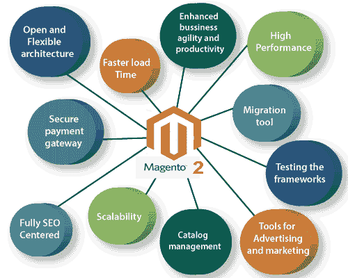

# Magento2 的特性

> 原文：<https://www.javatpoint.com/features-of-magento-2>

Magento2 成为最受欢迎的电子商务平台，它提供了比 Magento1 更灵活的工具来满足您的营销、目录管理和搜索引擎优化需求。Magento2 是非常快速、安全和更可靠的软件，它提供了可扩展性和改进的性能。

Magento2 通过引入一些关键功能和更有效地利用当前一代服务器的资源，在电子商务领域留下了深刻印象。这里有一些 Magento2 的特性列表。

**1。开放灵活的架构-** 它提供了灵活性，将商业愿景变为现实。更广泛的应用编程接口使我们能够与任何第三方解决方案进行大规模连接和操作。

**2。增强的业务敏捷性和生产力-** Magento2 通过提供更高效的体验来促进增长，从而增强其供应商或商家的能力。

Magento2 的新管理面板设计提供了一个设计良好的界面，在管理我们的日常任务时节省了时间。我们可以很容易地进行更新或跟踪订单，因为它是触摸友好的。

**3。更快的加载时间-** Magento2 可以在一小时内处理 1000 万的页面浏览量。另一方面，Magento1 无法在更短的时间内管理大量事务，也不支持全页缓存。

**4。安全支付网关-** Magento2 提供安全支付网关，与之集成的有 **Braintree、Paypal、Authorize.net、Google check out**等。因此，用户可以选择他们喜欢的支付网关。Magento 企业版 2.0 还集成了 WorldPay 和 CyberSource。它现在是最安全的电子商务平台之一。

**5。迁移工具-** Magento2 自带迁移工具，可以轻松从 Magento1.9 迁移到 Magento2.0。通过使用该工具，任何人都可以轻松地记录商店设置、目录、客户和类别。它使数据和设置变得容易。

**6。高性能-** Magento2 改进了其索引器、清漆缓存集成、Magento2 性能套件来提高性能。

*   **改进的索引器-** Magento2 系统通过索引转换卖家数据，如目录、价格、数据和用户。为了提高查询速度和存储的性能，它创建了索引表并一直保持更新。改进的索引器带来了更多的更新，包括以前版本的特性。
*   **清漆缓存-** Magento2 集成了清漆缓存，降低了服务器负载，也加快了页面负载。HTTP 加速器技术负责缓存常见的请求。
*   **Magento2 性能工具包-** 每个人都可以创建测试环境和代码更改，使用一组新的脚本来验证和优化系统性能。

**7。可伸缩性-** 为了提供更好的性能和可伸缩性，整页缓存和多个管理员用户也需要购物，这是由 Magento2 提供的。

*   **全页面缓存-** 一个页面的所有内容都被缓存，这样既提高了性能，也降低了服务器负载。
*   **多个管理员用户-** Magento2 提供多个管理员用户，可以创建和编辑产品，不用担心数据冲突。它有助于使用管理面板轻松管理订单。

**8。测试框架-** 它提供自己的测试框架。涉及到多个部分，例如集成、性能、功能区域和静态环境。Magento2 可以减少错误修复，同时使测试更容易。

**9。目录管理-** Magento2 提供了广泛的目录管理功能。目录是你网上商店的一个重要组成部分，无论你是销售家居饰品、电子产品、美容产品还是服装等。

*   它支持虚拟产品，允许下载音乐、视频等数字产品。
*   我们可以轻松编辑甚至删除产品评论。
*   它提供了高度可定制的选项，如水印和调整大小。

**10。完全以 SEO 为中心-** Magento2 让我们可以将网店与 Buffer、Hootsuite、HubSpace 等第三方工具进行整合。为了使搜索引擎优化(SEO)顺利地为您的在线商店工作，Magento2 提供了各种选项，例如-

*   它会自动对热门搜索进行排序，并对其进行修改。
*   它生成谷歌网站地图。
*   支持那些对搜索引擎友好的网址。

**11 时。广告和营销工具-** Magento2 不仅管理您的在线商店和目录，它还帮助营销、广告和产品促销。它为广告和营销提供了各种工具。

*   它还提供了通过电子邮件、时事通讯和离线分发优惠券代码的选项。
*   它允许基于质量和群体的价格变化。
*   它提供了 PPC 的登录页工具、网址工具、新产品推广工具等等。

* * *