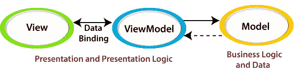
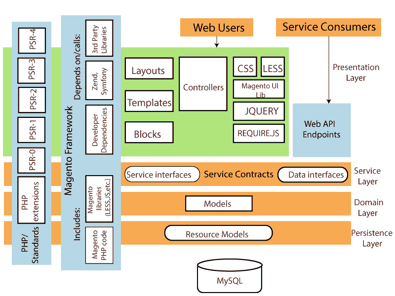

# 马根托 2 的建筑

> 原文:[https://www.javatpoint.com/architecture-of-magento-2](https://www.javatpoint.com/architecture-of-magento-2)

在这个主题中，我们将讨论 Magento 2 的架构。Magento 2 的架构与 Magento 1 完全不同。其架构的设计目标是使源代码尽可能广泛和模块化。这种方法的主要目的是使它能够根据项目的需要容易地进行调整和定制。每个业务逻辑和功能都是以模块的形式设计的。因此，每个模块都可以作为一个独立的单元工作。

Magento 2 有一个**模型视图视图模型(MVVM)架构**。这种 MVVM 体系结构在模型和视图层之间提供了更加健壮的分离，因为它与模型视图控制器(MVC)密切相关。MVVC 的简介如下:

**模型:**它保存应用程序的业务逻辑，并依赖于一个关联的类——资源模型来访问数据库。与 MVC 类似，它是数据管理的逻辑和对基础数据的描述，是应用程序运行所必需的。模型响应来自视图的请求。

**视图:**视图是用户在屏幕上看到的图形界面。它负责显示对用户请求的响应。视图是一种结构或布局，它以特定的格式表示数据。视图指定了“数据的外观”。它是视图模型提供的属性值或命令更改的订阅者。

**视图模型:**视图模型与模型层交互，只向视图层公开必要的信息。这是由 Magento 2 中模块的 Block 类处理的。需要注意的一点是，这通常是 MVC 系统的控制器角色的一部分。在 MVVM，控制器只负责处理用户流，这意味着它接收请求，并告诉系统呈现视图或将用户重定向到另一条路线。

它包含转换为视图的模型，还包含可用于影响模型的命令。视图模型基本上是公开公共属性和命令的视图的抽象。

根据官方文件，Magento 2 分为四层。

*   [表示层](#Presentation-Layer)
*   [服务层](#Service-Layer)
*   [域层](#Domain-Layer)
*   [持久层](#Persistence-Layer)

下面给出了 Magento 2 的层架构的详细描述。

### 1)表示层

表示层是 Magento 2 架构的最上层。当我们与 Magento 的 web 界面交互时，那一次，我们是在与表示层代码交互。它包含所有的控制器和视图元素，如布局、模板、块和 css.js 等。表示层通常使用服务契约调用服务层。它可以重叠业务逻辑。

Web 用户、系统管理员是表示层的用户

### 2)服务层

服务层是表示层和领域层之间的中间层。它在表示层和领域层以及特定于资源的数据之间提供了一个桥梁。服务层实现服务契约，服务契约是使用 PHP 接口定义的。这些服务契约允许我们在不破坏系统的情况下添加或更改业务逻辑资源模型。这是使用依赖注入配置文件(di.xml)完成的。

服务层授予对应用编程接口(REST/SOAP 或其他模块)的访问权限。它位于域层之上和表示层之下。

### 3)域层

领域层负责业务逻辑。它不包含特定于数据库或特定于资源的信息。领域层定义了包含业务逻辑的通用 Magento 数据对象或模型。该逻辑描述了可以对特定类型的数据(如客户对象)执行的操作。

为了用 MySQL 调用从数据库中检索数据，每个域层模型都有一个对资源模型的引用。

### 4)持久层

它描述了资源模型，负责使用 CRUD(创建、读取、更新和删除)请求在数据库中提取和修改数据。为了完成这些请求，资源模型包含 SQL 代码。还实现了额外的业务逻辑功能。

例如，数据库功能实现和数据验证。

* * *