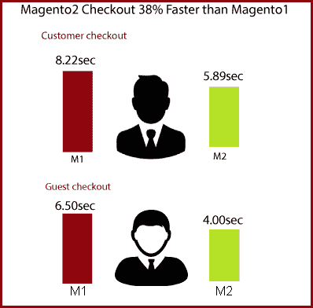
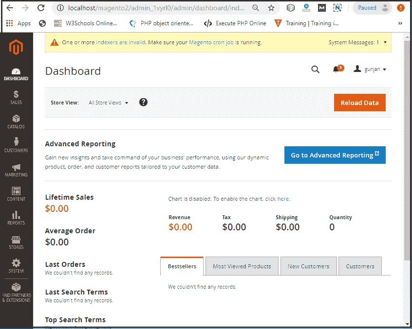
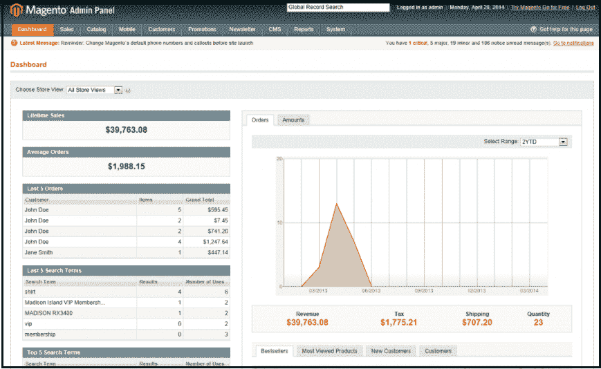
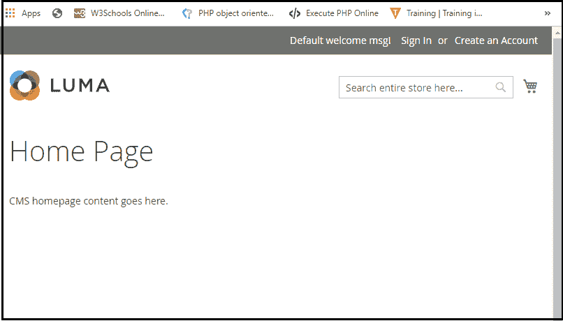

# Magento2 vs Magento1

> 吴奇珍:t0]https://www . javatppoint . com/mageto-2-vs Magento-1

Magento1 改变了开发者和商店老板对电子商务平台的看法。它有一个很好的运行，但现在它达到了生命的尽头，而 Magento2 比 Magento1 有更多的优势。Magento2 在 Magento1 10 年后发布，改进了很多缺点。Magento2 比 Magento1 有一些好处。Magento2 和 Magento1 有一些不同。

这里列出了 Magento2 和 Magento1 的不同之处。

1.  [架构](#Architecture)
2.  [支持](#Support)
3.  [性能](#Performance)
4.  [延伸](#Extension)
5.  [成本](#Cost)
6.  [仪表盘(后端)](#Dashboard)
7.  [前端](#Frontend)
8.  [SEO](#SEO)

* * *

## 1.体系结构

Magento1 的主要问题是商店性能，在 Magento2 中得到了提升。Magento 团队大幅改进了 Magento2 的架构。Magento2 增加了一些最新的技术，比如 Composer、Symfony、PHP 5.6+、Apache 2.2+、HTML5、CSS3、Nginx 1.7 或更高版本。一些重要的架构差异是:

*   Magento1 支持 PHP 5.2+，而 Magento2 支持 PHP 5.6+版本的 PHP。
*   Magento1 使用 HTML、CSS，而 Magento2 在安装时支持 HTML5、CSS3 以及 composer。
*   客户端的浏览器操作更少，由于捆绑和最小化了 JavaScript，浏览器不必要的操作也减少了。

* * *

## 2.支持

Magento 团队已经将 Magento1 的支持延长至 2020 年 6 月。这意味着 Magento 将停止从他们这边更新和发布最新的安全、补丁和扩展。

另一方面，Magento2 推出了先进的功能，如- PWA 集成、页面构建器、轻松管理和自动化代码。

* * *

## 3.表演

与 Magento1 相比，Magento2 的页面加载速度更快。主页、产品页面和类别页面加载页面的时间不到 1.5 秒，甚至不使用前端缓存。

所以，对比一下 Magento2 和 Magento1 的性能，Magento2 的性能要比 Magento1 快很多。万磁王 2 的页面加载速度比万磁王 1 快 50%。

有了新的简化结账，Magento2 的结账过程变得更快，对顾客来说也更舒适。客人无需登记即可结账。Magento2 通过注册客户的电子邮件地址自动识别他们。根据开发团队的说法，Magento2 的结账速度比 Magento1 快 38%

* * *

## 4.延长

Magento1 有很多可用的扩展，但安装可能需要很多时间，即使对于专业开发人员来说也是如此。然而，主要的问题是当两个或更多的扩展试图重写相同的功能时**扩展冲突**。这个问题是手工解决的，成本高，耗时长，需要全力以赴。

另一方面，在 Magento2 中，插件允许代码与核心代码重叠，而不是覆盖它。新的扩展可以很容易地在 Magento2 中以非常低的成本安装和更新。因为在 Magento2 中引入了新技术(HTML5、CSS3 和 require.js)，所以非常容易而且便宜。

* * *

## 5.费用

Magento 提供社区版和企业版。Magento1 和 Magento2 社区版免费，企业版不免费。但是 Magento1 和 Magento2 的企业版(EE)定价是有区别的。

*   **Magento1 EE -** 起价为每年 18000 美元
*   **Magento2 EE -** 起价为每年 22000 美元

* * *

## 6.仪表板(后端)

Magento2 中的管理面板是用户友好的，这使得我们可以很容易地找到信息。在 Magento2 中更有效地管理商店很容易。可以有效地导航管理面板的所有部分。

**Magento2 仪表板**

下面是给定的 Magento2 管理面板的截图，在其中您可以看到它提供了像终身销售额、最后订单、平均订单、最后搜索词、顶级搜索词、收入、税收、支票畅销书、运输、数量等信息。它将帮助你监控你的业务进展。

**Magento 1 仪表板**

与 Magento2 相比，Magento1 的管理面板有点混乱。

* * *

## 7.前端

Magento2 有 **Luma** 主题，而 Magento1 默认有 **Madison Island** 主题。你可以在下面的截图中看到这两个主题。

**Magento2 亮度主题**

Magento2 为客户提供默认的 ***【卢马】*** 主题，这是一个抢眼的主题。它很容易学习，因此我们可以轻松管理我们的在线商店。使用这个主题，我们可以同时显示更多的横幅，而无需让用户记住他们想要查看的内容。

**Magento1 麦迪逊岛主题**

Magento1 提供默认 ***麦迪逊岛*** 。在亮度购物车页面上，客户只需一步就能完成信息。之后，在第二个标签中显示评论&支付和促销代码区域。另一方面，麦迪逊岛需要 6 步。因此，要更改或更新订单，客户必须返回产品页面再次添加购物车。

* * *

## 8.搜索引擎优化和安全

目录页面上有丰富的片段，这改善了 SERPs 中的搜索结果。强化哈希算法(SHA-256)用于密码。这使得密码对字典类型的攻击更强。

Magento2.0 引入了 Scheme.org，这被证明可以促进商店的搜索引擎优化。

* * *