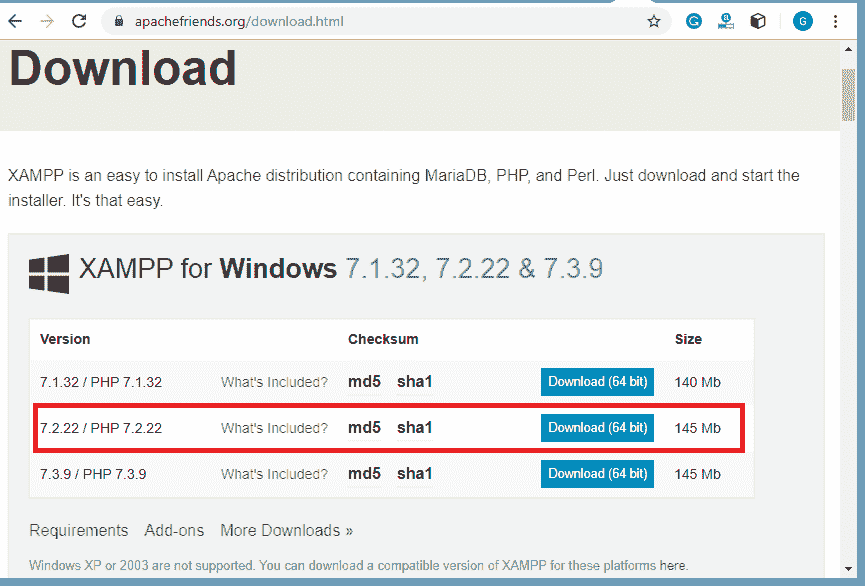
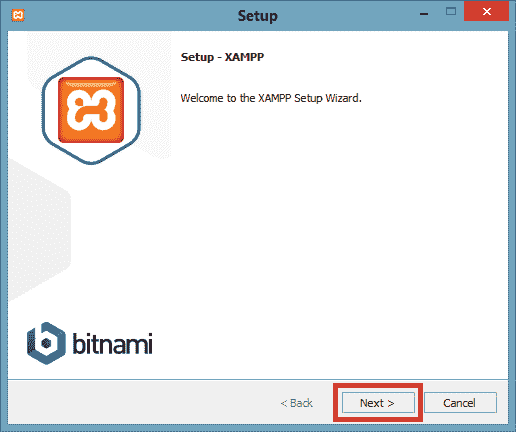
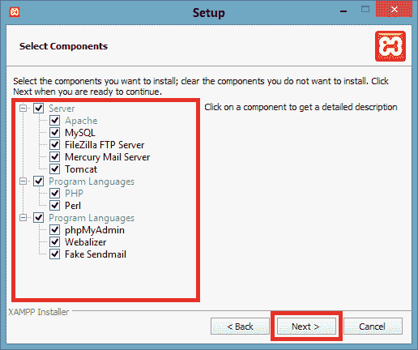
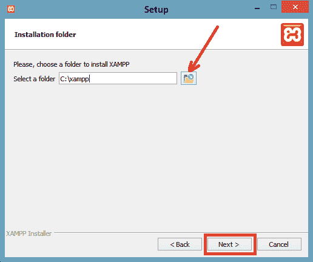
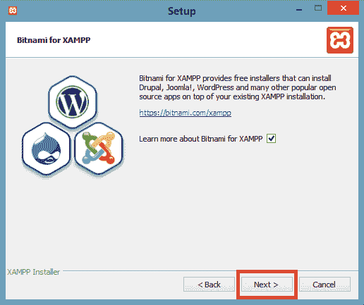
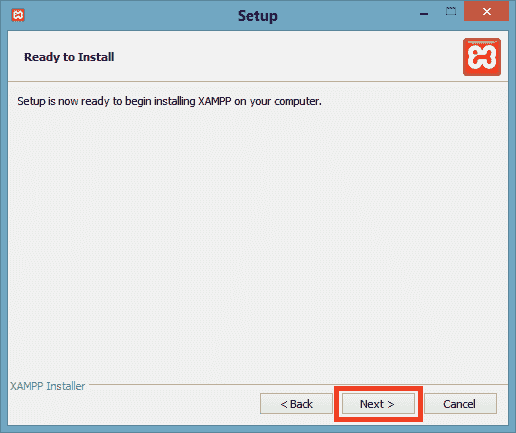
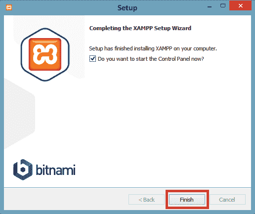
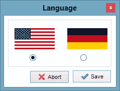
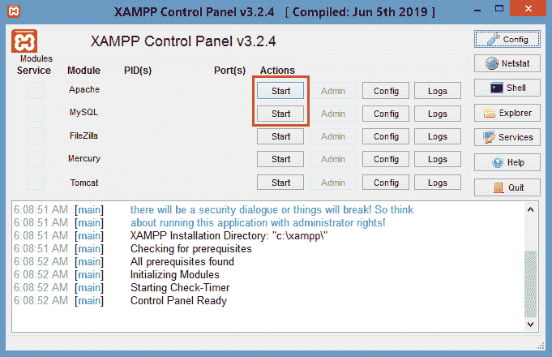
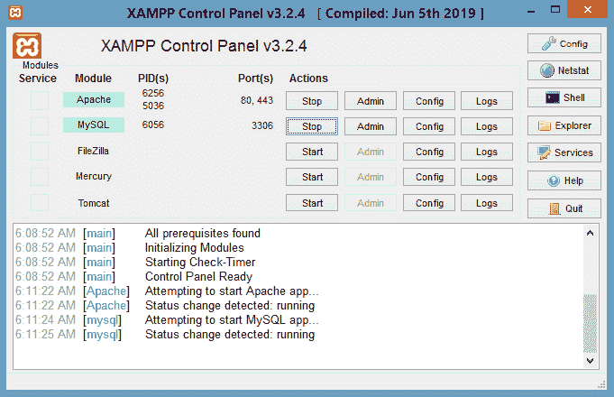

# XAMPP 装置

> 哎哎哎:# t0]https://www . javatppoint . com/mageto-2-xampp 安装[

XAMPP 是开源的，跨平台的软件。它代表 X(跨平台)、A (Apache)、P (MySQL)、P (PHP)、P (Perl)。XAMPP 是一个完整的软件包，包括 Apache 网络服务器、MySQL 数据库、PHP 和 Perl。因此，我们不需要单独安装所有这些。它通常是本地服务器或本地主机。我们在浏览器上使用 localhost/phpmyadmin/在这个 localhost 上运行 phpMyAdmin 数据库。

在这里，我们将在窗口上安装 XAMPP 7.2.22。请参见 XAMPP 的分步安装。

**第一步:**点击下载(64 位)从这里[https://www.apachefriends.org/download.html](https://www.apachefriends.org/download.html)下载 XAMPP 7.2.22 软件的设置。

**第二步:**下载 XAMPP 后双击下载的文件安装 XAMPP 并允许对系统进行更改。将打开一个向导，单击“下一步”。

**第 3 步:**从右侧选择要安装的组件，如果没有，则取消选择，然后单击下一步。

**步骤 4:** 设置您想要安装 XAMPP 安装程序的位置，然后单击下一步。默认情况下，它安装在 c 盘。

**第五步:**点击下一步按钮前进。

**第六步:**现在，XAMPP 准备安装。单击下一步按钮开始安装过程。

**第 7 步:**现在开始安装。完成安装后，单击“完成”按钮。

**第 8 步:**选择首选语言。

**第九步:**点击开始按钮运行 Apache 服务器和 MySQL。

**步骤 10:** 现在，XAMPP 已成功安装在您的系统上。如果您想停止运行 Apache 和 MySQL，请单击停止按钮。

* * *