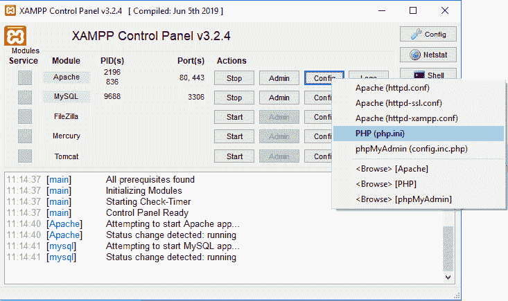
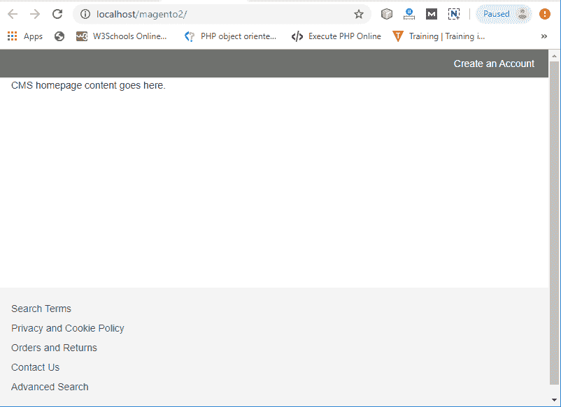

# 如何在 windows 上安装 Magento2？

> 原文：<https://www.javatpoint.com/how-to-install-magento-2-on-windows>

这一节我们要在 Windows 平台上安装 **Magento2.3.2** 。Magento 的**最新版本**是 **Magento2.3.2** 。Magento2 也可以用 composer 安装，各有各的好处。在这里，我们正在安装 Magento2，而不使用作曲家。在系统上开始安装 Magento2 之前，我们需要了解系统需求。先决条件如下:

## Magento2 的系统要求

*   **PHP -** PHP 5.6+
*   **数据库-** MySQL 5.6+
*   **Web 服务器-** Apache 2.2x 或 Nginx 1.7x
*   **操作系统-** 跨平台
*   **Brower -** 谷歌 Chrome，互联网浏览器，或者火狐等。
*   **安全套接字层(SSL)-**HTTPS 的有效安全证书
*   **XAMPP -** XAMPP 7.2.1+ (PHP、MySQL、Apache)

安装 **XAMPP 软件**获得完整的 PHP、MySQL 和 Apache 网络服务器包。所以，我们不需要单独安装所有这些软件。关于 XAMPP 的安装，请参见 [Magento2 XAMPP 安装](magento-2-xampp-installation)教程。

**第一步:**从以下网站[下载 Magento https://magento.com/tech-resources/download](https://magento.com/tech-resources/download)。在这里，我们正在安装 Magento2 . 3 . 2 版最新版本的 Magento。


**第二步:**为窗口选择 Magento 的 **zip 格式**，点击下载按钮。格式类型可以是 zip、tar.bz2 或 tar.bz2，您可以根据需要选择。


**第三步:**开始下载前，会要求为已有用户登录。如果您没有帐户，请单击创建新帐户创建新帐户。


**第四步:**现在，正确填写所有细节，创建新账户。


**第五步:**创建新账号后，登录 Magento 社区。登录后将自动开始下载。


**第六步:** Magento 在你的系统中下载成功。现在，在 XAMPP 的 htdocs 中创建一个名为 magento2 的新文件夹，即 xampp - > htdocs


**第 7 步:**将下载的 Magento2.3.2 zip 文件解压到 Magento2 文件夹中，该文件夹是您在上一步创建的，即 xampp - > ht-docs - > magento2。


**第八步:**完成 Magento2.3.2 的抽取后，在 XAMPP 服务器运行 Apache 和 MySQL。


**步骤 9:** 在浏览器上键入 localhost/magento2/并按回车键。


**第十步:**点击**同意并设置 Magento** ，开始 Magento2.3.2 在你系统上的安装过程。在这里，您将找到完成安装的六个步骤。


**步骤 11:** 第一步是就绪检查。点击**开始准备检查**，会出现 PHP 扩展缺失错误。


**步骤 12:** 就绪检查将显示 3 个 PHP 扩展 xsl、intl 和 soap 缺失。


**步骤 13:** 要消除此错误，请从 XAMPP 服务器打开 php.ini 文件。点击 Apache 的 Config，选择 PHP (php.ini)打开文件。



**第 14 步:**去掉分号(；)并保存文件。再次重新启动 XAMPP 服务器。


**第 15 步:**点击重试，您可以看到所有就绪检查都已完成，没有任何错误。现在，单击步骤 2 的下一步。


**第 16 步:**这里，你需要为你的 Magento2 添加一个数据库。因此，在 phpMyAdmin 中创建一个名为 magento2 的数据库。在安装 Magento2 时，相同的数据库名称将被传递到数据库名称字段。


**步骤 17:** 提供如下所示的数据库名称和其他详细信息，然后单击下一步。数据库名称应该与您之前创建的名称相同。


**第 18 步:**现在，我们要做 web 配置，在 web 上运行 Magento2。默认情况下，商店地址和 Magento 管理员地址会自动填写。您也可以根据自己的喜好进行更改，因为我们已经采取了**管理**。


**第 19 步:**下一步是定制你的店铺。配置默认时区、语言和货币，然后单击下一步。在这里你不需要改变任何东西。点击“下一步”按钮，继续前进。


**步骤 20:** 在此输入适当的详细信息以创建管理员帐户。在给定字段中输入用户名、电子邮件 id、密码和确认密码。


**第 21 步:**现在，你准备安装了。单击安装并开始安装。


**步骤 22:** 如果您获得类似于下面页面的成功页面，则 Magento2.3.2 已成功安装在您的系统上。Magento 已经准备好启动了，在这里你会得到商店地址和 Magento 管理员地址。

点击启动法师管理启动法师。


*   使用商店地址，您将获得亮度主题-网站的图形前端视图。
*   Magento 管理地址将为您提供仪表板，管理员可以在其中执行操作。

**步骤 23:** 启动 Magento Admin 后，如果显示的是空白屏幕而不是 Admin 登录面板，那么进入*xampp/htdocs/Magento2/厂商/Magento/框架/视图/元素/模板/文件/* 并打开 Validator.php 文件。

***替换代码***

```php
foreach ($directories as $directory) {
	if ( 0 == strops ( $realPath, $directory )) {
		return true;
	}
}

```

***替换为***

```php
foreach ($directories as $directory) {
	$realDirectory = this -> fileDriver -> getRealPath ($directory);
	//here, $directory is replaced with $realDirectory
	if ( 0 == strops ( $realPath, $realDirectory )) {
		return true;
	}
}

```

**第 24 步:**再次启动 Magento 管理，将打开管理登录页面。现在，在其中输入用户名和密码，然后单击登录。


## Magento2 灯接口

如果前端界面缺少 Luma 徽标，并且 CMS 主页显示的内容与下面的截图相同，请按照下面给出的步骤操作:



按照以下说明进行修复。

1.  打开*xampp/htdocs/Magento2/app/etc/di . XML*中的 **di.xml** 文件
2.  在截图中给出的 **di.xml** 文件中搜索**符号链接**。
3.  将文件中的“**符号链接**”替换为“**复制**”并保存。
4.  重新加载主页。现在，亮度主题(前端)将正确可见。


#### 注意:如果您在安装 Magento2 以及启动 Magento 管理面板时遇到问题，请查看安装错误页面了解 Magento2 错误。

* * *