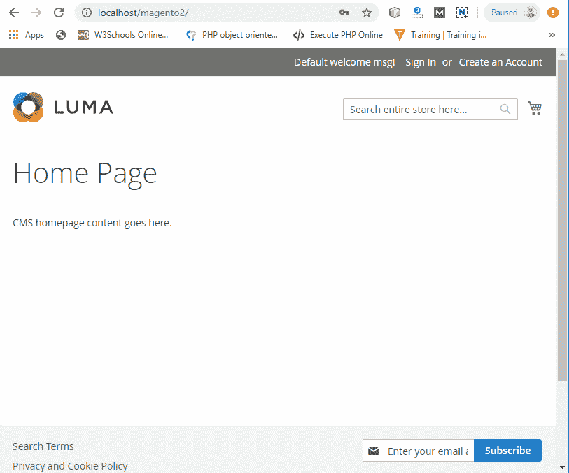

# 如何使用 Composer 安装 Magento 2？

> 原文：<https://www.javatpoint.com/how-to-install-magento-2-using-composer>

在本节中，我们将讨论在 windows 上使用 composer 安装 Magento 2.3.2。在这里，我们正在安装最新版本的 composer，即 v1.9.0。在安装 composer 之前，XAMPP 必须安装在我们的系统上，否则我们无法使用 Composer。所以，对于 Xampp 的安装，参见 [Magento 2 XAMPP 安装](magento-2-xampp-installation)教程。

## 先决条件

*   **PHP -** PHP 5.6+
*   **数据库-** MySQL 5.6+
*   **Web 服务器-** Apache 2.2x 或 Nginx 1.7x
*   **操作系统-** 跨平台
*   **Brower -** 谷歌 Chrome，互联网浏览器，或者火狐等。
*   **安全套接字层(SSL)-**HTTPS 的有效安全证书
*   **XAMPP -** XAMPP 7.2.1+ (PHP、MySQL、Apache)

**第一步:**从以下网站下载作曲 1 . 9 . 0[https://getcomposer.org/download/](https://getcomposer.org/download/)。点击*Composer-Setup.exe*下载 windows 作曲，如下图截图所示。


**第二步:**下载完作曲后，双击下载的文件运行。现在，点击运行。


**第三步:**如果你是初学者，那么离开开发者模式取消选中，点击下一步。开发者模式有点高级，所以，如果你是初学者，不要勾选这个框。


**第 4 步:**浏览想要安装作曲者设置的位置。默认情况下，它需要 C 驱动器。为了更方便，请在安装 XAMPP 的同一个驱动器中安装 composer 安装程序。


**第五步:**不需要改变什么。单击下一步继续。在安装 composer 之前，您必须在系统上安装 PHP。


**第六步:**这里可以留空。所以，点击下一步继续。


**第 7 步:**下面的向导将显示我们将要使用的 PHP 版本，也就是我们当前教程的 7.2.22。点击下一步，继续前进。


**第 8 步:**点击下一步继续。


**第九步:**安装完成。Composer 安装程序已成功安装在系统上。所以，点击完成按钮。


**第十步:**打开命令提示符，输入命令**作曲**。如果输出显示与下面的截图相同，那么作曲者安装成功。


现在，我们将安装最新版本的 Magento，即 Magento 2.3.2。

**第 11 步:**从[https://magento.com/tech-resources/download](https://magento.com/tech-resources/download)下载 Magento 2.3.2。在点击下载之前选择 Magento 的格式。


**第 12 步:**选择 windows 平台的 Magento 的 zip 格式，然后点击下载。


**第十三步:**下载 Magento 之前，它会要求你登录。如果您是现有用户，请使用注册的电子邮件和密码登录，否则请创建一个新帐户。单击为新用户创建新帐户。


**第 14 步:**在此正确输入详细信息，创建新账户。


**第 15 步:**现在，创建账号后用邮箱和密码登录，点击**登录下载**。下载将自动开始。


**步骤 16:** 现在，在 xampp 内部的 htdocs 文件夹中创建一个名为 magento2 的新文件夹，即 xampp - > htdocs。


**第 17 步:**提取上一步创建的 Magento 2 文件夹中下载的 Magento 2.3.2 zip 文件。要提取 zip 文件，右键单击下载的文件并选择提取文件，然后提供提取路径。


**步骤 18:** 现在，打开命令提示符。首先将目录更改为 *C:\xampp\htdocs\magento2* ，在这里提取 magento，然后在命令提示符下运行命令 **composer install** 。


**步骤 19:** 运行另一个命令 **php bin/magento 设置:在命令提示符下安装**。它将显示 xsl、intl 和 soap 扩展缺失的错误。


**第 20 步:**要删除扩展名缺失错误，请在记事本中打开 php.ini 文件，该文件位于 xampp->Apache->config->PHP(PHP . ini)中。


**第 21 步:**找到
；extension = intl
；扩展=肥皂
；扩展名= PHP . ini 文件中的 xsl，并删除这些扩展名前的分号。保存文件。


**第 22 步:**再次执行 **php bin/magento 设置:在命令提示符下安装**。它将显示另一个错误，即 magento2 名称的数据库不存在。因此，在 phpMyAdmin 中创建一个名为 magento2 的数据库。

*   在浏览器中键入 localhost/phpmyadmin/并按 enter 键。
*   点击新建，输入数据库名称为 **magento2** ，点击创建按钮。


**步骤 23:** 现在在命令提示符下运行以下命令，根据您的 magento 和数据库配置进行更改。

```php

php bin/magento setup:install --base-url=http://localhost /magento2 --db-host="name localhost" --db-name="name DB" --db-user="db username" --db-password="db password" --admin-firstname="firstname" --admin-lastname="lastname" --admin-email=admin@domain.com --admin-user="username" --admin-password="userpass" --language="en_UK" --currency="INR" --timezone="Asia/Kolkata" --use-rewrites="1"

```


现在在你的系统中开始安装 Magento

**第 24 步:**可以看到安装完成。从这里记下管理网址。


**第 25 步:** Magento 2.3.2 安装成功。现在，打开浏览器，在单独的选项卡中键入 Magento Admin Address- localhost/magento2/Admin _ nkongg/Store Address(前端)-localhost/Magento 2/即可。

## 胃癌组织管理小组


如果管理员登录面板没有打开，并在浏览器上显示一个空白屏幕，显示 Magento 管理员地址网址，然后按照以下说明操作。

*   进入*xampp/htdocs/magento 2/厂商/magento/框架/视图/元素/模板/文件/验证器. php*
*   打开 Validator.php 文件。
*   在 Validator.php 文件中找到给定的代码，然后

**更换代码**

```php

foreach ($directories as $directory) {
	if ( 0 == strops ( $realPath, $directory )) {
		return true;
	}
}

```

**替换为**

```php
foreach ($directories as $directory) {
	$realDirectory = this -> fileDriver -> getRealPath ($directory);
	//here, $directory is replaced with $realDirectory
	if ( 0 == strops ( $realPath, $realDirectory )) {
		return true;
	}
}

```

现在，保存 validator.php 文件并重新加载管理页面。管理面板正常可见。


### 亮度主题

前端界面缺少使用店铺地址的 **Luma** 标识，页面会显示如下截图，然后按照下面的步骤修复错误。


1.  打开*xampp/htdocs/magento 2/app/etc/di . XML*中的 **di.xml** 文件
2.  在截图中给出的 **di.xml** 文件中搜索**符号链接**。
3.  将文件中的“**符号链接**替换为“**复制**，保存文件。
4.  重新加载主页。现在，亮度主题(前端)将正确可见。



清除所有错误后，这里完成了 Magento 2.3.2 的安装，现在 Magento 的所有组件都正常工作。

* * *