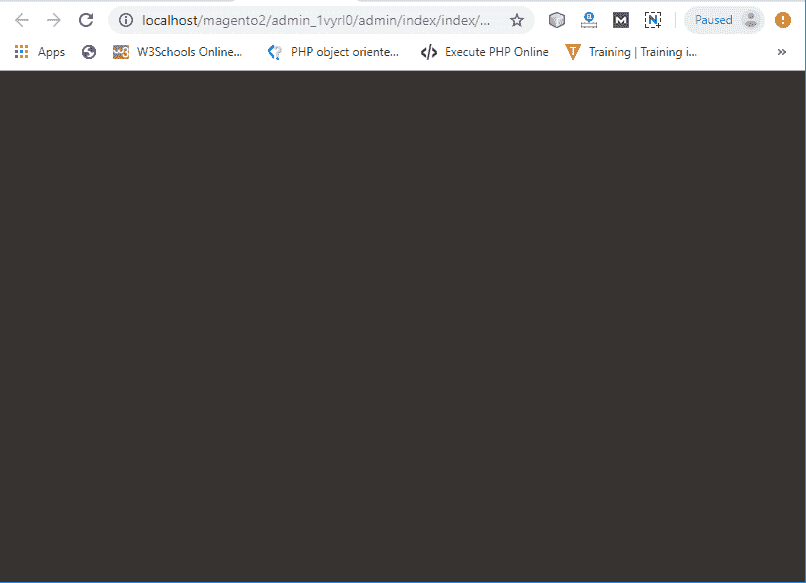
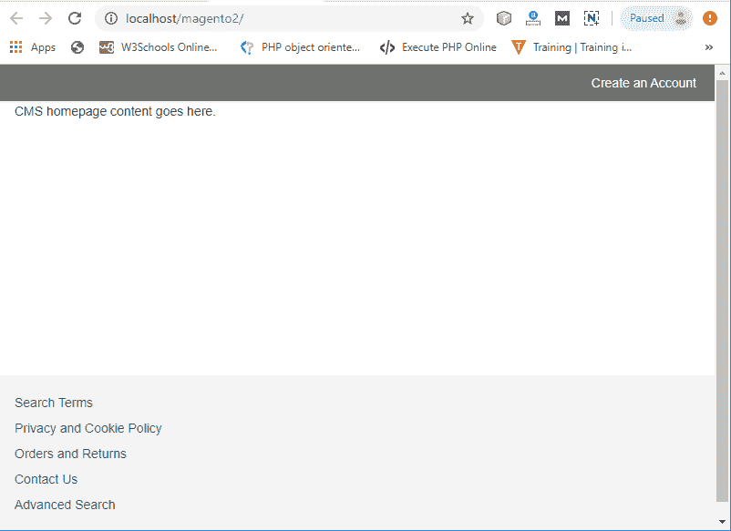
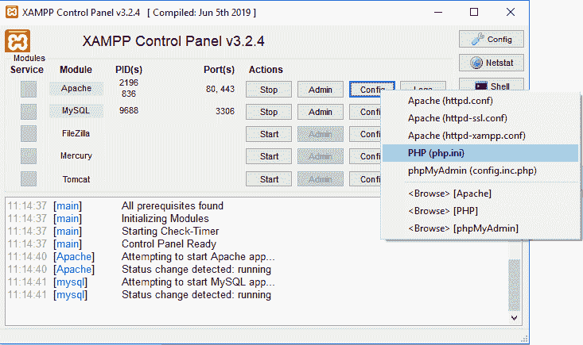

# 安装 Magento 2 时出错

> 原文:[https://www . javatpoint . com/errors-while-installation-magento-2](https://www.javatpoint.com/errors-while-installing-magento-2)

## 管理员登录面板不可见

在系统上成功安装 Magento 2.3.2 后，有时会面临布局崩溃错误。由于管理员登录页面没有正确打开，看起来像下面的截图一样空白:



要解决此问题，请遵循下面给出的说明:

*   进入 xampp/htdocs/magento 2/供应商/magento/框架/视图/元素/模板/文件/验证器
*   打开 Validator.php 文件。
*   在 Validator.php 文件中找到给定的代码，然后
*   替换此代码

```php

foreach ($directories as $directory) {
	if ( 0 == strpos ( $realPath, $directory )) {
		return true;
	}
}

```

*   用下面给出的代码替换上面的代码并保存文件。

```php
foreach ($directories as $directory) {
	$realDirectory = $this -> fileDriver -> getRealPath ($directory);
	//here, $directory is replaced with $realDirectory
	if ( 0 === strpos ( $realPath, $realDirectory)) {
		return true;
	}
}

```

现在，重新加载网页，管理员登录面板将可见。


## 前端/亮度主题不可见

如果前端界面缺失，商店页面将像这样可见，而不是亮度主题，请按照以下说明操作:



按照以下说明修复错误。

*   打开*内部的 di.xml 文件 xampp/htdocs/magento 2/app/etc/di . XML*
*   在截图中给出的 **di.xml** 文件中搜索**符号链接**。
*   将文件中的“**符号链接**替换为“**复制**，保存文件。
*   重新加载主页。现在，亮度主题(前端)将正确可见。


## 缺少 PHP 扩展

安装 Magento 2 的时候，第一步是就绪检查，在这里会发现一个错误**三个 PHP 扩展缺失**。这三个缺少的扩展是 xsl、soap 和 intl。因此，要消除这些错误，请遵循给定的说明。

*   从 XAMPP 打开 php.ini 文件，即 Apache -> Config -> PHP (php.ini)。请看下面的截图。



*   **找到:**
    ；分机= intl
    ；扩展=肥皂
    ；扩展名= xsl
*   删除分号(；)之前从所有三个扩展名中选择并保存文件。
*   重新启动 XAMPP 服务器，然后再次尝试就绪检查。这次准备就绪检查将毫无错误地完成。

## 仪表板图标不起作用

后端仪表板的菜单滑动条没有响应。您可以在给定截图的左侧看到。


按照以下说明进行修复。

*   打开*内部的 di.xml 文件 xampp/htdocs/magento 2/app/etc/di . XML*
*   在截图中给出的 **di.xml** 文件中搜索**符号链接**。
*   将文件中的“**符号链接**”替换为“**复制**，保存文件。
*   重装仪表板。现在，菜单滑动条中的所有图标都将正常工作。


* * *