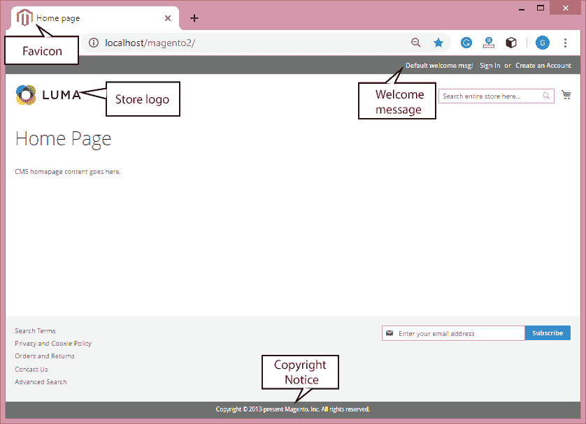

# Magento 2 中的基本配置

> 原文:[https://www.javatpoint.com/basic-configuration-in-magento-2](https://www.javatpoint.com/basic-configuration-in-magento-2)

在本节中，我们将介绍商店的管理工具，并介绍配置设置。在这里，我们将学习商店层次结构和配置范围的概念，并建立行业标准和要求的最佳实践。

## 商店管理员

商店管理员是一个受密码保护的后端办公室或仪表板，我们(作为一个商家)可以在这里设置产品、促销、管理订单，以及执行其他管理任务。所有基本配置任务和存储管理操作都由该管理员执行。

在这个默认的管理员帐户中，我们可以创建任意数量的额外帐户来处理商店和支持客户帐户。每个帐户都可以根据个人的业务需求与特定的角色和访问级别相关联。

## 商店详情

商店详细信息是我们可以输入商店基本信息的地方，例如商店名称、地址、语言、商店联系号码、国家、州和货币等。

## 店面品牌

它是商店前视图，具有 **Luma** 主题。我们首先要改变的是标题中的徽标，并为浏览器上传一个 favicon。我们还想更新下面页脚的版权声明。这些是我们首先需要做的基本任务。

要更改上面版本的 Magento 2.1+中的徽标和默认消息，请按照以下步骤操作:

1.从 **favicon.io** 网站创建一个 16*16 或 32*32 的标志。

2.在管理边栏上，单击内容。在设计下，选择配置。

3.在设计配置面板中，单击当前网站的编辑。

4.浏览其他设置部分下的 HTML Head，并从这里上传收藏夹图标。

5.点击上传浏览文件夹中的标识，选择标识后点击**保存配置**。

6.浏览 HTML 标题部分下面的标题部分，并从这里更改默认消息。

7.在欢迎文本字段中写入默认文本。

8.现在进入系统->缓存管理。标记页面缓存并从下拉列表中选择刷新，然后单击提交。

检查前端的徽标和默认消息是否已更改。

## 网站、商店和视图

Magento 有一个网站、商店和商店视图的层次结构，它们有一对多的关系。单个安装可以有各种网站，每个网站可以有多个商店和商店视图。Magento 2 让我们可以运行多个网站，商店有不同的看法。

**网站**

默认情况下，Magento 最初有一个名为“**主网站**”的网站。我们还可以创建多个网站，每个网站都有自己的 IP 地址和域名。

**门店**

一个网站可以有几个商店，每个商店都有自己的主菜单。商店共享相同的产品目录，但可以有不同的设计和产品选择。同一网站下的所有商店共享相同的管理和结帐。

**商店视图**

客户可以使用的每个商店都根据特定的视图进行显示。最初，商店只有一个默认视图。我们可以为不同的语言、设计和布局创建商店视图。在共享客户数据、结帐单、文章和购物车时，每个视图都可以有自己的领域、外观和语言。

## 行业合规性

Magento 2 提供安全和隐私功能，符合法律要求和在线商家的行业指南。某些政策是支付卡行业强制规定的，而其他政策则是法律要求的，具体取决于您的所在地。

* * *