# Magento 2 中的商店配置

> 原文：<https://www.javatpoint.com/store-configuration-in-magento-2>

在我们的系统上成功安装 Magento 2 后，我们需要配置一些常规设置。Magento 2 提供了配置文件，使我们能够轻松定制商店组件。商店配置包括常规、目录、安全、客户、销售、参与云、服务和高级。

在开始商店配置之前，我们将建议您为该角色创建一个新角色和用户。在这里，我们将创建一个经理角色。

## 创建用户角色

*   进入**系统**点击**用户角色**为您创建特定角色。

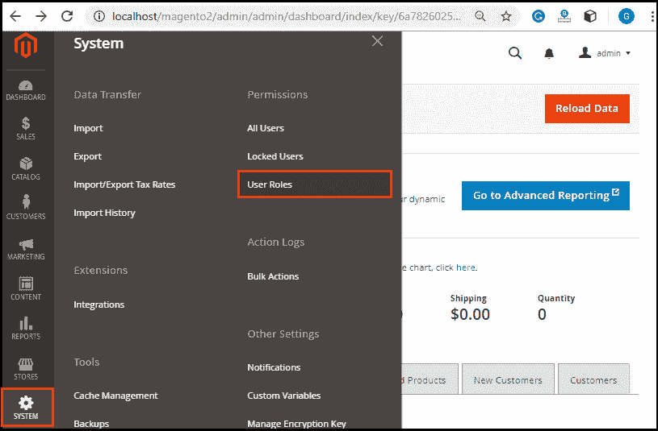

*   点击**添加新角色**，在角色信息中的给定字段输入角色名称和密码。我们也可以给这个角色分配权限，可以是自定义的，也可以是全部。

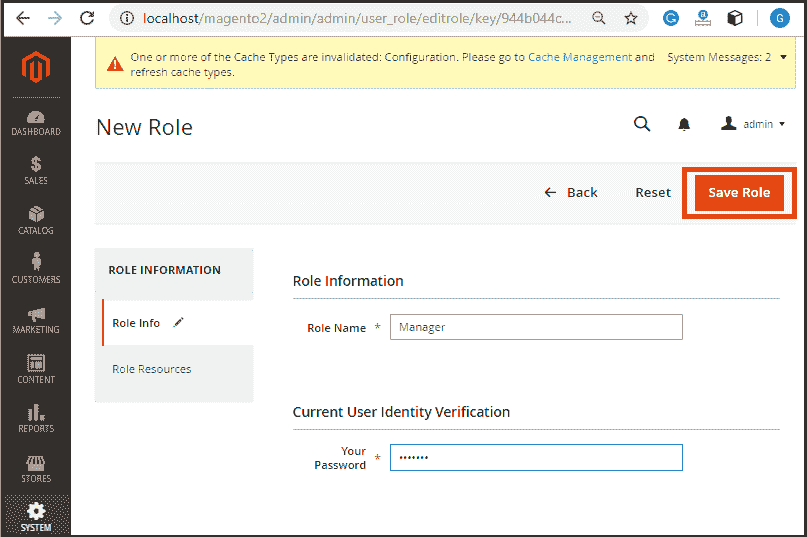

*   单击角色资源，并从下拉列表中为角色分配所有权限或自定义权限。单击保存角色。

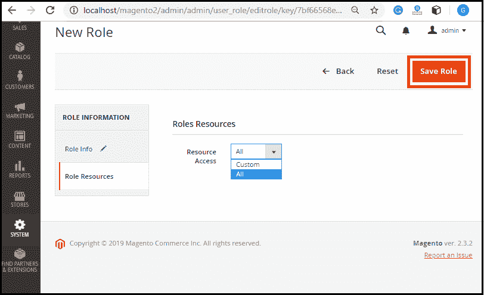

*   现在添加了经理角色。经理和管理员在这里具有相同的权限，因为我们将所有权限授予了经理。

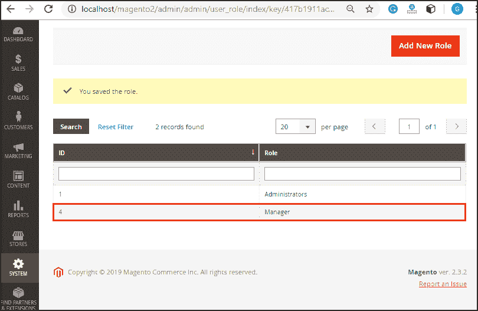

这不是马根托标准。这是 AWS 社区以及其他社区的标准，在这些社区中，我们将根帐户分开。我们可以减少经理角色的权限，比如-我们不允许他们创建新用户。创建用户角色后，我们将为经理创建用户。

## 创建用户

*   转到系统，单击所有用户以创建经理角色的用户。我们可以从这里创建用户。

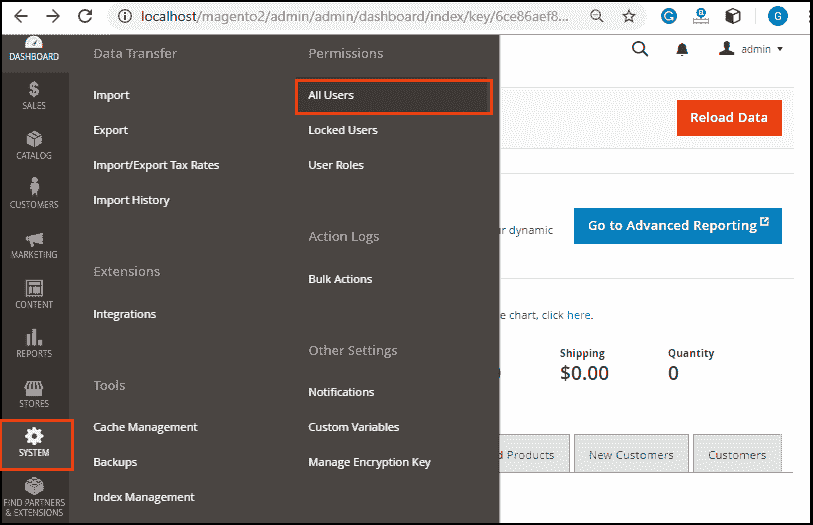

*   点击**添加新用户**，在给定的字段中填写所有需要的信息，创建新用户。

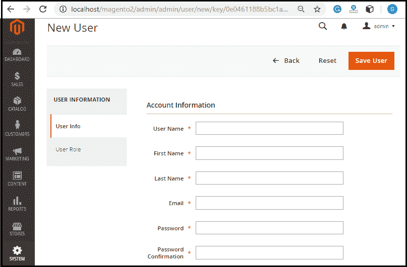

## 商店配置

商店配置应该只在开始时进行，因为在将来，如果我们执行这种更改，某些事情会中断，我们必须再次执行一些部分。现在，我们将配置网络商店的常规设置。因此，转到存储->配置。

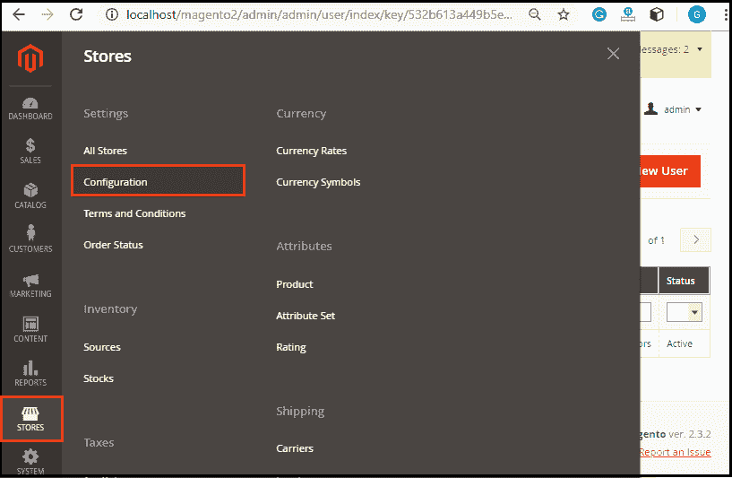

我们将获得不同的设置选项，但这里我们考虑的是一般配置。我们将在下面讨论重要的领域:

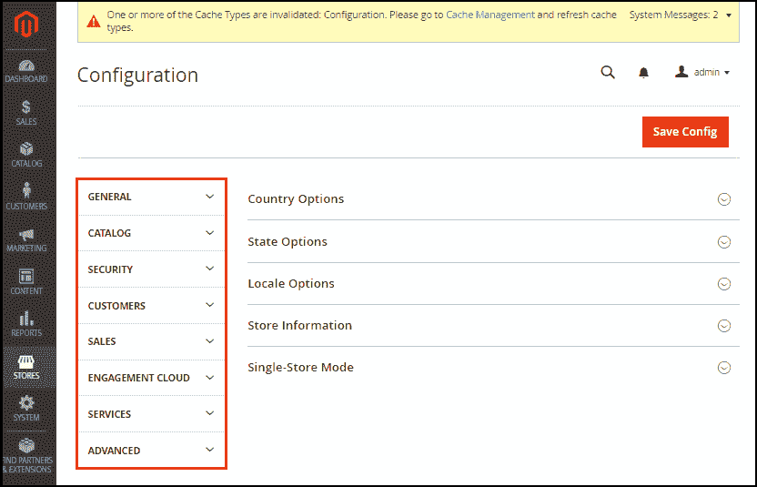

## 第一步:概述

常规部分包括网站、货币设置、商店电子邮件地址、联系人、报告、内容管理、新遗迹报告和高级报告。所以，第一个是一般。

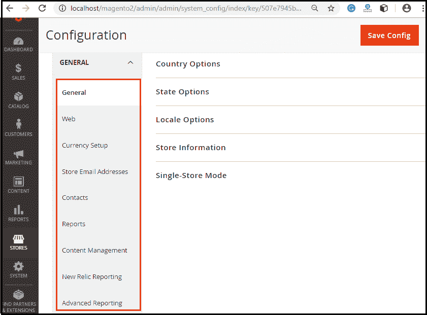

## 步骤 1.1 概述

### 国家选项

展开国家选项，并取消选中右侧的使用系统值。在这里，我们将把印度设置在**国家**领域以及**允许我们愿意接受订单的国家**领域。我们可以使用 ctrl 键多选国家。让其他字段保持原样。

**默认国家:**选择你的默认国家。就我们而言，是印度。

**允许国家:**默认允许所有国家。我们可以把国家搬到这里。

**邮政编码、欧盟国家和顶级目的地:**无需更改。

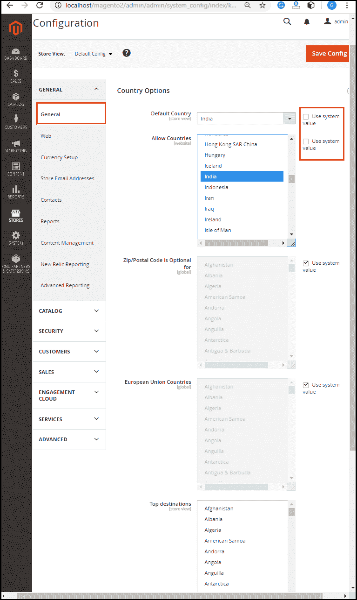

### 状态选项

我们有现在不需要的国家选项，因为我们已经改变了这个国家。

**状态为:**不需要改变。

**如果国家可选，允许选择州:**选择是或否

### 本地选项

时区是从我们的设置屏幕设置的。因此，不需要在状态选项和区域设置选项中进行任何更改。

**时区:**本店时区。

**地区:**默认语言

**重量单位:**重量单位会用到我们店里，还有发货流程。

**一周的第一天:**设置日历

**周末天数:**选择工作日。

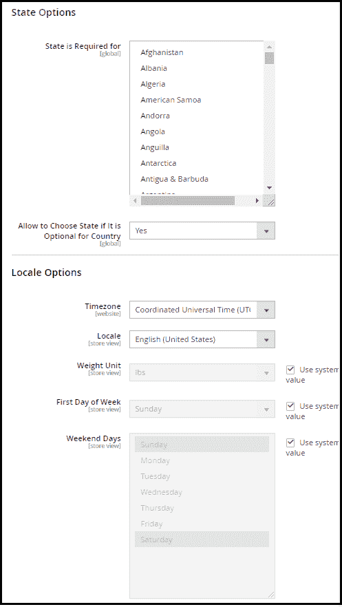

### 储存信息

在商店信息部分，添加您的商店的当前信息。

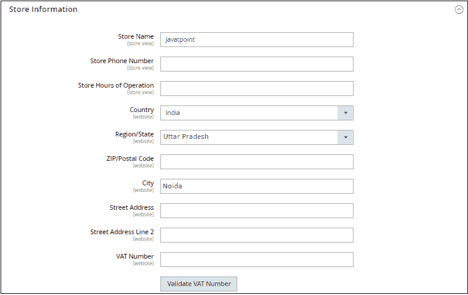

### 单一商店模式

在单店模式下，我们将其设置为“**是**”，因为我们预计不会有任何商店视图或许多客户可以切换的语言。它会给我们带来不错的性能优化。如果我们的商店有多种语言，那么我们可以禁用它。

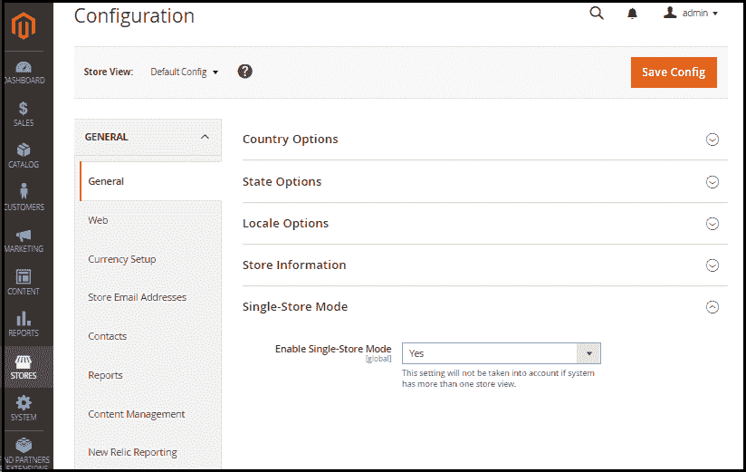

#### 注意:只有当系统有多个店铺视图时，才会进行该设置。

## 步骤 1.2:网络

在 web 部分，我们将获得这些字段:

### URL 选项

这里不需要改变任何东西。

### 搜索引擎优化

我们必须启用这个选项，如果我们想要搜索引擎抓取和索引我们的网站。为此，在“**使用网络服务器重写**”中选择**是**。

### 基本网址(安全)

此字段将使用安全基本网址来限定网址。它有两个基本的字段选项:

**使用店面上的安全网址:**如果我们想只通过 HTTPS 打开我们的商店前端，那么将该选项设置为**是**。

**在管理中使用安全网址:**它类似于前端。此外，将此选项设置为“是”，以使用 SSL 保护存储的管理员。

### 默认页面

通常，此选项将保留为默认值。然而，我们应该注意这些给定的选项，以避免相关问题。

**默认网址:**本店默认网址。

**CMS 首页:**默认为首页。

**默认无路由网址:**默认无路由网址(cms/route/index)。

**CMS 无路由页面:**默认 404 未找到。

**CMS 无 Cookie 页面:**默认为启用 Cookie。

**显示 CMS 页面的面包屑:**默认为是。

### 默认 Cookie 设置

这是我们需要考虑检查的“默认 cookie 设置”选项。有一些国家，如英国或欧洲国家，它是强制性的，如果我们的网站接受饼干，那么我们应该给他们一个通知。这在法律上是强制性的。因此，我们应该启用 Cookie 限制模式。

要启用 Cookie 限制模式，我们只需取消选中**使用系统值**，并在 Cookie 限制字段中选择是。

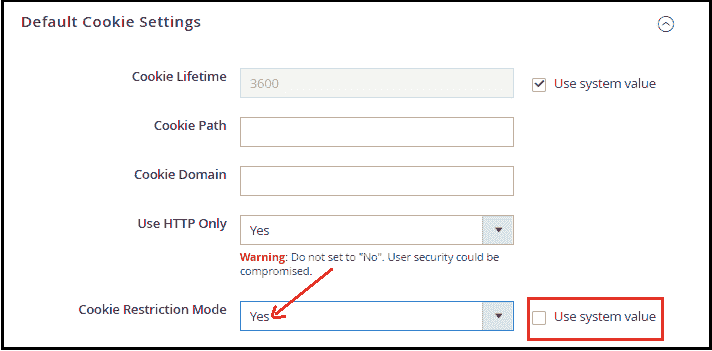

在其他国家，它不是必需的，因此根据您的要求，您可以设置或取消设置它。

## 步骤 1.3:货币设置

现在，我们将进入下一步，即货币设置。在这里，我们将设置我们的基础货币。所以，我们将印度卢比设定为基础货币。

### 货币期权

**基础货币:**基础货币为货币，用于所有网上支付交易。如果我们的网站上有多个商店视图，则基础货币范围由目录价格范围定义。我们在第四步商店定制中选择货币，同时安装 Magento 2。

**默认展示货币:**展示货币是我们店铺前端展示产品的货币。选择与基础货币相同的货币。

**允许的货币:**这是货币，在我们商店的付款中允许使用。这些是另一种货币，客户可以在其中兑换。将印度卢比设置为基本、默认和允许的货币。

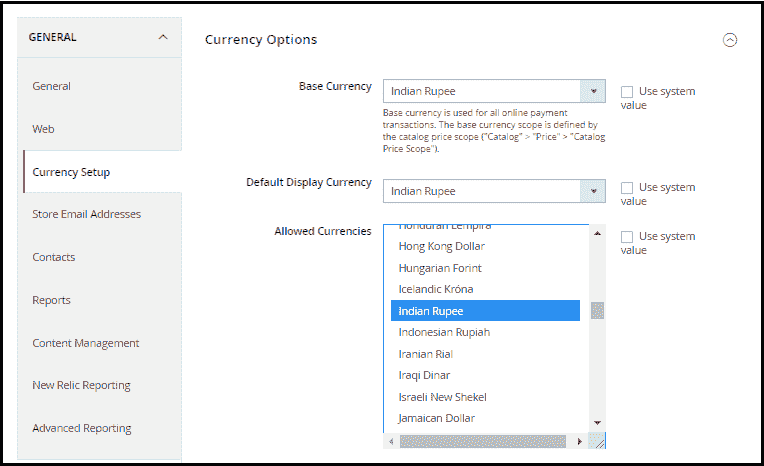

## 步骤 1.4:设置电子邮件地址

现在，我们将进入设置电子邮件地址，在那里我们有许多属于我们的电子邮件地址。

## 步骤 1.5:联系人

### 联系我们

启用联系我们并将其设置为**是**，以便您的客户可以轻松联系您。

### 电子邮件选项

在“电子邮件”选项中，只需更改设置，联系我们电子邮件的电子邮件就会发送给您。

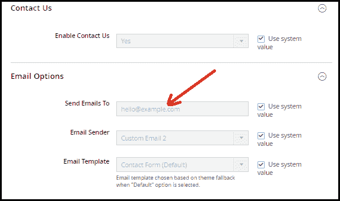

## 第二步:目录

目录包含目录、清单、XML 站点地图、RSS 源和给朋友的电子邮件字段。

### 步骤 2.1:目录

转到目录菜单中的“店面”部分，在这里我们有“使用平面目录类别”和“使用平面目录产品”。我们在这两个选项和保存配置中设置**是**。

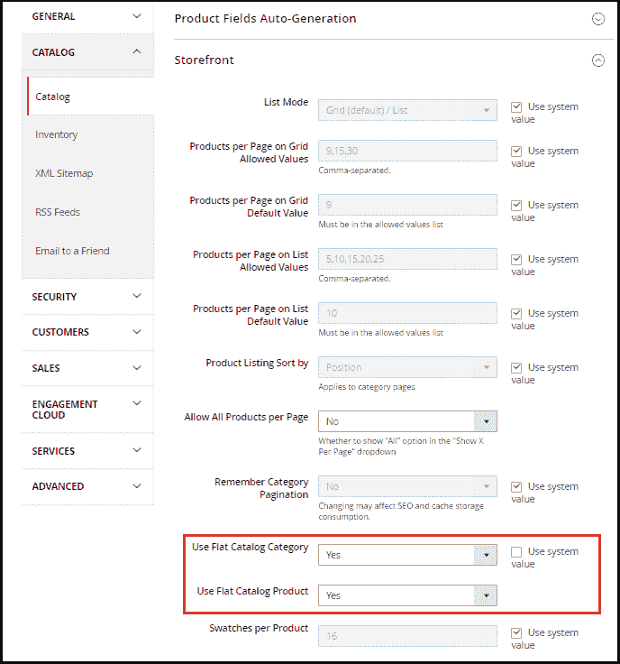

默认情况下，Magento 2 有 EAV 数据库结构，所以我们有一个实体，比如说 Product。它的值存储在六个不同的表中，所以，当使用 EAV 模型时，我们的 Magento 相对较慢。当我们将其更改为目录时，对于 Magento 来说，从数据库中加载数据是非常简单和快速的。所以，我们将其更改为**是**。

### 步骤 2.2:库存

转到库存部分，我们有股票期权，产品股票期权，管理批量操作，基于距离的 SSA 的距离提供商，和谷歌距离提供商。除产品商店选项外，不需要任何更改。

展开产品股票期权。如果我们接受延期交货，那么我们可以在这里允许延期交货，否则我们不需要在这里做任何改变。

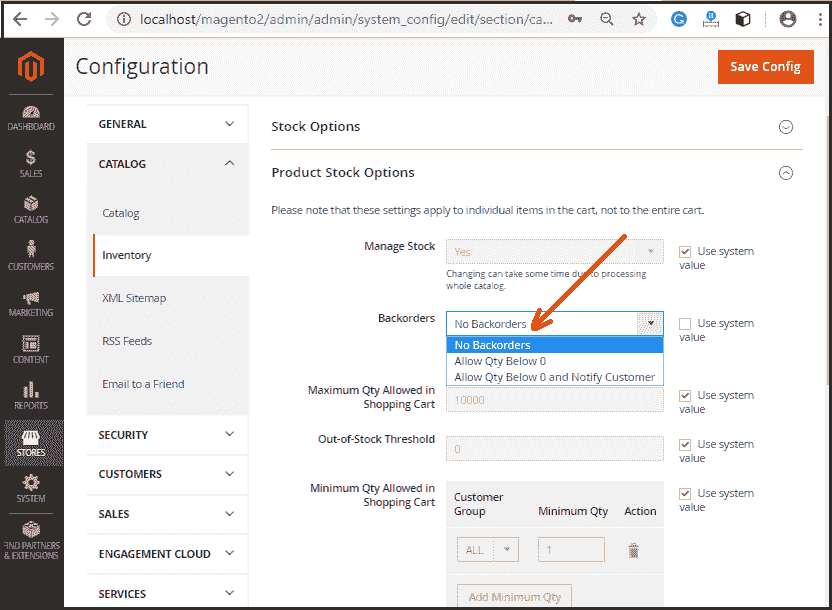

## 第三步:客户

客户部分很好，所以不需要更新。

## 第四步:销售

销售部分提供了多个子部分。在这方面，我们将首先讨论运输方法。我们将从这里确定我们将接受的运费。我们可以从这里启用和禁用运输方法。

展开销售部分，首先单击运输方法。

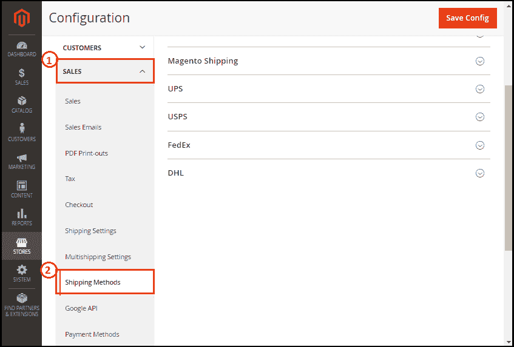

### 步骤 4.1:运输方法

我们将接受默认启用的统一费率，即 5.00 卢比。如果我们也想接受免费送货，我们可以从这里启用和禁用送货方式。

首先，取消选中使用系统值，然后在启用字段中设置**是**。单击保存配置保存更新的值。

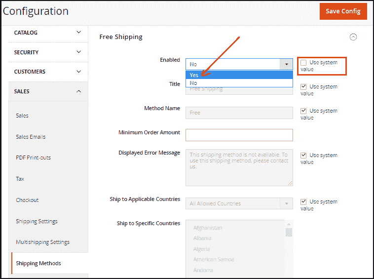

### 第 4.2 步:支付方式

在支付方式中，我们可以设置不同的支付方式，如货到付款，或使用借记卡、信用卡、贝宝或布伦特里等。要设置付款方式，请转到销售中的付款方式并启用货到付款。

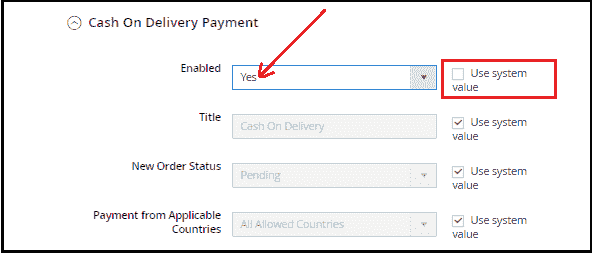

## 第五步:高级

现在，我们将进入**高级**部分，点击**管理**。

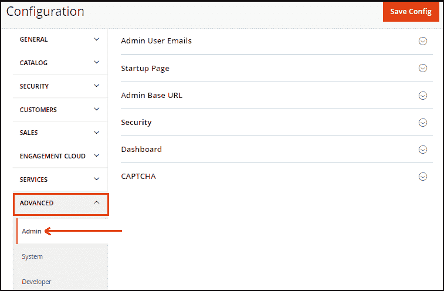

### 第 5.1 步:支付方式

**安全**

现在，展开安全部分并启用管理共享帐户。以便多个用户可以使用管理中相同的详细信息从多个系统登录。

取消选中使用系统值，并将管理帐户共享设置为是。

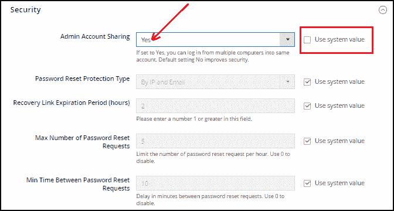

**仪表盘**

现在，我们将为仪表板启用图表。取消选中使用系统值，并在仪表板下的启用图表中设置**是**。单击保存配置将更改保存在存储中。

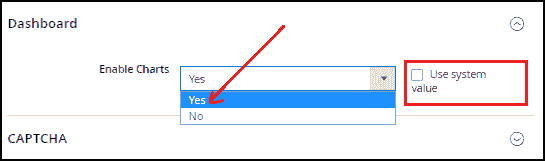

### 步骤 5.2:开发人员

下一步是在**高级**部分内移动显影剂。

**JavaScript 设置**

展开 JavaScript 设置，在取消选中使用系统值后，从下拉列表中将**是**设置为迷你 JavaScript 文件。

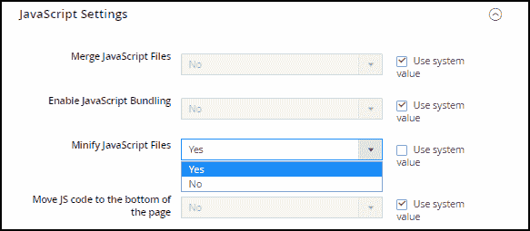

**CSS 设置**

取消选中使用系统值后，展开 CSS 设置并将**是**设置为缩小 CSS 文件。

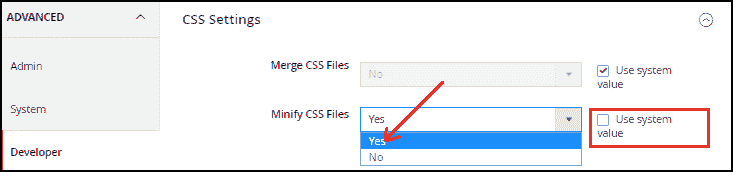

**网格设置**

从下拉列表中取消选中使用系统值启用异步索引，然后单击保存配置。

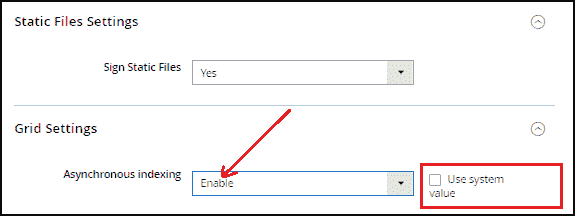

**Files Sign 的意思是，**每当您部署您的内容时，新的静态文件将在单独的 Sign 文件夹中创建。这样你的直播网站中的变化就很容易反映出来，否则就会被缓存，新的变化也不会反映出来。

**异步索引意味着**您的网格不会自动加载。例如，如果您在 Magento 下订单，它会存储在 sales_orders 表中，但管理网格是从 sales_orders_grid 表中加载的。如果我们将其设置为异步，则该条目会在一段时间后仅使用 crons。所以，这样，你的法师们就不会停留在特定时刻插入两张桌子的位置顺序上。

## 清除缓存

存储配置后，转到系统，点击缓存管理，如下图所示，刷新缓存。

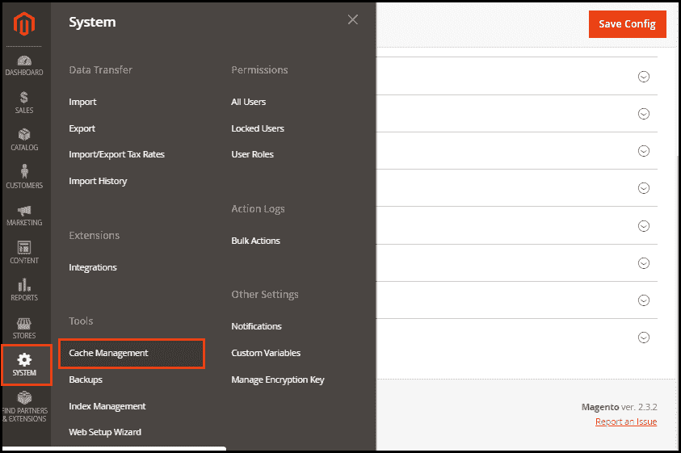

从**下拉列表**中选择全部，点击**提交**按钮。

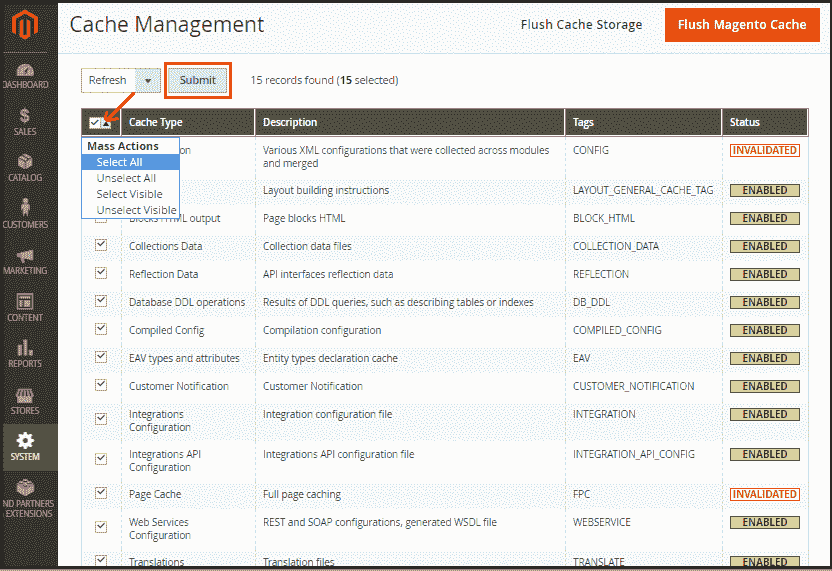

* * *