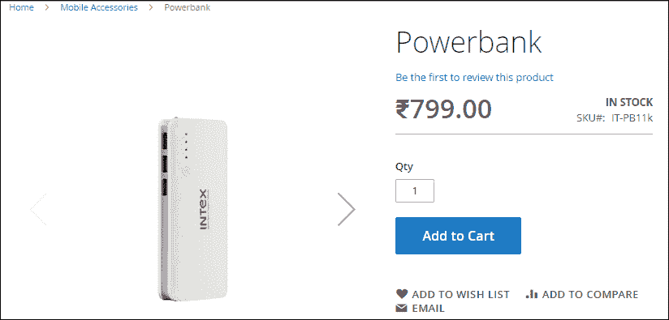
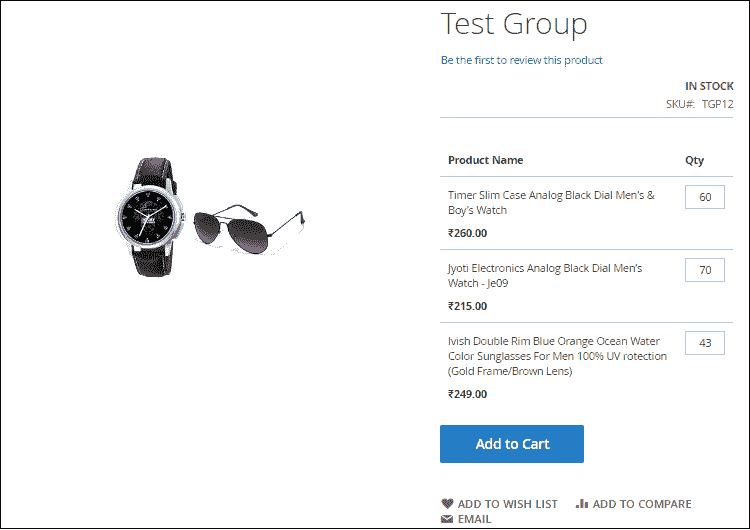
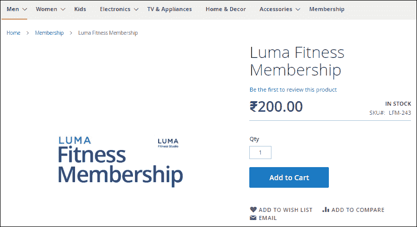
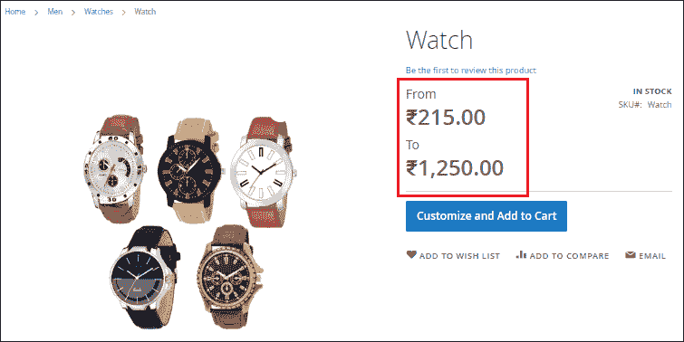

# Magento 2 中的产品及其类型

> 原文：<https://www.javatpoint.com/magento-2-product-types>

Magento 2 不仅帮助我们管理我们的商店，而且它对多种产品也很灵活。Magento 2 甚至可以灵活定制，可以满足我们所有的业务需求。我们可以通过许多变化在 Magento 2 中创建一个可配置的产品。在创建产品之前，我们需要创建产品的类别。

Magento 2 默认支持**六类**产品。这些是:

1.  [简单产品](#Simple)
2.  [可配置产品](#Configurable)
3.  [分组产品](#Grouped)
4.  [虚拟产品](#Virtual)
5.  [捆绑产品](#Bundled)
6.  [可下载产品](#Downloadable)

要在 Magento 2 商店中添加新产品，请参见下一章。这些产品的简要描述如下:

* * *

## 1.简单产品

简单的产品是没有任何可选变化的实体产品。它是最受欢迎的产品之一，也是商店的单位。在 Magento 2 中，简单的产品由其名称定义，这意味着这种类型的产品是单独销售的，或者作为可配置、捆绑或分组产品的一部分销售的。简单的产品定价多样，但没有颜色和尺寸可供选择，也没有其他选择。每一件商品都有其 **SKU** ( *仓储保管单位*)编码。

**例如-** 一个包、电源组、杯子或桌子等。

要添加简单产品，[点击此处](create-product-in-magento-2#Create-Simple-Product)。

* * *

## 2.可配置产品

可配置产品比简单产品复杂一点。可配置产品是简单产品与其他选项(如尺寸、颜色、材料等)的组合。每个选项都有一个单独的 SKU，允许商店管理员跟踪每个产品变化的库存。

**例如-** 牛仔全袖夹克是可配置的产品，因为它有不同的颜色和尺寸。

要添加可配置产品，[点击此处](create-product-in-magento-2#Create-Configurable-Product)。

* * *

## 3.分组产品

成组产品是几个简单产品或虚拟产品的集合，以组的形式呈现。它们具有相同的特征或相互关联，并且都显示在单个页面上。分组产品没有价格，只有自己孩子的产品有价格。这些产品可以单独购买，也可以集体购买，**如**，不同尺寸的刀组。

当你想在那个时候推广任何产品时，分组产品效果很好。所以，我们可以把这些项目结合起来，这是对彼此的赞美。在这种情况下，我们激励客户同时购买多种产品。

**例如-** 一套家具、夏装(墨镜搭配帽子和短裤)、一套美妆组合(眼线搭配睫毛膏)等。

在 Magento 2 中创建分组产品时，我们必须牢记以下几点:

*   分组产品的总价格应等于包含在该组中的单个简单产品的总和。
*   尽管被添加到一个单独的组中，但产品在购物车中是单独呈现的。
*   我们可以设置产品组的库存可用性，而库存必须单独管理。

要添加分组产品，[点击此处](create-product-in-magento-2#Create-Grouped-Product)。

* * *

## 4.虚拟产品

虚拟产品是那些没有实体存在的产品。因此，它们不需要运输、下载或交付。它们与简单产品非常相似，但没有重量选项。虚拟产品不是有形的。它们通常用于会员、订阅和保修等产品。虚拟产品可以与分组和捆绑产品协同工作。

**例如-** 预约、在线课程或咨询、保险、会员、订阅、技术服务等。您可以为客户、安装服务或贵宾会员提供两年保修。

要添加虚拟产品，[点击此处](create-product-in-magento-2#Create-Virtual-Product)。

* * *

## 5.捆绑产品

捆绑产品为定制产品，包括多个**简单产品**或**虚拟产品**。捆绑产品是不能单独销售的简单产品的集合。捆绑产品允许客户从各种选项中“构建自己的产品”。客户可以使用任何可用的选项来塑造该产品。

捆绑产品在其他电子商务平台中也被称为“套件”。

**例如-** 捆绑包可以是礼品篮、个人电脑、Xbox 捆绑包、雪碧瑜伽伴侣套装，里面有-瑜伽砖、球、瑜伽带、泡沫滚轮等不同的物品。在这种情况下，客户必须购买该套件中的所有物品，因为他们别无选择。

要添加捆绑产品，[点击此处](create-product-in-magento-2#Create-Bundled-Product)。

* * *

## 6.可下载产品

可下载产品是指可供下载的产品，如电子书、软件、视频、文件等。客户只有在下载后才能使用这些产品。在下载之前，他们只能观看预告片、样片进行测试。这些文件可以驻留在您的服务器上，也可以作为 URL 提供给任何其他服务器。

简而言之，可供下载的产品被称为可下载产品。它们是可数字下载的产品，允许您销售数字产品。

**例如-** 针对学习者的瑜伽视频、游戏、Magento 扩展、音乐文件和软件等。是可下载的产品。

要添加可下载产品，[点击此处](create-product-in-magento-2#Create-Downloadable-Product)。

* * *